# RNA-Seq Identification of Cancer Markers

> A quick markdown guide: https://wordpress.com/support/markdown-quick-reference/ (delete after finish)

## Overview

1. Why RNA-Seq
   * RNA-Seq overview
   * How Does RNA-Seq Identify Cancer Markers?
   * What Types of Genes Are We Interested In?
   * Advantages of RNA-Seq Compared to Traditional Techniques


2. A Few Cancer Markers Identified Using RNA-Seq
   * What are some cancer markers identified using RNA-Seq?
   * How are they identified?

3. Cancer Classification Pipeline

&nbsp;

***

## 1. Why RNA-Seq

### RNA-Seq Overview

RNA-seq is a recently developed technique that relies on NGS(Next Generation Sequencing) to to reveal the presence and quantity of RNA in a biological sample at a given moment, analyzing the continuously changing cellular transcriptome. 

As we already know, RNA-seq has many applications, it can detect

- alternative gene spliced transcripts
- post-transcriptional modifications
- gene fusion and mutations
- differences in gene expression in different groups or treatments


The last one is especially usefull in cancer study. Sometimes two types of cancer are very similar in symptom, analysis of gene expression can give more accurate diagnosis. Sometimes we want to investigate amoung all the genetic mutations of a particular cancer, which ones are determinants of tumor development. And sometimes we improve or invent a treatment, and we want to see if this treatment if indeed effective or more effective than the previous one. Under the scenerios above, RNA-seq is a very powerful tool by providing an accurate and detailed genetic profile.

### How Does RNA-Seq Identify Cancer Markers?

- Cancer cells have different behaviors from normal cells in many aspects, including growth rate, division rate, and apoptosis (cell suicide).

- The cause of such differences is differential expression of genes.

- RNA-Seq takes advantage of the characteristics of the gene expression process: instead of trying to understand everything that happens during transcription, RNA-Seq simply examines the final product after transcription, which is mRNA. 

- Hence, when researching differentially expressed genes between normal cells and cancer cells, RNA-seq is a powerful and efficient technique.

### What Types of Genes Are We Interested In?

<figure align="center">
  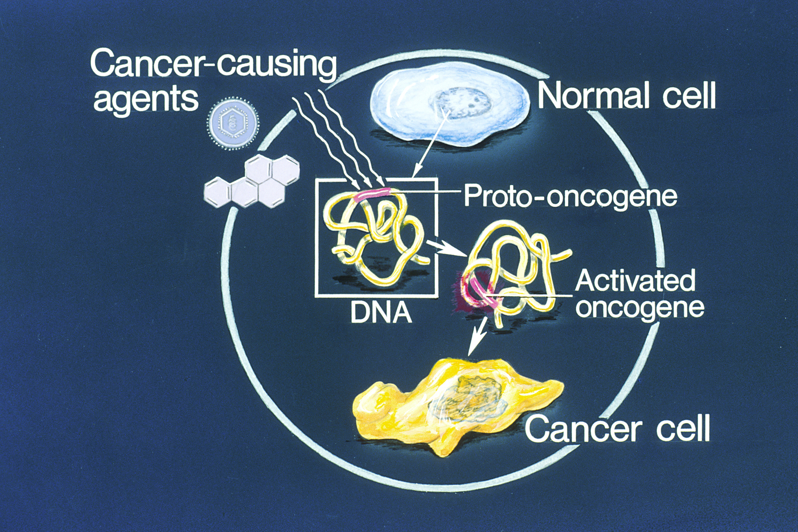
  

</figure>

&nbsp;

__Proto Oncogenes and Tumor Supressor Genes__:

- When we talk about gene expression in cancer cells, we often refer to two categories of genes: proto oncogenes and tumor supressor genes.

- **Proto oncogenes** are involved in cell division, proliferation, and apoptosis.

- **Tumor supressor genes** are involved in inhibition of cell division and repair of damaged DNA. 

Generally speaking, tumor cells often show __upregulated__ expression, or activation, or proto oncogenes, and __downregulation__ of tumor supressor genes. RNA-seq enables us to identify these genes. To do that, We can compare the RNA-seq data between normal cells and cancer cells, and find sections of genes that show **significant differences.** After idendifying potential proto oncogenes and tumor supressor genes, we can then use this information as a starting point to study the pathways involved with those genes. Then we can potentially develop drugs that target those specific pathways to treat cancer.


### Advantages of RNA-Seq Compared to Traditional Techniques

Before RNA-seq was invented, some laboratory techniques that are less technology-based can also be used to investigate gene expression.

They are:

- Northern blot
- Quantitative reverse transcription PCR (qRT-PCR)
- Serial analysis of gene expression (SAGE)
- DNA microarrays

Compared to these traditional methods, RNA-seq has the following advantages:

- Ability to detect novel transcripts: RNA-seq doesn't need a probe to identify the target sequence, so it can detect novel transcripts, gene fusions, single nucleotide variants, small insertions and deletions, and other previously unknown mutations better than traditional methods.

- Wider dynamic range: RNA-seq is more sensitive when the signal doesn't stand out in the background.

- Higher specificity and sensitivity: RNA-Seq has the ability to detect gene even at low level expression. 

- Simple detection of rare and low-abundance transcripts: Sequencing coverage depth can easily be increased to detect rare transcripts, single transcripts per cell, or weakly expressed genes.

Given the outstanding advantages above, RNA-seq now has been frequently used in cancer study.

&nbsp;

***

## 2. A Few Cancer Markers Identified Using RNA-Seq

| Cancer Marker for   | Description   |
|:----------------|:--------------|
| Metastatic vs. locally confined Luminal A breast cancer | Metastatic disease have a higher expression of mir-331 and a lower expression of mir-195 |
| Osteoblastoma vs. Osteosarcoma | miR-210 shows low expression levels in osteoblastoma & high expression levels in osteosarcoma |
| Pediatric Cytogenetically Normal Acute Myeloid Leukemia (CN-AML) | NUP98-PHF23 fusion gene is likely to be a novel therapeutic target in pediatric CN-AML |

&nbsp;

### Metastatic vs. locally confined Luminal A breast cancer
> Metastatic breast cancer, also known as advanced or stage IV, is breast cancer that has spread beyond the breast to other parts of the body, like such as bones, liver, and brain.

<figure align="center">
  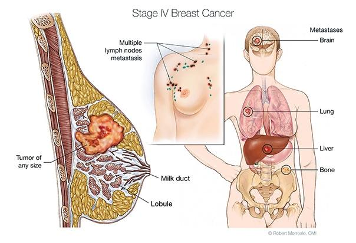
  
  Metastatic breast cancer
</figure>
&nbsp;

1. Patient selection
   
    The discovery cohort consists of plasma samples from 4 patients with Luminal A breast cancer metastasized to the bone, and 4 patients with locally confined Luminal A breast cancer.

    The validation cohort consists of whole blood samples from 22 patients with distant metastasized Luminal A breast cancer (17 to bone), 31 patients with locally confined Luminal A breast cancer, and 21 healthy age-matched controls.
 &nbsp;

2. RNA extraction & library preparation

    RNA was isolated from plasma samples (500 μl) using a miRNeasy Serum/Plasma Kit and a semi-automated QIAcube platform.
    
    Small-RNA libraries were constructed using NEXTflex Small RNA Sequencing Kit.
&nbsp;

3. Next generation RNA-Seq

    Next Generation Sequencing (maximum 200 nucleotide read) was performed using the Ion PI Sequencing 200 Kit v2 and Ion PI Chip Kit v2 BC, on the Ion Proton System.
&nbsp;

4. Data analysis

    712 miRNAs were identified in the discovery cohort, among which 16 were significantly differentially expressed between metastatic and locally confined Luminal A breast cancer (top 10 shown in Table 1). Among the 16 significantly differentially expressed miRNAs, three (miR-181a, miR-329, and miR-331) are chosen for further validation based on their involvement in metastatic processes (Table 2). miR-195 was also chosen based on its minimum 1.5-fold change in the discovery cohort, and previous studies proving it as a circulating biomarker in breast cancer.

    | Rank  | miRNA   | baseMean  | log2FoldChange  | p value |
    |:------|:--------|:----------|:----------------|:--------|
    | 1 | hsa-miR-487a-5p | 10.204322 | −6.5949809 | 	0.00157118 |
    | 2 | hsa-miR-376c-3p | 9.66930256 | −6.2249402 | 0.00395951 |
    | 3 | **hsa-miR-181a-2-3p** | 10.0812243 | 6.10481296 | 0.0050032 |
    | 4 | hsa-miR-6721-5p | 11.0766671 | −5.5985336 | 0.00517822 |
    | 5 | **hsa-miR-329-3p** | 40.6587497 | −4.2606132 | 0.00685817 |
    | 6 | hsa-miR-665 | 4.33646293 | −5.5104353 | 0.01118505 |
    | 7 | **hsa-miR-331-3p** | 9.380562 | −4.2942354 | 0.01649485 |
    | 8 | hsa-miR-4433a-5p | 15.8475709 | 3.90544954 | 0.01800022 |
    | 9 | hsa-miR-2277-3p | 3.59270664 | −4.7490645 | 0.02293153 |
    | 10 | hsa-miR-6734-5p | 25.3078788 | 3.92134038 | 0.02353415 |
    **Selected miRNAs in bold*

    Table 1: Top 10 differentially expressed miRNA between local and metastatic breast cancers in the discovery cohort
    

    | miRNA | Metastatic process  | Expression pattern  | Cancer  |
    |:------|:--------------------|:--------------------|:-------|
    | miR-181a | EMT | ↑ | Breast |
    || Migration and invasion | ↑ | Colorectal |
    |||| Breast |
    | miR-329 | Proliferation and migration | ↓ | Neuroblastoma |
    || Apoptosis | ↓ | Gastric |
    ||| ↓ | Lung |
    | miR-331 | Proliferation and EMT | ↑ | Liver |

    Table 2: Candidate miRNAs implicated in the metastatic cascade

&nbsp;

5. Validation by RT-qPCR

    The selected four miRNA targets were validated using the RNA extracted from 22 patients with metastatic breast cancer, 31 patients with locally confined Luminal A breast cancer, and 21 healthy controls.


    #### Identifying miRNA as metastatic or locally confined breast cancer biomarkers

    <figure align="center">
      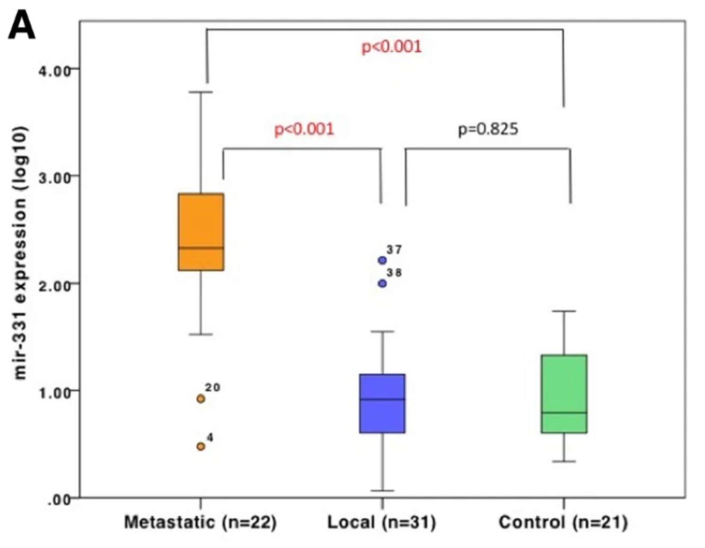

      RT-qPCR of miR-331 expression in metastatic cancer, locally confined cancer, and healthy groups

      

      &nbsp;

      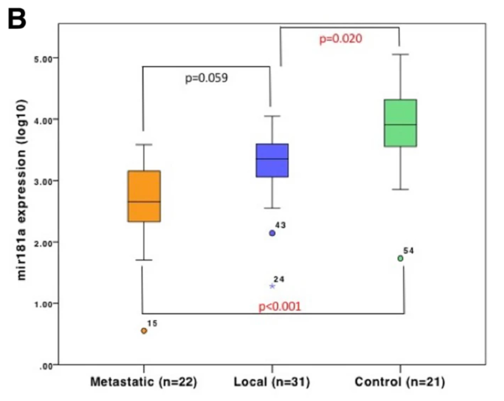

      RT-qPCR of miR-181a expression in metastatic cancer, locally confined cancer, and healthy groups

      &nbsp;

      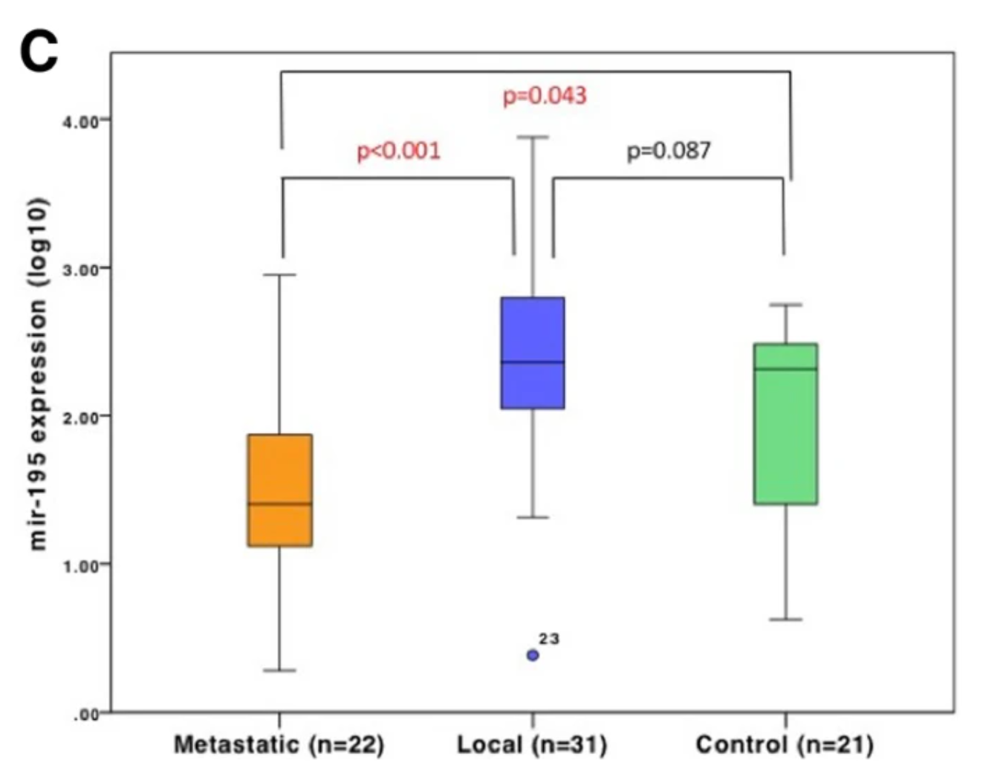

      RT-qPCR of miR-195 expression in metastatic cancer, locally confined cancer, and healthy groups</

    </figure>
    
    (p<0.05 is considered significant.)

    The expression of miR-331 was significantly higher in the metastatic group compared to both the locally confined group and the healthy control group (p<0.001 for both), and there was no significant difference in miR-331 expression between the locally confined group and the healthy control group (p=0.825).
    
    The expression of miR-181a was lower in the metastatic group compared to the locally confined group (p=0.059). It is significantly higher in the healthy control group compared to the metastatic group (p=0.001) and the locally confined group (p=0.02).
    
    The expression of miR-195 was significantly lower in the metastatic group compared to both locally confined group (p<0.001) and the healthy control group (p=0.043). There was no significant difference in miR-195 expression between the locally confined group and the control group (p=0.087).
    
    miR-329 was only detected in 2 metastatic cohort and 11 locally confined cohort, so further analysis was not performed.
    

    #### Identifying miRNA as breast cancer biomarkers

    <figure align="center">
      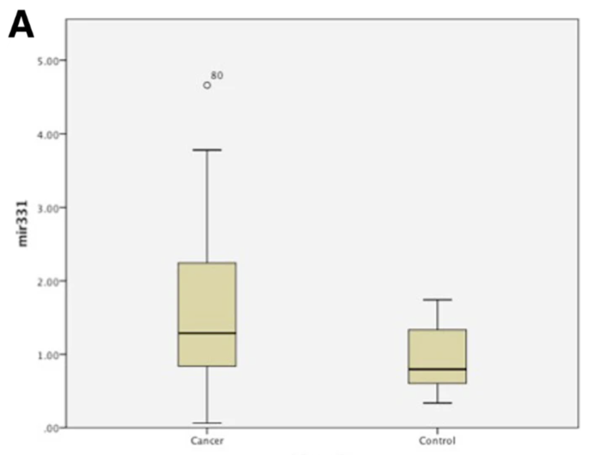

      RT-qPCR of miR-331 expression in cancer and healthy groups

      &nbsp;

      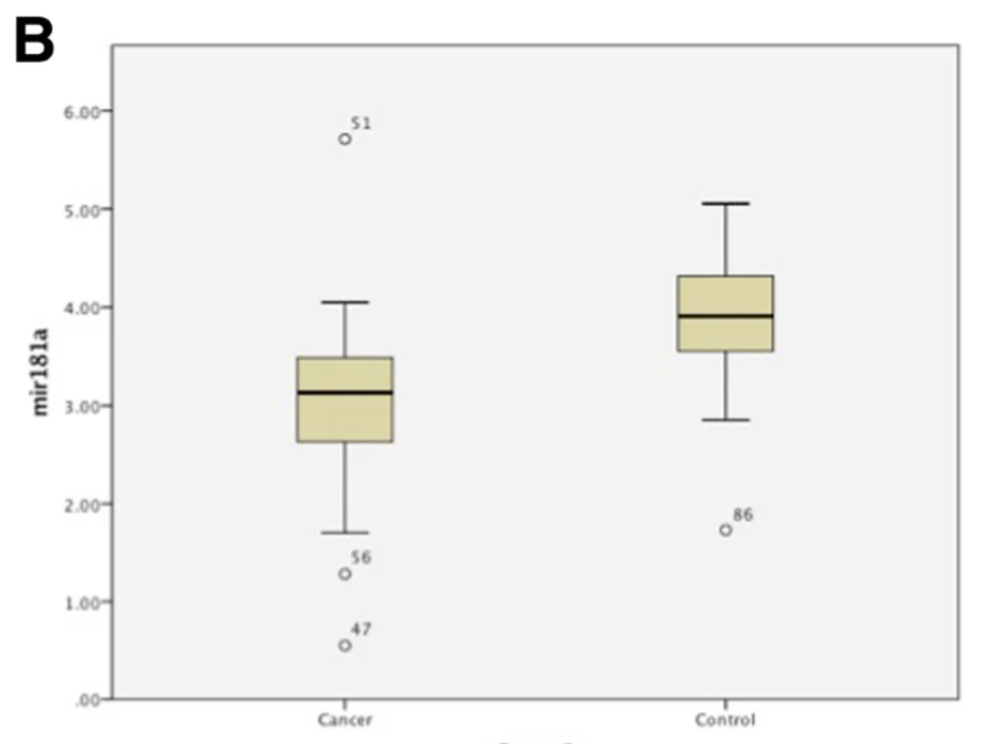

      RT-qPCR of miR-181a expression in cancer and healthy groups

      &nbsp;

      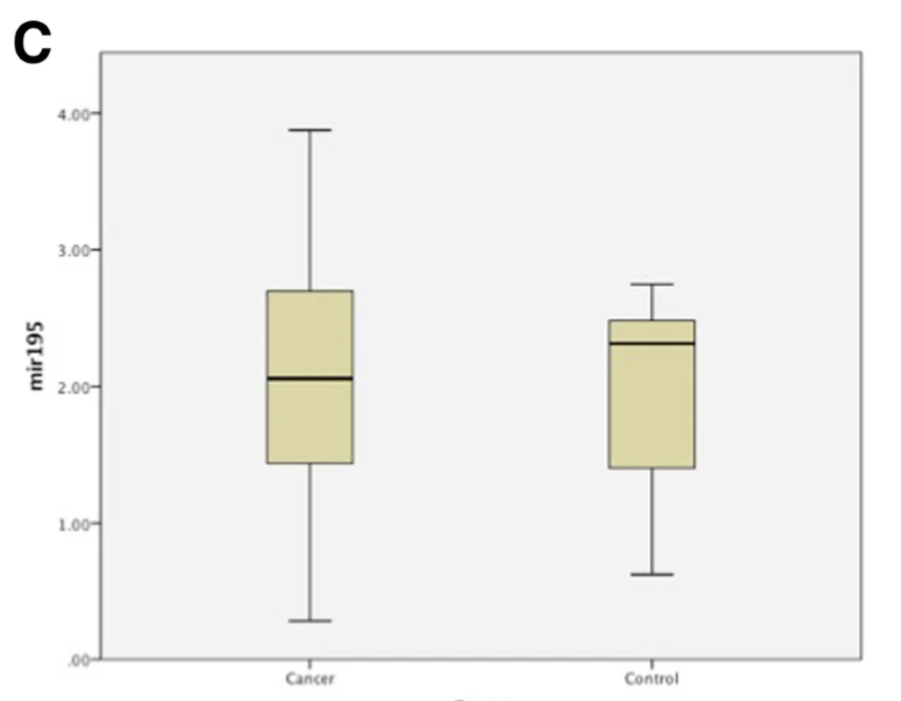
      
      RT-qPCR of miR-195 expression in cancer and healthy groups

    </figure>

    (p<0.05 is considered significant.)

    The expression of miR-331 was significantly higher in the cancer group compared to the healthy group (p<0.001). The expression of miR-181a was significantly lower in the cancer group compared to the healthy group (p<0.001). There was no significant difference in the expression of miR-195 (p=0.806).


&nbsp;

6. Statistical analysis

    Logistic regression was performed to test the ability of different combinations of the three miRNAs to distinguish metastatic and locally confined breast cancer.

    <figure align="center">
      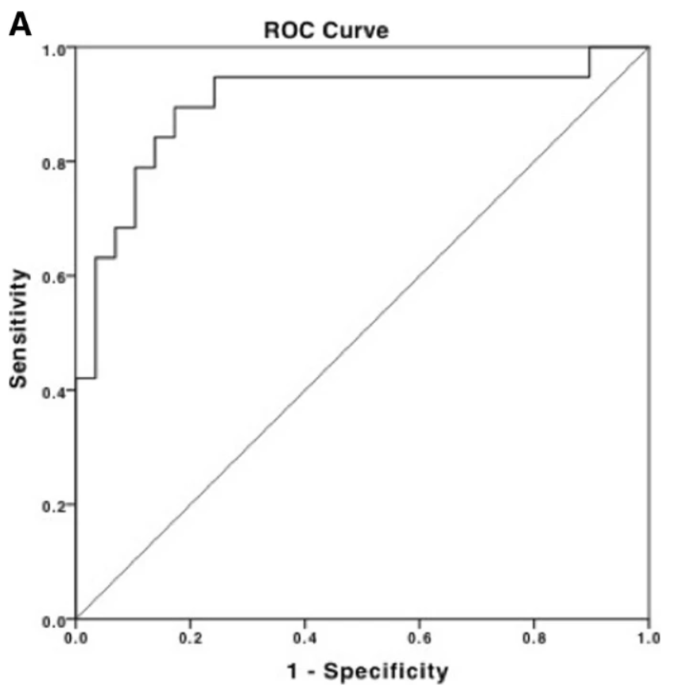

      ROC curve of combining miR-331 and miR-195

    </figure>

    The area under the curve (AUC) of receiver operator characteristic (ROC) curve generated by binary logistic regression was compared for all three combinations of miRNAs. The combination of miR-331 and miR-195 had the highest AUC of 0.902, with a sensitivity of 95% and a specificity of 76%.

&nbsp;

7. Conclusion
   
   Metastatic Luminal A breast cancer displays a higher expression of miR-331 and a lower expression of miR-195 than locally confined Luminal A breast cancer.

&nbsp;

### Osteoblastoma vs. Osteosarcoma

>Osteoblastoma is a benign bone cancer that is difficult to distinguish from osteosarcoma which is a malignant bone tumor.

Similarly, in the identification of the biomarker for osteoblastoma and osteosarcoma, next generation RNA-Seq was used as an expression screen to evaluate more than 2,000 miRNAs extracted from rare formalin fixed paraffin embedded (FFPE) archival tumor specimens. miRNAs that best distinguish osteoblastoma from osteosarcoma were validated on an independent tumor set using qPCR. Four miRNAs were identified as biomarker candidates through initial RNA-Seq scanning. The expression of miR-451a, miR-144-3p, and miR-486-5p was higher in osteoblastoma, and the expression of miR-210 was higher in osteosarcoma. The validation on the independent data set of 22 tumor specimens using qPCR showed that miR-210 was the most discriminating marker. miR-210 displays low levels of expression in all osteoblastoma specimens and robust expression in most osteosarcoma specimens.

Conclusion: miR-210 shows low expression levels in osteoblastoma and high expression levels in osteosarcoma.

&nbsp;

### Pediatric Cytogenetically Normal Acute Myeloid Leukemia (CN-AML)

> Childhood acute myeloid leukemia (AML) is a disease that has a survival rate of 60-70%, among which 20% of the cases do not show any known cytogenetic abnormality.

In the identification of the biomarker for pediatric CN-AML, RNA-Seq by HiScanSQ sequencer was performed to generate sequencing data. After performing bioinformatic analysis, a chimeric transcript involving *NUP98* and *PHF23* genes that resulted from a cryptic translocation was identified. RT-PCR analysis and Sanger sequencing were performed on a validation cohort of 168 AML children, among which 139 were negative for known recurrent genetic abnormalities and 29 had internal tandem duplication of *FLT3 (FLT3-ITD)*. 2 out of 139 CN-AML cases harbored *NUP98-PHF23*, and no patients with *FLT3-ITD* harbored *NUP98-PHF23*.

Many *NUP98*-rearrangements have been found to be associated with AML, but chromosomal rearrangements and/or mutations of *PHF23* have never been previously described in children with AML. *PHF23* gene encodes for a protein containing a plant homeodomain (PHD) finger involved in chromatin remodeling. Previous studies report that *NUP98-PHF23* fusion gene impairs the differentiation of myeloid progenitor cells and promote leukemia development. Thus, *NUP98-PHF23* fusion gene is likely to be a novel therapeutic target in pediatric CN-AML.

Conclusion: *NUP98-PHF23* fusion gene is likely to be a novel therapeutic target in pediatric cytogenetically normal acute myeloid leukemia (CN-AML).

&nbsp;

***


## 3. Cancer Classification Pipeline

The following is an example of using gene expression result to classify two cancers: Acute lymphocytic leukemia(ALL) and Acute myeloid leukemia(AML). This dataset comes from a proof-of-concept study published in 1999 by Golub et al. Notice that the data is generated from microarray instead of RNA-seq, but the analysis of data follows similar algorithm. This dataset is relatively small (contains less gene) compared to those generated by RNA-seq, which makes it an ideal practice set. Once you're familar with the classification methods, you'll be able to implement them into larger RNA-seq dataset. All codes are in python.

The dataset is available at www.kaggle.com/crawford/gene-expression. The data cleaning and preparing steps are from Ashwani on Kaggle, the original notebook can be accessed at www.kaggle.com/iashwani/gene-expression-classification.


```python
# import packages

import pandas as pd
import numpy as np

import matplotlib.pyplot as plt
import seaborn as sns
from mpl_toolkits.mplot3d import Axes3D
%matplotlib inline

from sklearn.metrics import accuracy_score, confusion_matrix, roc_auc_score, average_precision_score, roc_curve, precision_recall_curve
from sklearn.cluster import KMeans
from sklearn.linear_model import LogisticRegression
from sklearn.preprocessing import StandardScaler
from bioinfokit import visuz

```

### Import data

Having a good dataset is very important in real-world research. Before using the dataset, it's crucial to check it's source, author, data type and file type. Also, knowing what each row and column means is also very important before starting any analysis. 

First, we need to import the trainX, trainY, and label(Y) dataset. The dataset already seperate the trainX and testX, but we need to seperate Y into training and testing sets later. 


```python
# import the label(Y)
y = pd.read_csv('actual.csv')
```

```python
# each patient has ALL or AML cancer
y.head()
```


<div>

<table border="1" class="dataframe">
  <thead>
    <tr style="text-align: right;">
      <th></th>
      <th>patient</th>
      <th>cancer</th>
    </tr>
  </thead>
  <tbody>
    <tr>
      <th>0</th>
      <td>1</td>
      <td>ALL</td>
    </tr>
    <tr>
      <th>1</th>
      <td>2</td>
      <td>ALL</td>
    </tr>
    <tr>
      <th>2</th>
      <td>3</td>
      <td>ALL</td>
    </tr>
    <tr>
      <th>3</th>
      <td>4</td>
      <td>ALL</td>
    </tr>
    <tr>
      <th>4</th>
      <td>5</td>
      <td>ALL</td>
    </tr>
  </tbody>
</table>
</div>


```python
# relabel the two cancers by 1 and 0 for binary classification
y = y.replace({'ALL':0,'AML':1})
```


```python
# import data set of gene expression for each patient(X)
trainX = pd.read_csv('data_set_ALL_AML_train.csv')
testX = pd.read_csv('data_set_ALL_AML_independent.csv')
```


```python
testX.head()
```


<div>

<table border="1" class="dataframe">
  <thead>
    <tr style="text-align: right;">
      <th></th>
      <th>Gene Description</th>
      <th>Gene Accession Number</th>
      <th>39</th>
      <th>call</th>
      <th>40</th>
      <th>call.1</th>
      <th>42</th>
      <th>call.2</th>
      <th>47</th>
      <th>call.3</th>
      <th>...</th>
      <th>65</th>
      <th>call.29</th>
      <th>66</th>
      <th>call.30</th>
      <th>63</th>
      <th>call.31</th>
      <th>64</th>
      <th>call.32</th>
      <th>62</th>
      <th>call.33</th>
    </tr>
  </thead>
  <tbody>
    <tr>
      <th>0</th>
      <td>AFFX-BioB-5_at (endogenous control)</td>
      <td>AFFX-BioB-5_at</td>
      <td>-342</td>
      <td>A</td>
      <td>-87</td>
      <td>A</td>
      <td>22</td>
      <td>A</td>
      <td>-243</td>
      <td>A</td>
      <td>...</td>
      <td>-62</td>
      <td>A</td>
      <td>-58</td>
      <td>A</td>
      <td>-161</td>
      <td>A</td>
      <td>-48</td>
      <td>A</td>
      <td>-176</td>
      <td>A</td>
    </tr>
    <tr>
      <th>1</th>
      <td>AFFX-BioB-M_at (endogenous control)</td>
      <td>AFFX-BioB-M_at</td>
      <td>-200</td>
      <td>A</td>
      <td>-248</td>
      <td>A</td>
      <td>-153</td>
      <td>A</td>
      <td>-218</td>
      <td>A</td>
      <td>...</td>
      <td>-198</td>
      <td>A</td>
      <td>-217</td>
      <td>A</td>
      <td>-215</td>
      <td>A</td>
      <td>-531</td>
      <td>A</td>
      <td>-284</td>
      <td>A</td>
    </tr>
    <tr>
      <th>2</th>
      <td>AFFX-BioB-3_at (endogenous control)</td>
      <td>AFFX-BioB-3_at</td>
      <td>41</td>
      <td>A</td>
      <td>262</td>
      <td>A</td>
      <td>17</td>
      <td>A</td>
      <td>-163</td>
      <td>A</td>
      <td>...</td>
      <td>-5</td>
      <td>A</td>
      <td>63</td>
      <td>A</td>
      <td>-46</td>
      <td>A</td>
      <td>-124</td>
      <td>A</td>
      <td>-81</td>
      <td>A</td>
    </tr>
    <tr>
      <th>3</th>
      <td>AFFX-BioC-5_at (endogenous control)</td>
      <td>AFFX-BioC-5_at</td>
      <td>328</td>
      <td>A</td>
      <td>295</td>
      <td>A</td>
      <td>276</td>
      <td>A</td>
      <td>182</td>
      <td>A</td>
      <td>...</td>
      <td>141</td>
      <td>A</td>
      <td>95</td>
      <td>A</td>
      <td>146</td>
      <td>A</td>
      <td>431</td>
      <td>A</td>
      <td>9</td>
      <td>A</td>
    </tr>
    <tr>
      <th>4</th>
      <td>AFFX-BioC-3_at (endogenous control)</td>
      <td>AFFX-BioC-3_at</td>
      <td>-224</td>
      <td>A</td>
      <td>-226</td>
      <td>A</td>
      <td>-211</td>
      <td>A</td>
      <td>-289</td>
      <td>A</td>
      <td>...</td>
      <td>-256</td>
      <td>A</td>
      <td>-191</td>
      <td>A</td>
      <td>-172</td>
      <td>A</td>
      <td>-496</td>
      <td>A</td>
      <td>-294</td>
      <td>A</td>
    </tr>
  </tbody>
</table>
<p>5 rows × 70 columns</p>
</div>


### Cleaning and Preparation

Now we need to clean the data into a format that can be easily input to the model. In real-world practise, some of the datasets may contain patients name or symptom in it and some of the cells may be empty, which needs further cleaning. In this example, we'll only show modification of columns and rows in a dataframe, standardization and spliting of training and testing set.


```python
# remove call columns
train_to_keep = [col for col in trainX.columns if "call" not in col]
test_to_keep = [col for col in testX.columns if "call" not in col]

trainX_clean = trainX[train_to_keep]
testX_clean = testX[test_to_keep]
```


```python
testX_clean.head()
```


<div>

<table border="1" class="dataframe">
  <thead>
    <tr style="text-align: right;">
      <th></th>
      <th>Gene Description</th>
      <th>Gene Accession Number</th>
      <th>39</th>
      <th>40</th>
      <th>42</th>
      <th>47</th>
      <th>48</th>
      <th>49</th>
      <th>41</th>
      <th>43</th>
      <th>...</th>
      <th>54</th>
      <th>57</th>
      <th>58</th>
      <th>60</th>
      <th>61</th>
      <th>65</th>
      <th>66</th>
      <th>63</th>
      <th>64</th>
      <th>62</th>
    </tr>
  </thead>
  <tbody>
    <tr>
      <th>0</th>
      <td>AFFX-BioB-5_at (endogenous control)</td>
      <td>AFFX-BioB-5_at</td>
      <td>-342</td>
      <td>-87</td>
      <td>22</td>
      <td>-243</td>
      <td>-130</td>
      <td>-256</td>
      <td>-62</td>
      <td>86</td>
      <td>...</td>
      <td>-90</td>
      <td>-137</td>
      <td>-157</td>
      <td>-172</td>
      <td>-47</td>
      <td>-62</td>
      <td>-58</td>
      <td>-161</td>
      <td>-48</td>
      <td>-176</td>
    </tr>
    <tr>
      <th>1</th>
      <td>AFFX-BioB-M_at (endogenous control)</td>
      <td>AFFX-BioB-M_at</td>
      <td>-200</td>
      <td>-248</td>
      <td>-153</td>
      <td>-218</td>
      <td>-177</td>
      <td>-249</td>
      <td>-23</td>
      <td>-36</td>
      <td>...</td>
      <td>-87</td>
      <td>-51</td>
      <td>-370</td>
      <td>-122</td>
      <td>-442</td>
      <td>-198</td>
      <td>-217</td>
      <td>-215</td>
      <td>-531</td>
      <td>-284</td>
    </tr>
    <tr>
      <th>2</th>
      <td>AFFX-BioB-3_at (endogenous control)</td>
      <td>AFFX-BioB-3_at</td>
      <td>41</td>
      <td>262</td>
      <td>17</td>
      <td>-163</td>
      <td>-28</td>
      <td>-410</td>
      <td>-7</td>
      <td>-141</td>
      <td>...</td>
      <td>102</td>
      <td>-82</td>
      <td>-77</td>
      <td>38</td>
      <td>-21</td>
      <td>-5</td>
      <td>63</td>
      <td>-46</td>
      <td>-124</td>
      <td>-81</td>
    </tr>
    <tr>
      <th>3</th>
      <td>AFFX-BioC-5_at (endogenous control)</td>
      <td>AFFX-BioC-5_at</td>
      <td>328</td>
      <td>295</td>
      <td>276</td>
      <td>182</td>
      <td>266</td>
      <td>24</td>
      <td>142</td>
      <td>252</td>
      <td>...</td>
      <td>319</td>
      <td>178</td>
      <td>340</td>
      <td>31</td>
      <td>396</td>
      <td>141</td>
      <td>95</td>
      <td>146</td>
      <td>431</td>
      <td>9</td>
    </tr>
    <tr>
      <th>4</th>
      <td>AFFX-BioC-3_at (endogenous control)</td>
      <td>AFFX-BioC-3_at</td>
      <td>-224</td>
      <td>-226</td>
      <td>-211</td>
      <td>-289</td>
      <td>-170</td>
      <td>-535</td>
      <td>-233</td>
      <td>-201</td>
      <td>...</td>
      <td>-283</td>
      <td>-135</td>
      <td>-438</td>
      <td>-201</td>
      <td>-351</td>
      <td>-256</td>
      <td>-191</td>
      <td>-172</td>
      <td>-496</td>
      <td>-294</td>
    </tr>
  </tbody>
</table>
<p>5 rows × 36 columns</p>
</div>


```python
# rename the columns

train_columns_titles = ['Gene Description', 'Gene Accession Number', '1', '2', '3', '4', '5', '6', '7', '8', '9', '10',
       '11', '12', '13', '14', '15', '16', '17', '18', '19', '20', '21', '22', '23', '24', '25', 
       '26', '27', '28', '29', '30', '31', '32', '33', '34', '35', '36', '37', '38']

trainX = trainX_clean.reindex(columns=train_columns_titles)

test_columns_titles = ['Gene Description', 'Gene Accession Number','39', '40', '41', '42', '43', '44', '45', '46',
       '47', '48', '49', '50', '51', '52', '53',  '54', '55', '56', '57', '58', '59',
       '60', '61', '62', '63', '64', '65', '66', '67', '68', '69', '70', '71', '72']

testX = testX_clean.reindex(columns=test_columns_titles)
```


```python
X_train = trainX.T
X_test = testX.T
```


```python
X_test.head()
```


<div>

<table border="1" class="dataframe">
  <thead>
    <tr style="text-align: right;">
      <th></th>
      <th>0</th>
      <th>1</th>
      <th>2</th>
      <th>3</th>
      <th>4</th>
      <th>5</th>
      <th>6</th>
      <th>7</th>
      <th>8</th>
      <th>9</th>
      <th>...</th>
      <th>7119</th>
      <th>7120</th>
      <th>7121</th>
      <th>7122</th>
      <th>7123</th>
      <th>7124</th>
      <th>7125</th>
      <th>7126</th>
      <th>7127</th>
      <th>7128</th>
    </tr>
  </thead>
  <tbody>
    <tr>
      <th>Gene Description</th>
      <td>AFFX-BioB-5_at (endogenous control)</td>
      <td>AFFX-BioB-M_at (endogenous control)</td>
      <td>AFFX-BioB-3_at (endogenous control)</td>
      <td>AFFX-BioC-5_at (endogenous control)</td>
      <td>AFFX-BioC-3_at (endogenous control)</td>
      <td>AFFX-BioDn-5_at (endogenous control)</td>
      <td>AFFX-BioDn-3_at (endogenous control)</td>
      <td>AFFX-CreX-5_at (endogenous control)</td>
      <td>AFFX-CreX-3_at (endogenous control)</td>
      <td>AFFX-BioB-5_st (endogenous control)</td>
      <td>...</td>
      <td>Transcription factor Stat5b (stat5b) mRNA</td>
      <td>Breast epithelial antigen BA46 mRNA</td>
      <td>GB DEF = Calcium/calmodulin-dependent protein ...</td>
      <td>TUBULIN ALPHA-4 CHAIN</td>
      <td>CYP4B1 Cytochrome P450; subfamily IVB; polypep...</td>
      <td>PTGER3 Prostaglandin E receptor 3 (subtype EP3...</td>
      <td>HMG2 High-mobility group (nonhistone chromosom...</td>
      <td>RB1 Retinoblastoma 1 (including osteosarcoma)</td>
      <td>GB DEF = Glycophorin Sta (type A) exons 3 and ...</td>
      <td>GB DEF = mRNA (clone 1A7)</td>
    </tr>
    <tr>
      <th>Gene Accession Number</th>
      <td>AFFX-BioB-5_at</td>
      <td>AFFX-BioB-M_at</td>
      <td>AFFX-BioB-3_at</td>
      <td>AFFX-BioC-5_at</td>
      <td>AFFX-BioC-3_at</td>
      <td>AFFX-BioDn-5_at</td>
      <td>AFFX-BioDn-3_at</td>
      <td>AFFX-CreX-5_at</td>
      <td>AFFX-CreX-3_at</td>
      <td>AFFX-BioB-5_st</td>
      <td>...</td>
      <td>U48730_at</td>
      <td>U58516_at</td>
      <td>U73738_at</td>
      <td>X06956_at</td>
      <td>X16699_at</td>
      <td>X83863_at</td>
      <td>Z17240_at</td>
      <td>L49218_f_at</td>
      <td>M71243_f_at</td>
      <td>Z78285_f_at</td>
    </tr>
    <tr>
      <th>39</th>
      <td>-342</td>
      <td>-200</td>
      <td>41</td>
      <td>328</td>
      <td>-224</td>
      <td>-427</td>
      <td>-656</td>
      <td>-292</td>
      <td>137</td>
      <td>-144</td>
      <td>...</td>
      <td>277</td>
      <td>1023</td>
      <td>67</td>
      <td>214</td>
      <td>-135</td>
      <td>1074</td>
      <td>475</td>
      <td>48</td>
      <td>168</td>
      <td>-70</td>
    </tr>
    <tr>
      <th>40</th>
      <td>-87</td>
      <td>-248</td>
      <td>262</td>
      <td>295</td>
      <td>-226</td>
      <td>-493</td>
      <td>367</td>
      <td>-452</td>
      <td>194</td>
      <td>162</td>
      <td>...</td>
      <td>83</td>
      <td>529</td>
      <td>-295</td>
      <td>352</td>
      <td>-67</td>
      <td>67</td>
      <td>263</td>
      <td>-33</td>
      <td>-33</td>
      <td>-21</td>
    </tr>
    <tr>
      <th>41</th>
      <td>-62</td>
      <td>-23</td>
      <td>-7</td>
      <td>142</td>
      <td>-233</td>
      <td>-284</td>
      <td>-167</td>
      <td>-97</td>
      <td>-12</td>
      <td>-70</td>
      <td>...</td>
      <td>129</td>
      <td>383</td>
      <td>46</td>
      <td>104</td>
      <td>15</td>
      <td>245</td>
      <td>164</td>
      <td>84</td>
      <td>100</td>
      <td>-18</td>
    </tr>
  </tbody>
</table>
<p>5 rows × 7129 columns</p>
</div>


```python
X_train.columns = X_train.iloc[1]
```


```python
# remove the first two rows as we only need the rows with gene expression
X_train = X_train.drop(["Gene Description", "Gene Accession Number"])
```


```python
X_train = X_train.apply(pd.to_numeric)
```


```python
X_train.head()
```


<div>

<table border="1" class="dataframe">
  <thead>
    <tr style="text-align: right;">
      <th>Gene Accession Number</th>
      <th>AFFX-BioB-5_at</th>
      <th>AFFX-BioB-M_at</th>
      <th>AFFX-BioB-3_at</th>
      <th>AFFX-BioC-5_at</th>
      <th>AFFX-BioC-3_at</th>
      <th>AFFX-BioDn-5_at</th>
      <th>AFFX-BioDn-3_at</th>
      <th>AFFX-CreX-5_at</th>
      <th>AFFX-CreX-3_at</th>
      <th>AFFX-BioB-5_st</th>
      <th>...</th>
      <th>U48730_at</th>
      <th>U58516_at</th>
      <th>U73738_at</th>
      <th>X06956_at</th>
      <th>X16699_at</th>
      <th>X83863_at</th>
      <th>Z17240_at</th>
      <th>L49218_f_at</th>
      <th>M71243_f_at</th>
      <th>Z78285_f_at</th>
    </tr>
  </thead>
  <tbody>
    <tr>
      <th>1</th>
      <td>-214</td>
      <td>-153</td>
      <td>-58</td>
      <td>88</td>
      <td>-295</td>
      <td>-558</td>
      <td>199</td>
      <td>-176</td>
      <td>252</td>
      <td>206</td>
      <td>...</td>
      <td>185</td>
      <td>511</td>
      <td>-125</td>
      <td>389</td>
      <td>-37</td>
      <td>793</td>
      <td>329</td>
      <td>36</td>
      <td>191</td>
      <td>-37</td>
    </tr>
    <tr>
      <th>2</th>
      <td>-139</td>
      <td>-73</td>
      <td>-1</td>
      <td>283</td>
      <td>-264</td>
      <td>-400</td>
      <td>-330</td>
      <td>-168</td>
      <td>101</td>
      <td>74</td>
      <td>...</td>
      <td>169</td>
      <td>837</td>
      <td>-36</td>
      <td>442</td>
      <td>-17</td>
      <td>782</td>
      <td>295</td>
      <td>11</td>
      <td>76</td>
      <td>-14</td>
    </tr>
    <tr>
      <th>3</th>
      <td>-76</td>
      <td>-49</td>
      <td>-307</td>
      <td>309</td>
      <td>-376</td>
      <td>-650</td>
      <td>33</td>
      <td>-367</td>
      <td>206</td>
      <td>-215</td>
      <td>...</td>
      <td>315</td>
      <td>1199</td>
      <td>33</td>
      <td>168</td>
      <td>52</td>
      <td>1138</td>
      <td>777</td>
      <td>41</td>
      <td>228</td>
      <td>-41</td>
    </tr>
    <tr>
      <th>4</th>
      <td>-135</td>
      <td>-114</td>
      <td>265</td>
      <td>12</td>
      <td>-419</td>
      <td>-585</td>
      <td>158</td>
      <td>-253</td>
      <td>49</td>
      <td>31</td>
      <td>...</td>
      <td>240</td>
      <td>835</td>
      <td>218</td>
      <td>174</td>
      <td>-110</td>
      <td>627</td>
      <td>170</td>
      <td>-50</td>
      <td>126</td>
      <td>-91</td>
    </tr>
    <tr>
      <th>5</th>
      <td>-106</td>
      <td>-125</td>
      <td>-76</td>
      <td>168</td>
      <td>-230</td>
      <td>-284</td>
      <td>4</td>
      <td>-122</td>
      <td>70</td>
      <td>252</td>
      <td>...</td>
      <td>156</td>
      <td>649</td>
      <td>57</td>
      <td>504</td>
      <td>-26</td>
      <td>250</td>
      <td>314</td>
      <td>14</td>
      <td>56</td>
      <td>-25</td>
    </tr>
  </tbody>
</table>
<p>5 rows × 7129 columns</p>
</div>


```python
# testX is cleaned by the same way
X_test.columns = X_test.iloc[1]
X_test = X_test.drop(["Gene Description", "Gene Accession Number"])
X_test = X_test.apply(pd.to_numeric)
```


```python
# check the size of each dataset
print("Train shape:",X_train.shape)
print("Test shape:",X_test.shape)
print("Label shape:",y.shape)
```

    Train shape: (38, 7129)
    Test shape: (34, 7129)
    Label shape: (72, 2)

The Training set contains 38 dataX, each one is a 7129-vector, which means we use 38 samples to train the model, each sample contains expression of 7129 gene. The intrepretation for testing set is the same. The label contains 72 values (either 1 or 0) corresponding to the cancer type of each sample in training and testing set.


```python
# Split label into train and test (we first need to reset the index as the indexes of two dataframes need to be the same before you combine them).

# Subset the first 38 patient's cancer types
X_train = X_train.reset_index(drop=True)
y_train = y[y.patient <= 38].reset_index(drop=True)

# Subset the rest for testing
X_test = X_test.reset_index(drop=True)
y_test = y[y.patient > 38].reset_index(drop=True)
```


```python
X_test.head()
```


<div>

<table border="1" class="dataframe">
  <thead>
    <tr style="text-align: right;">
      <th>Gene Accession Number</th>
      <th>AFFX-BioB-5_at</th>
      <th>AFFX-BioB-M_at</th>
      <th>AFFX-BioB-3_at</th>
      <th>AFFX-BioC-5_at</th>
      <th>AFFX-BioC-3_at</th>
      <th>AFFX-BioDn-5_at</th>
      <th>AFFX-BioDn-3_at</th>
      <th>AFFX-CreX-5_at</th>
      <th>AFFX-CreX-3_at</th>
      <th>AFFX-BioB-5_st</th>
      <th>...</th>
      <th>U48730_at</th>
      <th>U58516_at</th>
      <th>U73738_at</th>
      <th>X06956_at</th>
      <th>X16699_at</th>
      <th>X83863_at</th>
      <th>Z17240_at</th>
      <th>L49218_f_at</th>
      <th>M71243_f_at</th>
      <th>Z78285_f_at</th>
    </tr>
  </thead>
  <tbody>
    <tr>
      <th>0</th>
      <td>-342</td>
      <td>-200</td>
      <td>41</td>
      <td>328</td>
      <td>-224</td>
      <td>-427</td>
      <td>-656</td>
      <td>-292</td>
      <td>137</td>
      <td>-144</td>
      <td>...</td>
      <td>277</td>
      <td>1023</td>
      <td>67</td>
      <td>214</td>
      <td>-135</td>
      <td>1074</td>
      <td>475</td>
      <td>48</td>
      <td>168</td>
      <td>-70</td>
    </tr>
    <tr>
      <th>1</th>
      <td>-87</td>
      <td>-248</td>
      <td>262</td>
      <td>295</td>
      <td>-226</td>
      <td>-493</td>
      <td>367</td>
      <td>-452</td>
      <td>194</td>
      <td>162</td>
      <td>...</td>
      <td>83</td>
      <td>529</td>
      <td>-295</td>
      <td>352</td>
      <td>-67</td>
      <td>67</td>
      <td>263</td>
      <td>-33</td>
      <td>-33</td>
      <td>-21</td>
    </tr>
    <tr>
      <th>2</th>
      <td>-62</td>
      <td>-23</td>
      <td>-7</td>
      <td>142</td>
      <td>-233</td>
      <td>-284</td>
      <td>-167</td>
      <td>-97</td>
      <td>-12</td>
      <td>-70</td>
      <td>...</td>
      <td>129</td>
      <td>383</td>
      <td>46</td>
      <td>104</td>
      <td>15</td>
      <td>245</td>
      <td>164</td>
      <td>84</td>
      <td>100</td>
      <td>-18</td>
    </tr>
    <tr>
      <th>3</th>
      <td>22</td>
      <td>-153</td>
      <td>17</td>
      <td>276</td>
      <td>-211</td>
      <td>-250</td>
      <td>55</td>
      <td>-141</td>
      <td>0</td>
      <td>500</td>
      <td>...</td>
      <td>413</td>
      <td>399</td>
      <td>16</td>
      <td>558</td>
      <td>24</td>
      <td>893</td>
      <td>297</td>
      <td>6</td>
      <td>1971</td>
      <td>-42</td>
    </tr>
    <tr>
      <th>4</th>
      <td>86</td>
      <td>-36</td>
      <td>-141</td>
      <td>252</td>
      <td>-201</td>
      <td>-384</td>
      <td>-420</td>
      <td>-197</td>
      <td>-60</td>
      <td>-468</td>
      <td>...</td>
      <td>341</td>
      <td>91</td>
      <td>-84</td>
      <td>615</td>
      <td>-52</td>
      <td>1235</td>
      <td>9</td>
      <td>7</td>
      <td>1545</td>
      <td>-81</td>
    </tr>
  </tbody>
</table>
<p>5 rows × 7129 columns</p>
</div>

Notice tha there're various way to split training and testing set. Here we are using the simplest 1:1 split as our dataset is very small. 


```python
# Convert from integer to float
X_train_fl = X_train.astype(float, 64)
X_test_fl = X_test.astype(float, 64)

# Apply the same scaling to both datasets
scaler = StandardScaler()
X_train_scl = scaler.fit_transform(X_train_fl)
X_test_scl = scaler.transform(X_test_fl) # note that we transform rather than fit_transform
```
Now, we have our trainX, trainY, testX, testY datasets ready to train the model.

We can visualize the gene expression of differentially expressed gene by plotting a heatmap. Following is an example heatmap for 50 genes.

```python
X_train_transpose = X_train.T
X_train_transpose.shape

visuz.gene_exp.hmap(df=X_train_transpose[150:200], rowclus=False, colclus=False, dim=(10,15), tickfont=(4, 4))
```
  <figure align="center">
      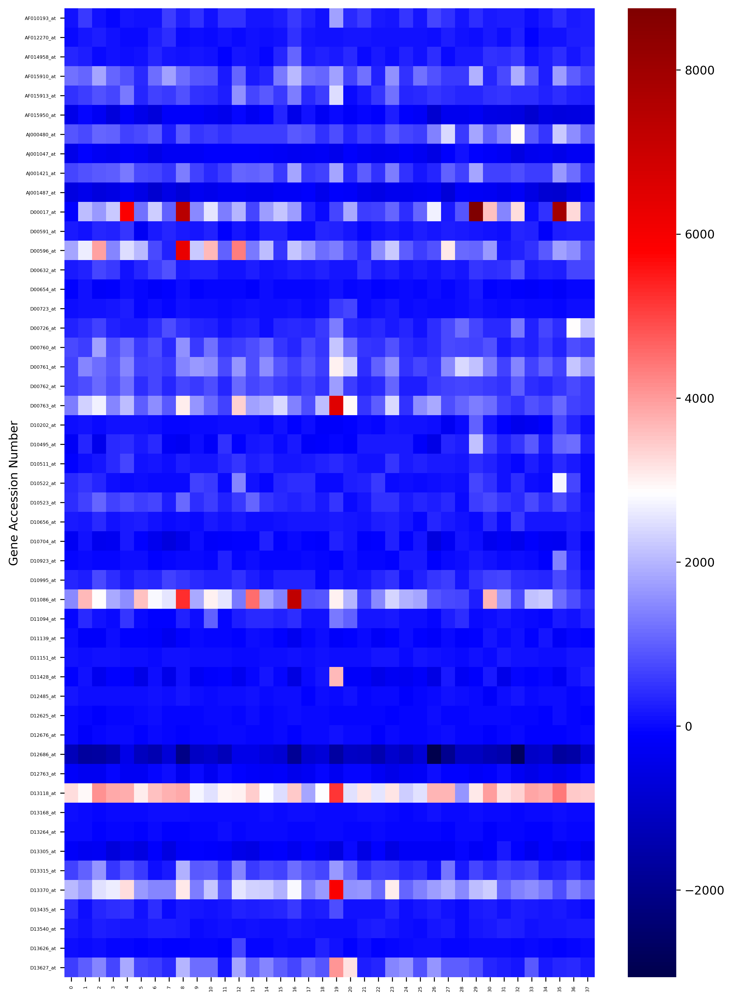
      <figcaption>Heat map for gene 150~200.
      </figcaption> 
    </figure>

The y-axis are all the samples in the training set, and the x-axis are 50 gene expression in these samples. As you may notice, it's very hard to classified them into two different cancer types by eyes, as 1) only 50/7129 gene are shown and 2) some of the gene are not determinants of cancer and show similar expression across types. Thus, we need to apply machine learning methods to help us do classification.


In the following part, we use two different methods to classified the cancers: logistic regression(supervised) and k-mean clustering(unsupervised). The logic behind these two methods are already clearly explained in lecture. Please review class lecture if any part of the algorithm is confusing to you.


### Logistic Regression

```python
# fit the model
clf = LogisticRegression().fit(X_train_scl, y_train.iloc[:,1])
```


```python
predict_y = clf.predict(X_test_scl)

# get the predicted probability of the testing set
prob = clf.predict_proba(X_test_scl)[:,1]
```


```python
auroc = roc_auc_score(y_test.iloc[:,1], prob)
print("auroc score is", auroc)
aupr = average_precision_score(y_test.iloc[:,1], prob)
print("aupr score is", aupr)
```

    auroc score is 0.9928571428571428
    aupr score is 0.9901360544217686


```python
# Plot the confusion matrix 

labels = ['ALL', 'AML']
cm_km = confusion_matrix(y_test.iloc[:,1], predict_y)

ax = plt.subplot()
sns.heatmap(cm_km, annot=True, ax = ax, fmt='g', cmap='Reds') 

ax.set_xlabel('Predicted labels')
ax.set_ylabel('True labels') 
ax.set_title('Logistic Regression Confusion Matrix') 
ax.xaxis.set_ticklabels(labels) 
ax.yaxis.set_ticklabels(labels, rotation=360);
```


    
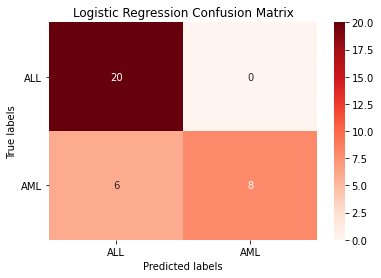
    


```python
# get the binary parameters for plotting ROC and PR curve

fpr, tpr, thresholds1 = roc_curve(y_true = y_test.iloc[:,1], y_score = prob) 
precision, recall, thresholds2 = precision_recall_curve(y_true = y_test.iloc[:,1], probas_pred = prob)
```


```python
plt.plot(fpr, tpr, marker='.', label='Logistic')
plt.xlabel('False Positive Rate')
plt.ylabel('True Positive Rate')
plt.title('ROC Curve')
```


    Text(0.5, 1.0, 'ROC Curve')


    
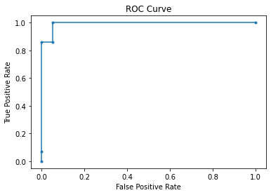
    


```python
plt.plot(recall, precision, marker='.', label='Logistic')
plt.xlabel('recall')
plt.ylabel('precision')
plt.title('PR Curve')
```


    Text(0.5, 1.0, 'PR Curve')


    
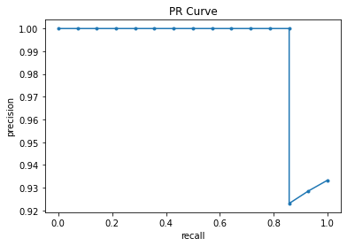
    


### K-means Clustering


```python
kmeans = KMeans(n_clusters=2, random_state=0).fit(X_train_scl)
km_pred = kmeans.predict(X_test_scl)

print('K-means accuracy:', round(accuracy_score(y_test.iloc[:,1], km_pred), 3))

cm_km = confusion_matrix(y_test.iloc[:,1], km_pred)

ax = plt.subplot()
sns.heatmap(cm_km, annot=True, ax = ax, fmt='g', cmap='Greens') 

# labels, title and ticks
ax.set_xlabel('Predicted labels')
ax.set_ylabel('True labels') 
ax.set_title('K-means Confusion Matrix') 
ax.xaxis.set_ticklabels(labels) 
ax.yaxis.set_ticklabels(labels, rotation=360);
```

    K-means accuracy: 0.294


    
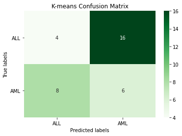
    


As we can see from the confusion matrix, logistic regression gives higher percent of correct classification. Also, compared the accuracy of these two methods, we can see that logistic regression is much more accurate than k-mean clustering, as supervised machine learning usually gives more accurate results than unsupervised. 

Above is a simple example of how to use gene expression data in cancer study. In real-world senerio, the RNA-seq data are expected to be more complex and the dataset be larger. More cleaning steps may be needed to protect patient's private information and more cancer types may be encountered. A careful consideration is needed when choosing model to exsure ideal performance.S

&nbsp;

***

## Conclusion

By now, you have learned:
  
  - The history of using RNA-Seq in cancer research
  - The logic behind RNA-Seq
  - Specific implementations of different algorithms and their pros and cons
  - How to analyze RNA-Seq data to achieve research objectives
  
Since its initial appearance in the early 2000s, RNA-Seq has constantly been used as a powerful tool in many frontier biological and medical researches. Its unique advantages and efficiency has helped researchers conquer obstacles that were once considered impossible to conquer. The technology world is growing rapidly, and constantly expanding possibilities for the research field. In the future, with the help the emerging Third Gen Sequencing technologies, RNA-Seq will potentially be used on a wider range of research topics.

At the end, we hope this handout can get you familiarized with RNA-Seq and its applications on identifying cancer markers. We also hope this tool can make you more confident and prepared in your future research. Thanks!

&nbsp;

***

## References

1. “About Metastatic Breast Cancer (MBC) | Verzenio (Abemaciclib).” Verzenio.com, 2019, www.verzenio.com/metastatic-breast-cancer.

2. Ashwani. “Gene Expression Classification.” Kaggle.com, 24 Apr. 2020, www.kaggle.com/iashwani/gene-expression-classification. Accessed 14 Dec. 2020. 

3. Cancer Support Community. “Metastatic Breast Cancer | Cancer Support Community.” Www.Cancersupportcommunity.org, www.cancersupportcommunity.org/metastatic-breast-cancer.

4. Chu, Yongjun, and David R. Corey. “RNA Sequencing: Platform Selection, Experimental Design, and Data Interpretation.” Nucleic Acid Therapeutics, vol. 22, no. 4, Aug. 2012, pp. 271–274, 10.1089/nat.2012.0367. Accessed 10 Oct. 2019.

5. Crawford, Chris. “Gene Expression Dataset (Golub et Al.).” Kaggle.com, 8 Aug. 2017, www.kaggle.com/crawford/gene-expression.

6. McAnena, Peter, et al. “Circulating MicroRNAs MiR-331 and MiR-195 Differentiate Local Luminal a from Metastatic Breast Cancer.” BMC Cancer, vol. 19, no. 1, 10 May 2019, 10.1186/s12885-019-5636-y.

7. Mendonca, Dalmo. “Biology Genius – The Central Dogma.” Genius, 2014, genius.com/Biology-genius-the-central-dogma-annotated.

8. “Oncogenes: Image Details - NCI Visuals Online.” Visualsonline.Cancer.Gov, visualsonline.cancer.gov/details.cfm?imageid=2351. Accessed 9 Dec. 2020.

9. Petti, Allegra A., et al. “A General Approach for Detecting Expressed Mutations in AML Cells Using Single Cell RNA-Sequencing.” Nature Communications, vol. 10, no. 1, 14 Aug. 2019, 10.1038/s41467-019-11591-1. Accessed 14 Dec. 2020.

10. Riester, Scott M., et al. “Hypoxia-Related MicroRNA-210 Is a Diagnostic Marker for Discriminating Osteoblastoma and Osteosarcoma.” Journal of Orthopaedic Research: Official Publication of the Orthopaedic Research Society, vol. 35, no. 5, 1 May 2017, pp. 1137–1146, pubmed.ncbi.nlm.nih.gov/27324965/, 10.1002/jor.23344.

11. “RNA-Seq vs Microarrays | Compare Technologies.” Www.Illumina.com, www.illumina.com/science/technology/next-generation-sequencing/microarray-rna-seq-comparison.html.

12. Togni, Marco, et al. “Identification of the NUP98-PHF23 Fusion Gene in Pediatric Cytogenetically Normal Acute Myeloid Leukemia by Whole-Transcriptome Sequencing.” Journal of Hematology & Oncology, vol. 8, no. 69, 12 June 2015, www.ncbi.nlm.nih.gov/pmc/articles/PMC4467064/, 10.1186/s13045-015-0167-8.


