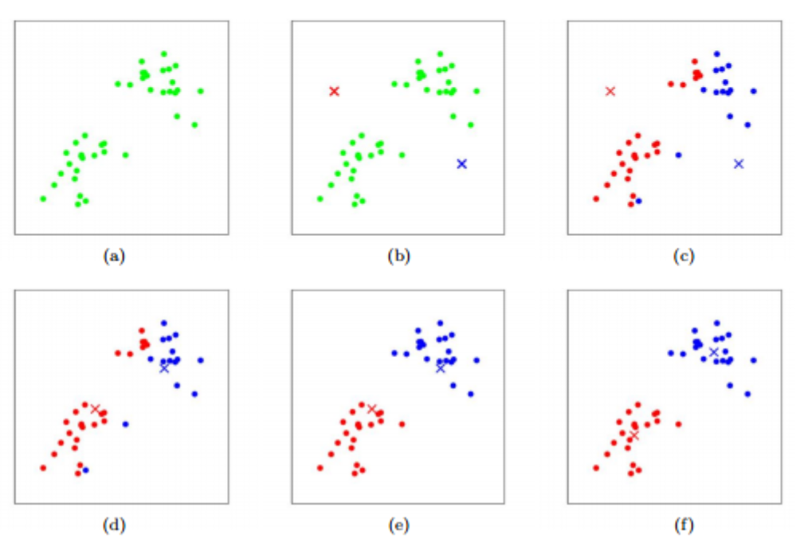
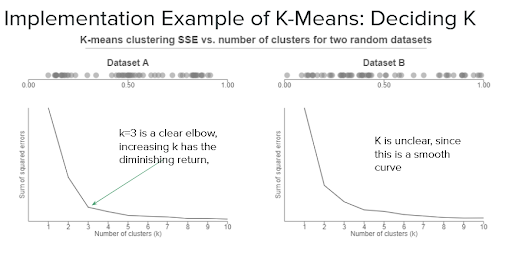
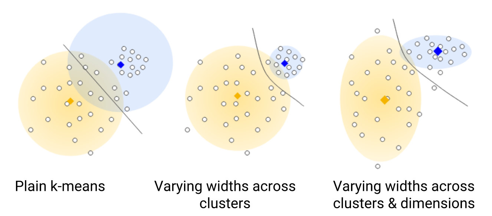

# K-Means-Intros, Algorithms, and Limitations


K-Means Clustering: 
1. [Introduction](#1)
2. [Algorithm](#2)
3. [Implementations](#3)
4. [Limitations and Advantages](#4)

## 1. Introduction<a name="1"></a>
**K-means clustering** is a **clustering** algorithm that partitions n objects into **k** groups in which each object belongs to the cluster with the nearest **mean** (aka. cluster centroid). In bioinformatics, K-means can be used to find the genes that share common expression patterns across different samples and the patients that share similar gene expression patterns, etc. We will show an example of the second application in the following sections. Compared to other clustering methods, K-means clustering can work with large datasets in an efficient runtime.

## 2. Algorithm<a name="2"></a>
In a nutshell, K-means clustering begins with randomly selected centroids (graph b), assigns objects to the closest cluster (graph c), updates the centroids based on the current assignment of objects (graph d), and repeats the previous two steps (graph e and f) until it reaches convergence.


The pseudocode of K-means clustering is as follows:
```
kmeans(X: {x_1,x_2,...,x_n}, k)
	centroids: {c_1,c_2,...,c_k} = random_points(k)     \\randomly initialize k centroids
	Y: {y_1,y_2,...,y_n} = new list(n)                  \\initialize the output list
	while the clustering changes: 
		for x_i in X:
			y_i = closest_centroid(centroids,x_i)       \\find the closest centroid for each data point
		for c_i in centroids:
			c_i = update_centroid(Y)                    \\update each centroid based on current assginment
    return Y
```

## 3. Implementation<a name="3"></a>
With a given dataset, we could perform K-Means clustering easily through the steps below:
1. Normalizing the raw data
2. Choosing a statistically reasonable k: Elbow Method
3. Initializing Centroids
4. Code Implementation
5. Visualization (Plotting) of the Clustering Results

### 3.1. Normalizing the raw data
An important step we have to do before we actually use k means clustering to process our data is normalization. 


### 3.2. Choosing a statistically reasonable K (the number of clusters): Elbow Method
There are a number of ways to do this, but a more common method is the elbow method. 
What elbow method does is essentially running k-means with a range of values of k, for example, from 1 to 10, and then we calculate and plot the sum of squared errors with each respecting k number in a line chart. Lastly, the elbow point yields some of the best selections. We can do this whole process with pre-installed packages such as the KelbowVisulizer in python and wssplot in R. 

See an example of Elbow Plot below:



Example of Using Elbow Method to Decide K. 

Robert Gove, “Using the elbow method to determine the optimal number of clusters for k-means clustering”, 2017, https://bl.ocks.org/rpgove/0060ff3b656618e9136b

The two graphs are the line graphs of the sum of squared errors with respect to their k numbers for two randomly generated datasets. The elbow point is the point where the sum of errors begins decreasing slowly. 
As we can see, a number of 3 would be a good K selection. 

#### 3.3.1. Initializing centroids
The performance of k-means clustering relies on good initial centroids. Bad initialization may end up getting bad clusters. In the example of the graph below, if at least two of the initial centroids chosen happened to be in the bottom cluster then the resulting solution will be very far from the true solution! (Both green and red clusters are actual one cluster)  
There is no built-in mechanism to correct for initial wrong starting points. One may run multiple iterations for selecting good starting points even though it’s costly. That is, re-iterating the algorithm and initialization of centroids multiple times and choose the initialization with small intracluster distance and large intercluster distance.(Satyam Kumar, 2020)


Clusters Beginning with a Bad Initialization.

Jianpeng Qi, Yanwei Yu et al, “An Effective and Efficient Hierarchical K-means Clustering Algorithm”, 2017, Research Gate, https://www.researchgate.net/figure/Example-of-clusters-begins-with-a-bad-initialization_fig1_319271749

#### 3.3.2. K-Means++ methods for selecting good initialization points
Spreading out the initial centroids is a worthy objective for selecting good initialization, given that initial centroids close to each other often give bad results.

Here are general steps:
1, choose the first centroid randomly
2, Calculate distance of all points x_i from all of the previously selected centroids c_j. d_i should be the minimum value of distances between x_i and c_j, where j =  h, 1 ≤ h ≤ m. m is the number of total previously selected centroids.
3, Select the data points from the data set as a new centroid. The probability of any data point in the data setx_i is chosen is proportional to d_i, which is the minimum value in step2.  
4, repeat step2 and step3 until k centroids are selected. (Charles Zaiontz, 2016)

The method aims to push the centroids such that they can be as far from one another as possible, overlaying as much of the occupied data space. (David Arthur and Sergei Vassilvitskii, 2006)

### 3.4. Code Implementation
As a comparably matured clustering method, there are a number of ways to implement the K-Means algorithm in codes, such as using python, R, or Matlab. Here, a python implementation is shown:

```
import numpy as np
from sklearn.cluster import KMeans
import matplotlib.pyplot as plt

data = np.array() #data initialization, needs to be an array
kmeans = KMeans(n_clusters=2) #initialize number of clusters, K
kmeans.fit_predict(data) #fit data points with kmeans
```

Requirement: Python 3.8 (as Python 3.9 would not currently work). sklearn package.  

The exact low-level algorithm is pretty self-explanatory:
a. Start with a data array (np).
b. Initialize the kmeans with the number of clusters of choice.
c. Fit the data into the kmeans. 

### 3.5. Visualization (Plotting) of the Clustering Results
For plotting, each data points’ cluster labels will be stored in kmeans.labels_ (with a small underline at the end). You can use tools such as matplotlib for scatter plot, as shown in the example below:

```
import numpy as np
from sklearn.cluster import KMeans
import matplotlib.pyplot as plt

data = np.array() #data initialization, needs to be an array
kmeans = KMeans(n_clusters=2) #initialize number of clusters, K
kmeans.fit_predict(data) #fit data points with kmeans


plt.scatter(data[:,0], data[:,1], s = 10, c = kmeans.labels_, cmap='rainbow')
#2D arrays of data coordinates[[x, y]]

plt.title('Clusters of Coordinates (Dataset1, KMean)')
plt.xlabel('x')
plt.ylabel('y')
plt.show()
```

## 4. Limitations and Advantages<a name="4"></a>
1. Limitations of K-means Clustering
2. Advantages of K-means Clustering

### 4.1. Limitations of K-means Clustering
1. One of the limitations is that the k value is chosen manually
2. When updating the centroids, the new mean vector can be deeply influenced by the outliers. Therefore, consider removing or clipping outliers before clustering.
3. the ratio of the standard deviation to the mean of distance between examples decreases as the number of dimensions increases. This convergence means k-means becomes less effective at distinguishing between examples as the num of dimensions increases. (unknown author, unknown date)


Curse of Dimensionality

Unknown author, “k-Means Advantages and Disadvantages”, unknown date, Machine Learning Crash Course, https://developers.google.com/machine-learning/clustering/algorithm/advantages-disadvantages 

### 4.2. Advantages of K-means Clustering
1. K-Means is in O(tkn) where n is the number of objects, k is the number of clusters, and t is how many iterations it takes to converge.  Compared to other clustering methods. Agglomerative hierarchical clustering is in O(n^3). If speed is your priority work, K-Means can work well with the large dataset. 

2. The ease of modifying the shape of k-means is another reason why it's powerful. In the left plot, No generalization, resulting in a non-intuitive cluster boundary. In the right plot, Besides different cluster widths, allow different widths per dimension, resulting in elliptical instead of spherical clusters, improving the result. (unknown author, unknown date)



Generalization of Kmeans

Unknown author, “k-Means Advantages and Disadvantages”, unknown date, Machine Learning Crash Course, https://developers.google.com/machine-learning/clustering/algorithm/advantages-disadvantages 

## 5. References<a name="5"></a>
Sheng Zhong, “Midterm2”, 2020, Beng183 FA20

Imad Dabbura, “K-means Clustering: Algorithm, Applications, Evaluation Methods, and Drawbacks”, towards data science, 2018, https://towardsdatascience.com/k-means-clustering-algorithm-applications-evaluation-methods-and-drawbacks-aa03e644b48a

Satyam Kumar, “Understanding K-Means, K-Means++ and, K-Medoids Clustering Algorithms”, towards data science, 2020, https://towardsdatascience.com/understanding-k-means-k-means-and-k-medoids-clustering-algorithms-ad9c9fbf47ca

Charles Zaiontz, “Initializing clusters via k-means++ algorithm”, Real Statistics Using Excel, 2016, https://www.real-statistics.com/multivariate-statistics/cluster-analysis/initializing-clusters-k-means/

David Arthur and Sergei Vassilvitskii, “k-means++:  The Advantages of Careful Seeding”, Stanford InfoLab Publication Server, http://ilpubs.stanford.edu:8090/778/1/2006-13.pdf

Unknown author, “k-Means Advantages and Disadvantages”, unknown date, Machine Learning Crash Course, https://developers.google.com/machine-learning/clustering/algorithm/advantages-disadvantages
