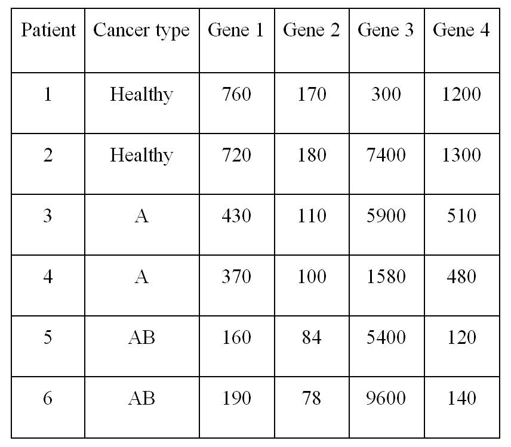
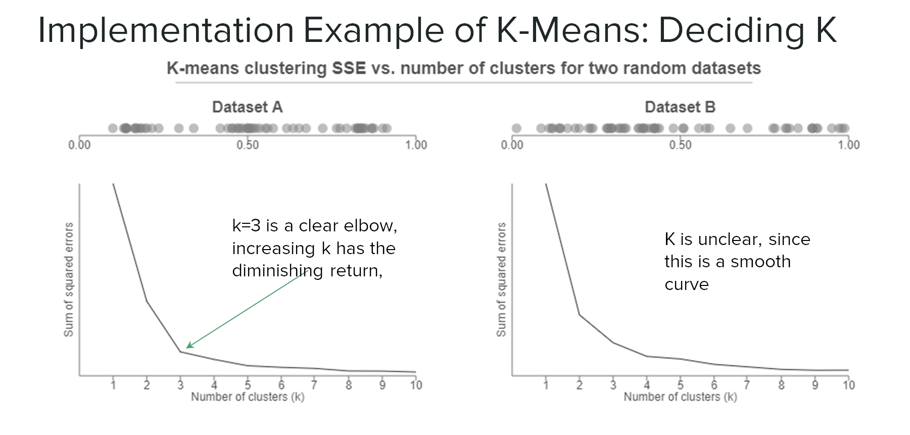
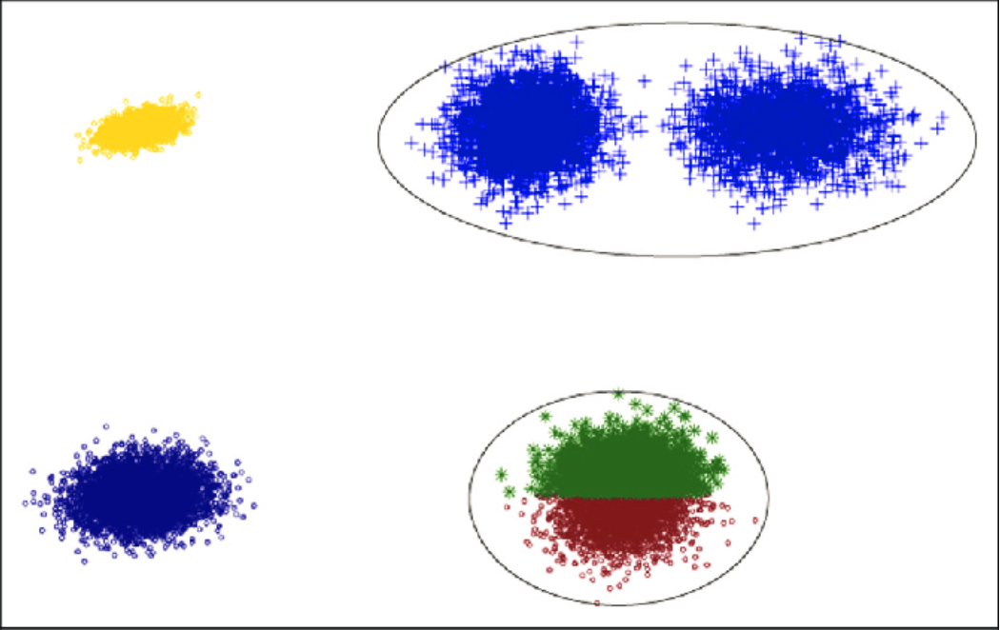
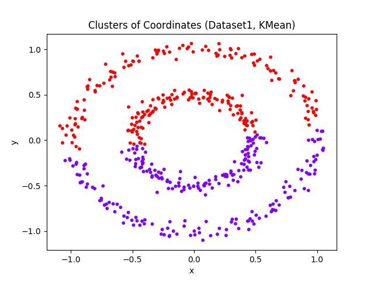
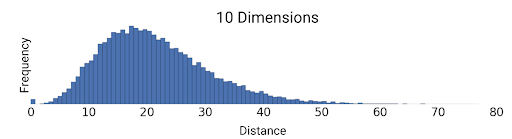
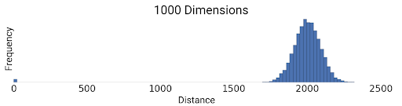

# K-Means Clustering


K-Means Clustering: 
1. [Introduction](#1)
2. [Algorithm](#2)
3. [Implementations](#3)
4. [Limitations and Advantages](#4)

## 1. Introduction<a name="1"></a>
**K-means clustering** is a **clustering** algorithm that partitions n objects into **k** groups in which each object belongs to the cluster with the nearest **mean** (aka. cluster centroid). In bioinformatics, K-means can be used to find the genes that share common expression patterns across different samples and the patients that share similar gene expression patterns, etc. We will show an example of the second application in the following sections. Compared to other clustering methods, K-means clustering can work with large datasets in an efficient runtime.

## 2. Algorithm<a name="2"></a>
In a nutshell, K-means clustering begins with randomly selected centroids (graph b), assigns objects to the closest cluster (graph c), updates the centroids based on the current assignment of objects (graph d), and repeats the previous two steps (graph e and f) until it reaches convergence.


Figure 1: An Illustration of Kmeans Algorithm. **Figure by Sheng Zhong, “Beng183 FA20 Lecture 15 Machine Learning, part 2”, (2020)**.

The pseudocode of K-means clustering is as follows:
```
kmeans(X: {x_1,x_2,...,x_n}, k)
    centroids: {c_1,c_2,...,c_k} = random_points(k)     		\\randomly initialize k centroids
	Y: {y_1,y_2,...,y_n} = new list(n)           			\\initialize the output, y_1 will be x_1's cluster
	while the clustering changes: 
		for x_i in X:
			y_i = closest_centroid(centroids,x_i)       	\\find the closest centroid for each data point
		for c_j in centroids:
			c_j = update_centroid(Y,c_j)                    \\update each centroid based on current assginment
    return Y
```
where `closet_centroid(centroids, x_i)` is a function that can find the closest centroid for `x_i` from the set of all centroids by calculating the euclidean distance. By assigning the return value of `closet_centroid(centroids, x_i)` to `y_i`, we assign the data `x_i` to the corresponding cluster. After we have found the closest centroid for each data point, the currect assignment of data points to clusters is stored in the output list `Y`. On the other hand, `update_centroid(Y,c_j)` is a funtion that can update the centroid `c_j` by calculating the average of all data points that are currently assigned to the cluster cooresponding to `c_j`. 

## 3. Implementation<a name="3"></a>
With a given dataset, we could perform K-Means clustering easily through the steps below:
1. [Standardizing the Raw Data](#3.1)
2. [Choosing a Statistically Reasonable k: Elbow Method](#3.2)
3. [Initializing Centroids](#3.3)
4. [Code Implementation](#3.4)
5. [Visualization (Plotting) of the Clustering Results](#3.5)

### 3.1. Standardizing the Raw Data<a name="3.1"></a>
An important step we have to do before we actually use k means clustering to process our data is standardization. 


Table 1: Gene expression levels of four genes in patients with different cancer subtypes. **Table by Sheng Zhong, “Midterm2”, 2020, Beng183 FA20**.

Taking the question 7 from midterm 2 (Sheng Zhong, Beng183 FA2020) as an example, given the  data above, our goal is to see how well the expression of these four genes can classify patients. We can see that the expression level of gene 3 is much greater than other genes in almost all samples. When we try to perform k-means clustering on this data, this difference in expression levels will make gene 3 weigh too much when calculating the distances and finding the average of a cluster. 

The function used to calculate the euclidean distance between patient P_i=(p1_i, p2_i, p3_i, p4_i) and centroid C_j=(c1_j, c2_j, c3_j, c4_j) is 
```
Distance(P_i, C_j)= [ (p1_i-c1_j)^2 + (p2_i-c2_j)^2 + (p3_i-c3_j)^2 + (p4_i-c4_j)^2 ]^(1/2)
```
The function used to find the average of cluster C_j containing patients P_i,...,P_k is 
```
update_centroid(C_j)=(mean(p1_i,...,p1_k), mean(p2_i,...,p2_k), mean(p3_i,...,p3_k), mean(p4_i,...,p4_k))
```
Let's think about what the functions above tell us. The euclidean distance is based on all four genes, while the distance p3_i-c3_j is likely to be greater than other three distance because of the larger range of the expression level of gene 3. So if a patient P_i has expression level p3_i such that p3_i-c3_j is small, then it will be assign to the cluster of C_j no matter if the differences p1_i-c1_j, p2_i-c2_j, or p4_i-c4_j is small. 

As a result, the final clusters will be based more on patterns in gene 3 while ignoring patterns in other genes (Lakshmanan 2019). However, we want to see how these four genes together can help identify the cancer type, instead of merely gene 3. Therefore, we have to standardize the raw data to transform all variables to comparable scales so that all genes have the same importance (Lakshmanan 2019).

We can standarize our data easily using sklearn package in Python (Lakshmanan 2019). 
```python
from sklearn.preprocessing import StandardScaler
data = np.array() 		#data initialization, needs to be an array
scaler = StandardScaler() 	#scaler initialization
data_scaled = scaler.fit_transform(data)	#standardize the data using the standard scaler
```


### 3.2. Choosing a Statistically Reasonable K: Elbow Method<a name="3.2"></a>
There are a number of ways to do this, but a more common method is the elbow method. 
What elbow method does is essentially running k-means with a range of values of k, for example, from 1 to 10, and then we calculate and plot the sum of squared errors with each respecting k number in a line chart. Lastly, the elbow point yields some of the best selections. We can do this whole process with pre-installed packages such as the KelbowVisulizer in python and wssplot in R. 

See an example of Elbow Plot below:



Figure 2: Example of Using Elbow Method to Decide K. **Figure by Robert Gove, “Using the elbow method to determine the optimal number of clusters for k-means clustering” (2017)**.

The two graphs are the line graphs of the sum of squared errors with respect to their k numbers for two randomly generated datasets. **The elbow point is the point where the sum of errors begins decreasing slowly**. 
As we can see, for Dataset A, a number of 3 would be a good K selection where the slope of the curve changes rapidly. However, for Dataset B, there is not a clear elbow point since the curve is rather comparably smooth. In this case, we might need to try other methods of K selection (e.g. the silhouette score) (Gove, 2017).

### 3.3. Initializing Centroids<a name="3.3"></a>
The performance of k-means clustering relies on good initial centroids. Bad initialization may end up getting undesirable clusters. We will briefly talk about how to select good initial centroids.
#### 3.3.1. Bad Initial Centroids
In the example of the graph below, if at least two of the initial centroids chosen happened to be in the bottom cluster then the resulting solution will be very far from the true solution! (Both green and red clusters are actual one cluster).
There is no built-in mechanism to correct for initial wrong starting points. One may run multiple iterations for selecting good starting points even though it’s costly. That is, re-iterating the algorithm and initialization of centroids multiple times and choose the initialization with small intracluster distance and large intercluster distance (Satyam Kumar, 2020).


Figure 3: Clusters Beginning with a Bad Initialization. **Figure by Jianpeng Qi, Yanwei Yu et al, “An Effective and Efficient Hierarchical K-means Clustering Algorithm”, Research Gate (2017)**.

#### 3.3.2. K-Means++ Methods for Selecting Good Initialization Points
Spreading out the initial centroids is a worthy objective for selecting good initialization, given that initial centroids close to each other often give bad results.

Here are general steps:
1. Choose the first centroid randomly.
2. Calculate distance of all points x_i from all of the previously selected centroids c_j. d_i should be the minimum value of distances between x_i and c_j, where j =  h, 1 ≤ h ≤ m. m is the number of total previously selected centroids.
3. Select the data points from the data set as a new centroid. The probability of any data point in the data setx_i is chosen is proportional to d_i, which is the minimum value in step2.  
4. Repeat step2 and step3 until k centroids are selected (Charles Zaiontz, 2016). 

The method aims to push the centroids such that they can be as far from one another as possible, overlaying as much of the occupied data space (David Arthur and Sergei Vassilvitskii, 2006). 

### 3.4. Code Implementation<a name="3.4"></a>
As a comparably matured clustering method, there are a number of ways to implement the K-Means algorithm in codes, such as using python, R, or Matlab. Here, a python implementation is shown:

```python
import numpy as np
from sklearn.cluster import KMeans
import matplotlib.pyplot as plt

data = np.array() 		#data initialization, needs to be an array
kmeans = KMeans(n_clusters=2)	#initialize number of clusters, K
kmeans.fit_predict(data) 	#fit data points with kmeans
```

Requirement: Python 3.8 (as Python 3.9 would not currently work). sklearn package.  

The exact low-level algorithm is pretty self-explanatory:
a. Start with a data array (np).
b. Initialize the kmeans with the number of clusters of choice.
c. Fit the data into the kmeans. 

### 3.5. Visualization (Plotting) of the Clustering Results<a name="3.5"></a>
For plotting, each data points’ cluster labels will be stored in kmeans.labels_ (with a small underline at the end). You can use tools such as matplotlib for scatter plot, as shown in the example below:

```python
import numpy as np
from sklearn.cluster import KMeans
import matplotlib.pyplot as plt

data = np.array() 		#data initialization, needs to be an array
kmeans = KMeans(n_clusters=2) 	#initialize number of clusters, K
kmeans.fit_predict(data) 	#fit data points with kmeans


plt.scatter(data[:,0], data[:,1], s = 10, c = kmeans.labels_, cmap='rainbow')
#2D arrays of data coordinates[[x, y]]

plt.title('Clusters of Coordinates (Dataset1, KMean)')
plt.xlabel('x')
plt.ylabel('y')
plt.show()
```

Example scatter plot:



Figure 4: Scatter Plot Example Using Python with a Data Size of 500.

## 4. Limitations and Advantages<a name="4"></a>
1. [Limitations of K-means Clustering](#4.1)
2. [Advantages of K-means Clustering](#4.2)

### 4.1. Limitations of K-means Clustering<a name="4.1"></a>
1. One of the limitations is that the k value is chosen manually
2. When updating the centroids, the new mean vector can be deeply influenced by the outliers. Therefore, consider removing or clipping outliers before clustering.
3. the ratio of the standard deviation to the mean of distance between examples decreases as the number of dimensions increases. This convergence means k-means becomes less effective at distinguishing between examples as the num of dimensions increases (“k-Means Advantages and Disadvantages”, Machine Learning Crash Course). 





Figure 5: Curse of Dimensionality. **Figure by Unknown author, “k-Means Advantages and Disadvantages”, unknown date, Machine Learning Crash Course**.

### 4.2. Advantages of K-means Clustering<a name="4.2"></a>
1. K-means is in O(tkn) where n is the number of objects, k is the number of clusters, and t is how many iterations it takes to converge. The step that we assign the data to its closest cluster takes O(kn) in the worst case. This is because for each data x_i, we have to compute its Euclidean distance to each centroid c_j, and assign the data to the cluster withh the shortest distance. For each data x_i, we calculate k euclidean distances since there are k centroids. Since there are n data points, generating a new cluster assignment takes O(kn). Since we need t iterations until we finally reach the convergence, i.e. the final cluster assignment, the algorithm takes O(tkn) (Pinocchio, StackExchange). In most cases, t <<n, k << n, so we may consider the runtime of k-means algorithm as linear runtime. Other algorithms, such as agglomerative hierarchical clustering which takes O(n^3), are not as efficient as k-means. So if you are working on large dataset, i.e. n is large, k-means clustering works more efficiently compared to other clustering methods.

2. The ease of modifying the shape of k-means is another reason why it's powerful. In the left plot, No generalization, resulting in a non-intuitive cluster boundary. In the right plot, Besides different cluster widths, allow different widths per dimension, resulting in elliptical instead of spherical clusters, improving the result (“k-Means Advantages and Disadvantages”, Machine Learning Crash Course). 


Figure 6: Generalization of Kmeans. **Figure by Unknown author, “k-Means Advantages and Disadvantages”, unknown date, Machine Learning Crash Course**.

3. K-means algorithm always converges. This is because there are only a finite number of possible cluster assignments. The k-means algorithm generates a new cluster assignment strictly better than the old assignment for each iteration, so each assignment is only passed through once, and you cannot possibly come back to one cluster assignment again. Therefore k-means algorithm will not run forever (Alex R, StackExchange). 

## 5. References<a name="5"></a>
Sheng Zhong, “Beng183 FA20 Lecture 15 Machine Learning, part 2”, (2020)

Sheng Zhong, “Midterm2”, 2020, Beng183 FA20

Swetha Lakshmanan, “How, When, and Why Should You Normalize / Standardize / Rescale Your Data?”, Towards AI, 2019, https://towardsai.net/p/data-science/how-when-and-why-should-you-normalize-standardize-rescale-your-data-3f083def38ff

Robert Gove, “Using the elbow method to determine the optimal number of clusters for k-means clustering”, 2017, https://bl.ocks.org/rpgove/0060ff3b656618e9136b

Jianpeng Qi, Yanwei Yu et al, “An Effective and Efficient Hierarchical K-means Clustering Algorithm”, 2017, Research Gate, https://www.researchgate.net/figure/Example-of-clusters-begins-with-a-bad-initialization_fig1_319271749

Satyam Kumar, “Understanding K-Means, K-Means++ and, K-Medoids Clustering Algorithms”, towards data science, 2020, https://towardsdatascience.com/understanding-k-means-k-means-and-k-medoids-clustering-algorithms-ad9c9fbf47ca

Charles Zaiontz, “Initializing clusters via k-means++ algorithm”, Real Statistics Using Excel, 2016, https://www.real-statistics.com/multivariate-statistics/cluster-analysis/initializing-clusters-k-means/

David Arthur and Sergei Vassilvitskii, “k-means++:  The Advantages of Careful Seeding”, Stanford InfoLab Publication Server, http://ilpubs.stanford.edu:8090/778/1/2006-13.pdf

Unknown author, “k-Means Advantages and Disadvantages”, unknown date, Machine Learning Crash Course, https://developers.google.com/machine-learning/clustering/algorithm/advantages-disadvantages

Pinocchio, "Run time analysis of the clustering algorithm (k-means)", StackExchange, https://stats.stackexchange.com/questions/89229/run-time-analysis-of-the-clustering-algorithm-k-means

Alex R, "why K-means Algorithm will terminate in a finite number of iterations?", StackExchange, https://stats.stackexchange.com/questions/181319/why-k-means-algorithm-will-terminate-in-a-finite-number-of-iterations
