# Proteomic Applications of Supervised Learning
*Group 26: Veronika Pister, Rohit Kandula, Aditya Chandrasekar*\
*BENG 183 Fall 2020 Final Project*\
*University of California, San Diego*\

Contents:
1. [Supervised Learning Overview](#Supervised-Learning-in-Bioinformatics)\
    a. [Problem Domains](#Problem-Domains)\
    b. [Supervised Learning](#Supervised-Learning)\
    c. [Feature Generation & Selection](#Feature-Generation-&-Selection)
2. [Protein Function Prediction](#Predicting-Protein-Function)\
    a. [Framing the Problem with Gene Ontology](#Framing-the-Problem-with-Gene-Ontology)\
    b. [Features for Protein Function](#Features-for-Protein-Function)\
    c. [Training Algorithms](#Training-Algorithms)

3. [Protein Structure Prediction](#Structure-Prediction)\
    a. [Introduction to Protein Folding](#Introduction-to-Protein-Folding)\
    b. [Possible Approaches](#Possible-Approaches)\
    c. [AlphaFold](#AlphaFold)\
    d. [Has the Protein Folding Problem Been Solved?](#Has-The-Protein-Folding-Problem-Been-Solved?)
4. [Interactome Prediction](#Interactome-Prediction)\
    a. [Biology of the Interactome](#Biology-of-the-Interactome)\
    b. [Current Approaches](#Current-Approaches)\
    c. [Computational Approaches](#Computational-Approaches)
5. [References](#Works-Cited)

---

## Supervised Learning in Bioinformatics

### Problem Domains
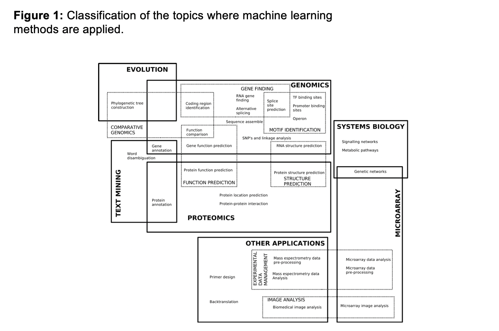
*[[1]](#Works-Cited) Fig 1: applications of Machine Learning within the bioinformatics problem domain*

Figure 1 depicts the problem domains within bioinformatics which supervised learning can be applied to. Many of these problems have been introduced throughout the course. This figure gives an idea of how impactful supervised learning is and can continue to be in the field of bioinformatics. In the center of the figure, a plethora of proteomics problems are described. The focus of this chapter will be supervised learning in functional prediction, structure prediction, interaction prediction, and the interplay between all three.

### Supervised Learning

*[Fig 2](https://www.javatpoint.com/supervised-machine-learning): Supervised learning follows the general workflow displayed above. The left half of the image depicts the labeled data which characterizes supervised learning.*

Supervised learning describes the machine learning algorithms which train on labeled input data in order to classify or otherwise analyze testing data. This is in opposition to unsupervised learning which does not interact with labeled data. In previous chapters, we have already discussed the following supervised algorithms: k nearest neighbors (kNN), linear regression, and support vector machines. Some other common supervised learning algorithms are naive bayes, decision trees, and most recently neural networks.

1. **Naive Bayes**: These algorithms assume a strong independence between different features of input data. All methods dubbed “naive bayes” are relatively simple probabilistic algorithms which are inspired by the Bayes’ theorem.
2. **Decision trees**: Decision tree learning algorithms depend on a predictive decision tree to anticipate the value of a variable of interest.
3. **Neural Networks**: Neural networks computationally mimic the convergence of neurons within the human brain. Famously, neural networks are a complex sequence of algorithms to reduce features through a progression of “artificial neurons” and weighted edges which represent the propagating neural signals.

For the purpose of this chapter, we can assume all of these algorithms are a black box with specific input and output formats. The question remains: how can we use supervised learning algorithms to tackle large scale bioinformatics problems? The answer is in formatting input data. The real effort of machine learning in bioinformatics is learning how to frame input data in the most advantageous way. This process is called “feature selection”.

### Feature Generation & Selection
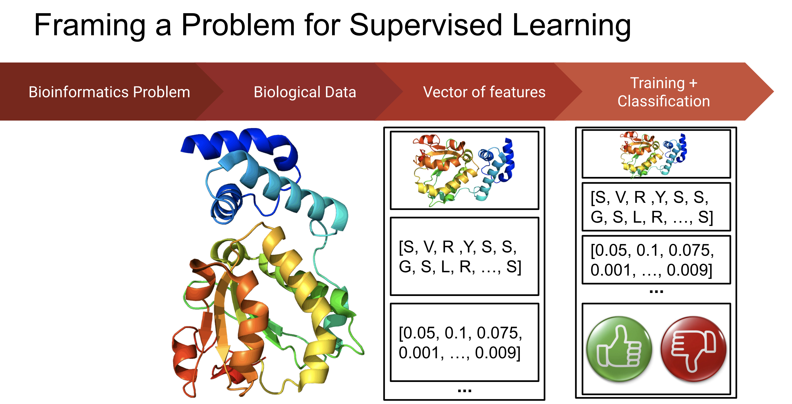
*Fig 3: This shows the translation of biological data into a vector of features.*

At a high level, feature generation is the act of turning input data into an interpretable vector for algorithmic consumption. Feature generation is a very complex process to fully describe. In its most simplistic form, it is choosing relevant quantifiable “features” of non quantifiable data. Take for example, a protein. To input a protein as training data into an algorithm, it must be reduced to key elements. For example, the amino acid sequence, the amino acid distribution, or the amino acid transitions can be used to represent a protein. Selecting the most useful features is another endeavour that requires extensive statistical analysis or manual expertise. Statistician George Box once sagely quipped "All models are wrong, but some are useful". This very much applies to feature selection [[2]](#Works-Cited). Once features have been decided, they are ogranized by a single vector for each variable of testing data.

---
## Predicting Protein Function

Because of the limitations of current biological techniques, we haven’t seen the same growth in protein function understanding as we’ve seen in protein discovery[[3]](#Works-Cited). There has been an exponential growth in databases such as DDBJ but classifying and understanding these entries have not yielded nearly as much growth. This is because techniques such as functional mutation analysis are too inefficient in terms of both time and data gathered. Protein function involves an incredibly complex interaction of biological pathways and particles that make this classification of function so difficult. This growing imbalance is why machine learning techniques in the area of protein function are so crucial. More specifically we’ll talk about the use of supervised learning algorithms in protein function prediction.

### Framing the Problem with Gene Ontology

Understanding protein function requires an in-depth knowledge of the various intersections between biological pathways and particles. As such it is important that there exists an accurate representation of protein function in terms of all areas of biological relevance. Gene ontology does just this by providing a comprehensive representation of gene encoding and gene products. It effectively divides protein function into three domains: molecular function, biological process, and cellular component. From these domains further hierarchical division down the line further represents a more encompassing low level representation of all interacting facets of gene encoding and gene products[[4]](#Works-Cited). This representation allows for a clear way in which to frame the protein function needing to be solved and where and how relevant features are present.

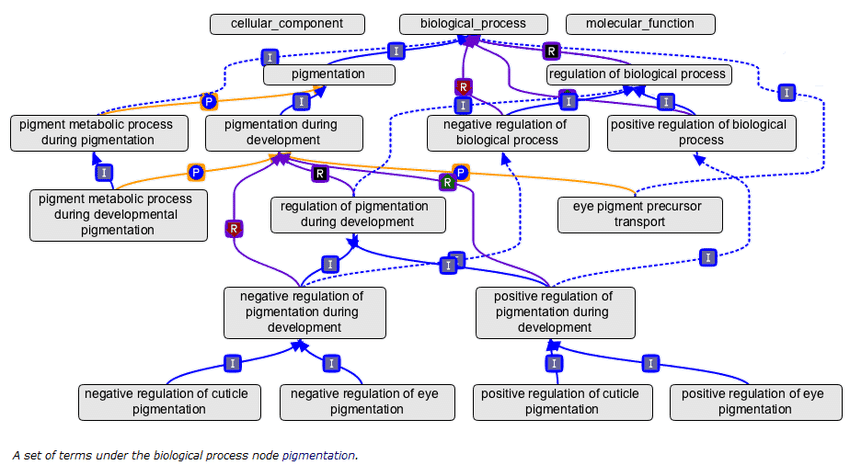
fig 4.[[4]](#Works-Cited)

### Features for Protein Function

With the use of supervised learning algorithms in solving protein function problems our training models require input data from which to train on. In order to do this, it is crucial that relevant features are selected, meaning features that are useful for characterizing protein functions. The models will use this data in the form of feature vectors to develop classifications with which to discriminate new input data. With proteins, typical features include amino acid sequences, physicochemical properties, and protein-protein interaction data[[3]](#Works-Cited). Physicochemical properties include data such as hydrophobicity, solubility and thermal denaturation properties. Protein-protein interaction networks model connections between protein in terms of cellular pathways and function.

#### Feature Engineering

Feature engineering involves the extraction of smaller sets of features from existing features sets or reducing the dimensionality of features all for the purpose of improving our model[[5]](#Works-Cited). It is important to note that features can be used in conjunction to improve our models. We will go over a few examples of feature extraction in protein function problems.

##### Feature Engineering Applications

###### Pseudo Amino Acid Composition
Current research has really focused on the use of sequence data in conjunction with other features, most notably physicochemical properties. A common protein sequence feature used is the Pseudo Amino Acid Composition[[6]](#Works-Cited). This is a feature vector of size [20+λ] that depicts the composition of the first 20 amino acids followed by sequence order information. The pseAAC has been used in conjunction with SVMs to classify conotoxin superfamilies[[7]](#Works-Cited).

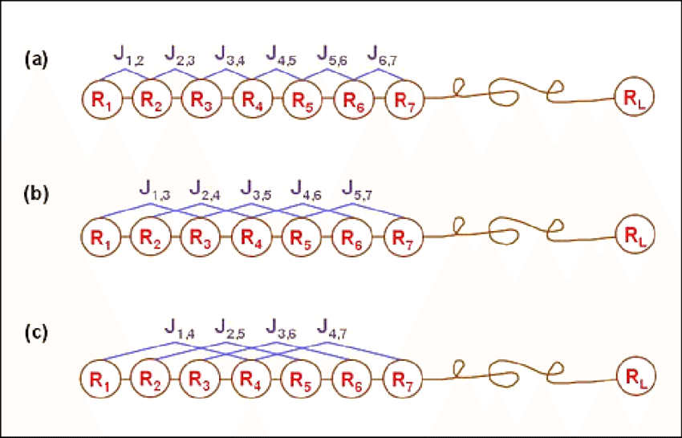
fig 5. [[8]](#Works-Cited)

###### Position Specific Scoring Matrix
Another common protein sequence feature used is the Position Specific Scoring Matrix. This is a matrix that indicates the level of conservation of amino acids at specific sequence positions. High scores in regions of the sequence could hint to some biological relation. One way the PSSM has been used in feature extraction is the development of the Pseudo-PSSM which was made by combining the pseAAC and the PSSM[[9]](#Works-Cited).

This feature extraction has been used in conjunction with SVM in a study on submitochondrial locations for the purpose of understanding biological function of proteins due to location specific mitochondrial function[[10]](#Works-Cited).

Jeong et Al. extracted further features sets from a PSSM in conjunction with other features[[11]](#Works-Cited). The first feature set was derived from averaged PSSM profiles over blocks where a PSSM was divided into 20 blocks of 20 features giving a 1x400 feature vector. Another feature set was derived using a similar technique but focusing on sequence domains with similar rates of conservation. A third 1x180 set was developed utilizing consensus sequences in conjunction with 9 physicochemical properties of hydrophobicity, isoelectric point, mess scale, hydrophobicity, hydrophilicity, polar, nonpolar, positive, and negative charge residues. And finally a fourth 1x980 set combining all three feature sets was made. After the utilization of training algorithms feature set 2 was found as most effective[[11]](#Works-Cited). These extractions are a good example of the versatility of feature extraction.

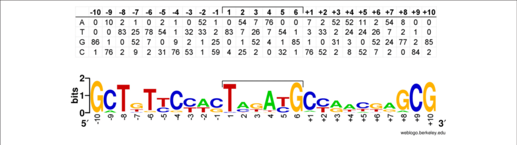
fig 6. [[12]](#Works-Cited)

##### Feature Selection

Feature Selection is an alternative approach to obtaining relevant feature sets. This process utilizes feature selection algorithms (FSA) to produce a smaller set of features by selecting features that are most suitable to the problem.[[13]](#Works-Cited) FSAs need to evaluate the performance of features in order to make this selection. These algorithms can involve statistical tests like ANOVA to evaluate features[[13]](#Works-Cited). A novel method called FrankSum was developed for protein function using the Wilcoxon-Rank Test p-value and correlation coefficient, to measure feature significance and feature redundancy respectively[[14]](#Works-Cited).

###### FSAs and Applications [[13]](#Works-Cited)

Filter methods: Use of statistical tests to evaluate features  such as FrankSum[[14]](#Works-Cited).

Wrapper method: Utilizes training algorithm in feature evaluation and was used in the classification of signaling proteins[[15]](#Works-Cited).

Embedded methods: Perform feature selection during model training and was used in the evaluation of sequence features in classification of enzyme function[[16]](#Works-Cited)

### Training Algorithms

After we’ve obtained a relevant set of features, we can then input these vectors into training algorithms in order to construct our models. All supervised learning algorithms can be used to solve protein function problems. We’ll go over a few algorithms and their application in protein function understanding.

#### SVM

Application: Classification of Enzyme function[[16]](#Works-Cited)

Support Vector Machines is a 2 group classification algorithm that from input data maps points and constructs a hyperplane with the purpose of maximizing the margin from the points.

fig 7. [[17]](#Works-Cited)

#### kNN

Application: Classification of proteins based on a similarity of function coefficient[[18]](#Works-Cited)

The k-Nearest Neighbor algorithm assumes proximity means similarity and as such there doesn’t exist a traditional training step. Rather, input data is classified based on classification of most of its k-neighbors.

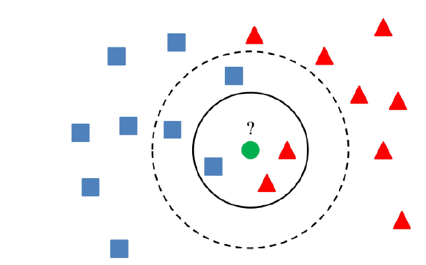
fig 8. [[19]](#Works-Cited)

#### Logistic Regression

Application: Scoring Gene Ontology Terms for a target protein[[18]](#Works-Cited)

Logistic Regression is used to classify data based on probability and as such involves predictive analysis. The probability of input data belonging to a certain classification is what the algorithm returns[[20]](#Works-Cited).

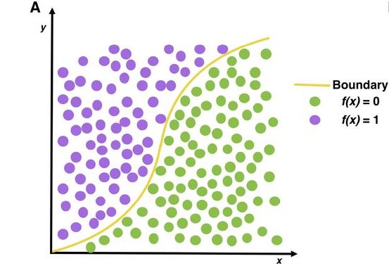
fig 9. [[21]](#Works-Cited)

#### Efficiency

The efficiency of these algorithms really depends on the type of input data and the type of problem. For example in the application of various classifiers in the problem of classifying yeast protein function, SVM and Random Forest seemed to outperform all other classifiers[[3]](#Works-Cited). Whereas just SVM seemed to be most efficient in classifying enzyme function[[22]](#Works-Cited).

---
## Structure Prediction

### Introduction to Protein Folding

From the aggregate body plan of mammals to the subtle chemical interactions of biological macromolecules, it becomes difficult to deny the deep links between biological structure and function. Our understanding of protein structure is no different, providing a model for studying biochemical structure. The three-dimensional structure of a protein can give us great insight into the protein’s function, and by being able to predict protein structure from amino acid sequence, we’d be able to deepen our understanding of the molecular biology pipeline: from the genetic code to amino acids to functional biological units. [[23]](#Works-Cited)

The problem of predicting three-dimensional structure from two-dimensional sequence is mathematically ill-defined -- there are far more possible three-dimensional structures than two-dimensional ones. However, biological molecules manage to find their configurations efficiently regardless, so there must rhyme and reason at the core of the mapping [[24]](#Works-Cited). Anfinsen’s dogma, the idea that the mapping from amino-acid sequence to three-dimensional structure is unique, further inspires us to try to pin this mapping down.

Since not every biological question is so well-defined (find a function mapping from sequence to structure), the applications of unsupervised learning to structure prediction provides an excellent toy example from which to understand the process of framing biological problems as supervised learning ones, and how to export advances of computer science to bioinformatics problems.

### Possible Approaches

Since the protein-folding problem is fundamental to our understanding of biology, there have been a variety of approaches towards solving the mapping problem, outlined below:

#### Brute-force Approaches

Brute-force approaches rely on raw computational power, and are the essence of the work done by Folding-at-home. By crowd-sourcing the computations, you hope that some of the sequences asked to crowd-fold will find a close solution at hand, by the law of large numbers. [[25]](#Works-Cited)

#### Physics-based Approaches

Protein-folding is fundamentally a chemical process -- one of trying to find the molecular conformation that minimizes free energy. Computational modelling and simulation can simulate these chemical interactions, at high computational cost. Past the physics -- other assessments of protein structure can be made based on understanding of biological motifs, depending heavily on domain-knowledge and a priori knowledge about protein folding. Although this method works for small molecules, it's too computationally expensive to scale. [[26]](#Works-Cited)

#### Statistical Approaches

We have plenty of data for empirically-verified protein folding patterns already, and so statistics can provide a powerful tool to generalize to new structures. On the way, difficult statistical questions arise: which patterns and secondary structures generalize, and which do not? These difficult questions about generalization lend themselves to abstracting statistics away into modern supervised learning approaches, which manage to pick up complex signals and learn to ignore noise if given appropriate data and time. [[27]](#Works-Cited)

Supervised Learning has lent itself extremely well to protein folding because of two reasons: the mapping between sequence and structure is complex, and we have lots of data from which to pick up signal from [[27]](#Works-Cited). This is where the magic has been in recent years, and what we'll be focusing on in showing the power of exporting supervised learning to a domain.

#### Combined Approaches

Most high-performing models take a combined physics-based and supervised learning approach, leveraging simulation techniques in specific contexts. Since the physics simulation is computationally expensive, the main driver of most modern algorithms is supervised learning, where physics helps ground the learning  output in biologically plausible results. [[28]](#Works-Cited)

### AlphaFold

To understand how a supervised learning algorithm can be applied to proteomics, a high-level overview of AlphaFold, the current state of the art for predicting 3D backbone structure, can paint a good picture of the power of framing biological problems correctly.

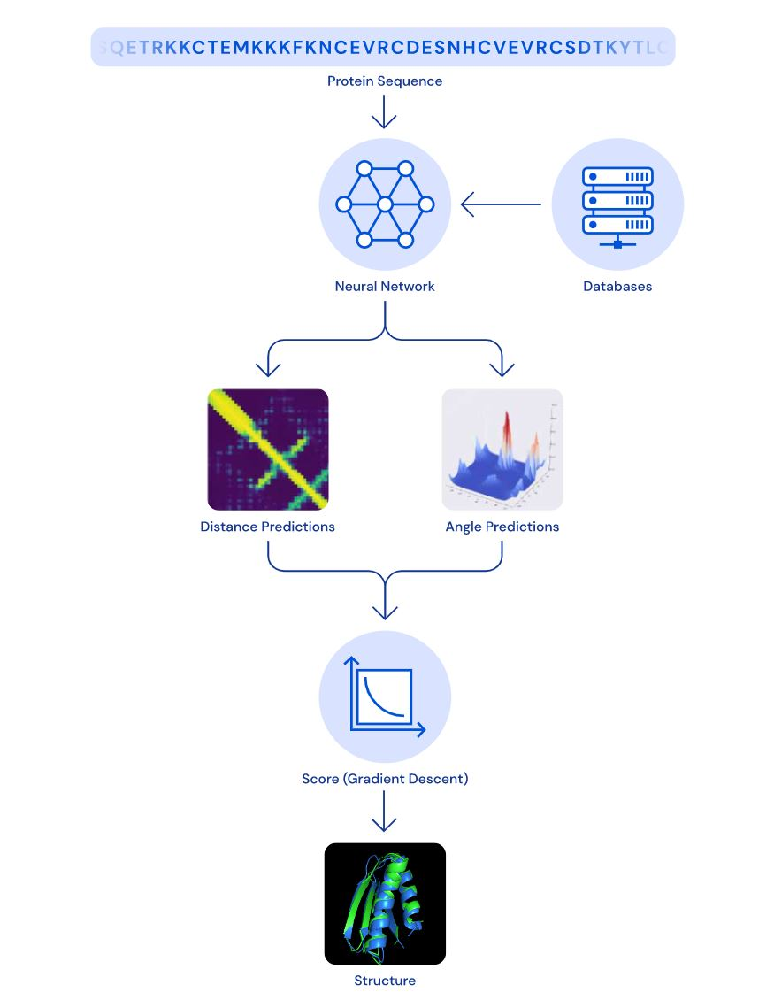

Fig 10. High-level schematic of AlphaFold’s algorithm. [[29]](#Works-Cited)

#### High-Level Overview of AlphaFold

The schematic illustrated above gives us a good picture of AlphaFold’s organization. The main Supervised Learning component is the Neural Network that the Protein Sequence is fed into, which has been trained against a database of empirically verified 3D structures. The algorithm has two outputs: A prediction of the pairwise distance-matrix for the protein sequence, as well as predictions of torsional angle prediction at points down the protein’s structure [[30]](#Works-Cited).

The main driver of the algorithm is the distance matrix prediction. The angle prediction helps break ties between candidate structures, but doesn’t provide enough information to solve the folding itself.

After finding both the distance matrix and the angles, physics simulation techniques (gradient descent algorithm on an energy landscape) are employed to find the optimal 3D structure for various random starting points [[30]](#Works-Cited).

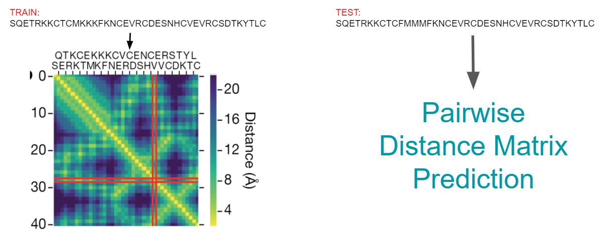

Fig 11. The main driver of the algorithm: Distance-Matrix prediction. [[30]](#Works-Cited)

#### Pairwise Distance Matrix Prediction

The core of the algorithm is simple: predict a distance matrix given an amino acid sequence. The distance matrix represents pairwise distance in angstroms between any two points in the sequence (M[i,j] corresponds to the three-dimensional distance between sequence[i] and sequence[j]). In this fairly simple move, which has also seen application in RNA structure prediction, we have transformed our biological problem to an image recognition one [[25]](#Works-Cited).

After training our algorithm on empirically-validated distance matrices, we now have a model that can predict new distance matrices from new sequences. The only prerequisite is a clean training set, and computational time (there is plenty of protein data around, but getting the data into this format may require some domain knowledge and ingenuity!) [[26]](#Works-Cited)

#### Reasons for Success

Although the computational resources at deep mind played a huge role in the success of AlphaFold in protein folding, many other factors are at play: The design of the neural network supervised learning algorithm (described below), as well as the reliance of statistical feature extraction rather than domain-based feature engineering [[31]](#Works-Cited). The protein-folding problem had plenty of data involved, making pinning down complex mappings tractable with computational time -- minimizing overfitting and other vagaries of overgeneralization common with unsupervised learning.

#### Additional Information

We’ve treated neural networks as a generic unsupervised learning model, and this takes us quite far -- they’re all sides of the same coin. However, neural networks, considered one of the best “universal function approximators” given enough data and time, have other strengths that are utilized on AlphaFold. Without straying much from supervised learning in general, these fascinating neural network ideas can be found here: [AlphaFold](https://www.nature.com/articles/d41586-020-03348-4) for understanding the design choices of the algorithm, [Neural Networks](https://www.youtube.com/watch?v=aircAruvnKk&t=3s&ab_channel=3Blue1Brown) for a clean introduction to deep learning, and [Convolutions](https://youtu.be/8rrHTtUzyZA) and [Attention](https://arxiv.org/abs/1706.03762) to explore deep learning techniques used here.

More specific information about the neural network architecture used in AlphaFold for interested readers:

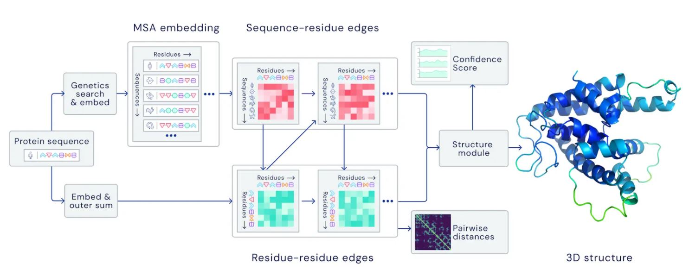

Fig 12. Low-level details of neural network architecture. [[29]](#Works-Cited)

#### AlphaFold 2

In the news recently, AlphaFold 2 has beat out AlphaFold and all other protein-folding models, with many claiming the protein-folding problem is finally solved. The comparison in performance of the top models is shown below:

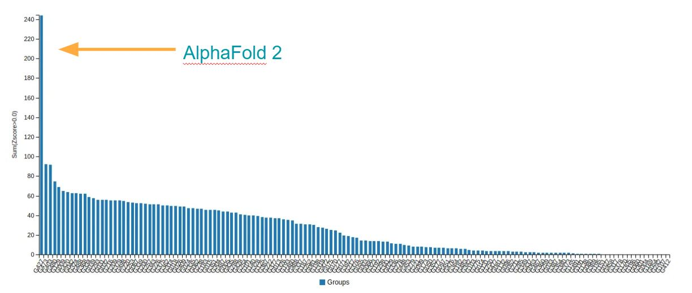

Fig 13. Performance of top protein folding models. [[32]](#Works-Cited)

### Has the Protein Folding Problem been solved?

We have reached new levels of accuracy in protein structure prediction. But do we truly understand protein folding? Has the protein folding problem been solved?

Unsupervised methods are great for classification and regression, but they can sometimes be impenetrable black-boxes -- they don’t necessarily teach us how the protein folds. Do we need to understand this to consider the protein folding problem solved?

#### "Yes, The Problem has been Solved"

Some say the protein folding problem has been solved by these modern supervised learning techniques, since these models can be treated as the next step in our standard genetic code to amino acid translation table: After translating the codons, we can plug our amino acid sequence into the model to understand protein structure (and guess at function) [[30]](#Works-Cited). The full molecular biology pipeline is made clearer than ever.

#### "No, The Problem is yet to be Solved" (And Next Steps)

Again, we don’t truly know understand the biology of this mapping table (and the problem is complex enough to make us wonder whether we’ll ever get there). Because of the inscrutability of our model, many important questions remain: how can we predict secondary structures, post-translational modifications, proteins with multiple stable configurations, prions, etc.

The key to understanding folding dynamics, and making use of them, may now be the inverse folding problem: figuring out the amino acid sequence from a structure of interest. Scientifically, this might be a better indicator of how well we've actually "solved" the protein folding problem [[32]](#Works-Cited), but there’s also a huge amount of therapeutic potential. Understanding inverse folding would unlock avenues in protein and drug engineering, which could serve to be a great tool in years ahead [[31]](#Works-Cited).

The knowledge of biophysics gained from AlphaFold can also help us explore other important protein-related questions, especially as it comes to tackling the complexity of protein-protein interaction networks...

---
## Interactome Prediction

### Biology of the Interactome
Interactomics is the study of molecular interactions within the cell. This includes protein-protein interactions and protein-genome interactions. Study of the interactome provides insight into signalling pathways and the effect of various perturbations on the cell. This is exceptionally helpful for novel drug development. Most recently, an extensive UCSF study of COVID19’s interactome played a crucial role in understanding the impact of the virus and potential therapies [[33]](#Works-Cited). The medical significance of the interactome makes it a pressing area of research. In fact, much of the effort to predict protein function and structure is in an attempt to predict protein interactions within the cell.

### Current Approaches
The current experimental approaches to map out molecular interactions within the cell have crucial limitations. In this course, we have thoroughly explored ChIP-seq and its various applications. ChIP-seq is a method of studying protein-genome interactions for a protein of interest through immunoprecipitation. ChIP-seq is highly effective but requires a long and cumbersome experimental process. Because of this strain and the low throughput of ChIP-seq (only one protein per experiment), it is difficult to perform extensive studies with only ChIP sequencing.

A common method to study protein-protein interactions *in vivo* is affinity purification mass spectrometry (AP-MS). AP-MS involves overexpressing a protein of interest and utilizing a molecular flagging system to determine binding partners. As with many spectrometry methods, AP-MS requires highly specialized equipment and is not accessible to most labs. Similarly to ChIP-seq, AP-MS has very limited throughput. Each experiment only determines the binding partners of a single protein at a time. [[34]](#Works-Cited)

There are anywhere between 80,000 and 400,000 different proteins in the human proteome [[35]](#Works-Cited). Thus, these experimental approaches that cover a single protein at a time are insufficient for a complete understanding of the human interactome. The magnitude of the problem demands computational assistance.

### Computational Approaches
The supervised learning approach to interaction prediction is fairly intuitive. The trick is in labeling training data. Each variable (or protein) must be labeled by its experimentally established interactome. This is often done by assigning a number gradient to the strength of interaction of each pair of proteins.

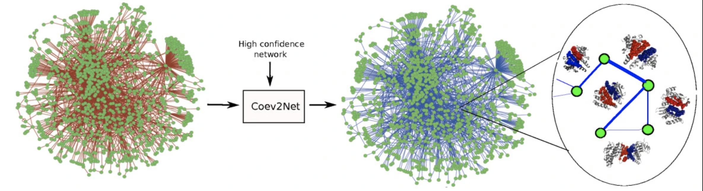
*[[36]](#Works-Cited) Fig 14: This visually represents the interactome of Protein Data Bank. Each node is a protein and each edge is a interaction with an assigned strength. This shows Struct2Net's algorithm, Coev2Net, training on highly complex data and placing testing data within the model.*

An example of a computational success in this field is MIT’s [Struct2Net](http://cb.csail.mit.edu/cb/struct2net/webserver/) software [[36]](#Works-Cited). The software takes either one or two amino acid sequences as input. It then maps the amino acids to the closest match in the Protein Data Bank. The Protein Data Bank is a resource to accumulate experimentally derived information about proteins. After determining a match, Struct2Net guesses the interactive domains of the input protein. Finally, interaction predictions are performed with a boosted classifier. Two input amino acid sequences will result in a single interaction prediction. Whereas, a single input protein will return a list of potential interactors.

## Works Cited

[1] Pedro Larrañaga, Borja Calvo, Roberto Santana, Concha Bielza, Josu Galdiano, Iñaki Inza, José A. Lozano, Rubén Armañanzas, Guzmán Santafé, Aritz Pérez, Victor Robles, *Machine learning in bioinformatics*, Briefings in Bioinformatics, Volume 7, Issue 1, March 2006, Pages 86–112, https://doi.org/10.1093/bib/bbk007

[2] Lualdi, M., & Fasano, M. (2018). *Statistical analysis of proteomics data: A review on feature selection.* Journal of Proteomics. doi:10.1016/j.jprot.2018.12.004

[3] Bonetta, R,  Valentino, G.  Machine learning techniques for protein function prediction. Proteins.  2020; 88: 397– 413. https://doi.org/10.1002/prot.25832

[4]	Kahtani, Abdullah. (2018). A Case Study of the Gene Database Ontology A Case Study of the Gene Database Ontology. 10.13140/RG.2.2.29089.86888.

[5]	Liu, S.; Liu, C.; Deng, L. Machine Learning Approaches for Protein–Protein Interaction Hot Spot Prediction: Progress and Comparative Assessment. Molecules 2018, 23, 2535.

[6]	Chou KC. Prediction of protein signal sequences and their cleavage sites. Proteins. 2001;42:136-139.

[7]	Mondal S, Bhavna R, Mohan Babu R, Ramakumar S. Pseudo amino acid composition and multi-class support vector machines approach for conotoxin superfamily classification. J Theor Biol. 2006 Nov 21;243(2):252-60. doi: 10.1016/j.jtbi.2006.06.014. Epub 2006 Jun 27. PMID: 16890961.

[8]	Khan, Zaheer. (2015). PREDICTION OF ACIDIC AND ALKALINE ENZYME USING PSEUDO AMINO ACID COMPOSITION IN COMBINATION WITH MACHINE LEARNING APROACHES. 10.13140/RG.2.2.17215.51365.

[9]	K. C. Chou and H. B. Shen. MemType- 2L: A Web server for predicting membrane proteins and their types by incorporating evolution information through Pse-PSSM. Biochem Biophys Res Comm, 360:339– 345, 2007.

[10] Qiu W, Li S, Cui X, Yu Z, Wang M, Du J, Peng Y, Yu B. Predicting protein submitochondrial locations by incorporating the pseudo-position specific scoring matrix into the general Chou's pseudo-amino acid composition. J Theor Biol. 2018 Aug 7;450:86-103. doi: 10.1016/j.jtbi.2018.04.026. Epub 2018 Apr 18. PMID: 29678694.

[11] Jeong JC, Lin X, Chen XW. On position-specific scoring matrix for protein function prediction. IEEE/ACM Trans Comput Biol Bioinform. 2011;8:308-315.

[12] Vandecraen, Joachim & Monsieurs, Pieter & Mergeay, Max & Leys, Natalie & Aertsen, Abram & Van Houdt, Rob. (2016). Zinc-Induced Transposition of Insertion Sequence Elements Contributes to Increased Adaptability of Cupriavidus metallidurans. Frontiers in Microbiology. 7. 10.3389/fmicb.2016.00359.

[13] Hira ZM, Gillies DF. A Review of Feature Selection and Feature Extraction Methods Applied on Microarray Data. Adv Bioinformatics. 2015;2015:198363. doi:10.1155/2015/198363

[14] Al-Shahib A, Breitling R, Gilbert DR. Franksum: new feature selec- tion method for protein function prediction. Int J Neural Syst. 2005; 15:259-275.

[15] Fernandez-Lozano C, Cuinas RF, Seoane JA, Fernandez-Blanco E, Dorado J, Munteanu CR. Classification of signaling proteins based on molecular star graph descriptors using machine learning models. J Theor Biol. 2015;384:50-58.

[16] Kumar C, Li G, Choudhary A. Enzyme function classification using protein sequence features and random forest. Proceedings of IEEE International Conference on Bioinformatics and Biomedical Engi- neering Beijing, China, 2009

[17] García-Gonzalo, Esperanza & Fernández-Muñiz, Zulima & Garcia Nieto, Paulino Jose & Sánchez, Antonio & Menéndez, Marta. (2016). Hard-Rock Stability Analysis for Span Design in Entry-Type Excavations with Learning Classifiers. Materials. 9. 531. 10.3390/ma9070531.

[18] You R, Zhang Z, Xiong Y, Sun F, Mamitsuka H, Zhu S. GOLabeler: improving sequence-based large-scale protein function prediction by learning to rank. Bioinformatics. 2018;34:2465-2473.

[19] https://www.researchgate.net/figure/K-nearest-neighbor-algorithm-illustration-The-green-circle-is-the-sample-which-is-to-be_fig14_267953942

[20] J.G. Liao, Khew-Voon Chin, Logistic regression for disease classification using microarray data: model selection in a large p and small n case, Bioinformatics, Volume 23, Issue 15, August 2007, Pages 1945–1951, https://doi.org/10.1093/bioinformatics/btm287

[21] *Machine learning versus logistic regression methods for 2-year mortality prognostication in a small, heterogeneous glioma database*
Sandip S Panesar, Rhett N D’Souza, Fang-Cheng Yeh, Juan C Fernandez-Miranda
bioRxiv 472555; doi: https://doi.org/10.1101/472555

[22] Silva M, Leijoto L, Nobre C. Algorithms analysis in adjusting the SVM parameters: an approach in the prediction of protein function. J Appl Artif Intell. 2017;31:316-331.

[23] “Free Modern Language Association 8th Edition Bibliography & Citation Maker.” BibMe, www.bibme.org/bibliographies/266942990?new=true.“Free Modern Language Association 8th Edition Bibliography & Citation Maker.” BibMe, www.bibme.org/bibliographies/266942990?new=true.

[24] Dobson, C. *Protein folding and misfolding*. Nature 426, 884–890 (2003). https://doi.org/10.1038/nature02261

[25]
Maxwell I. Zimmerman, Justin R. Porter, Michael D. Ward, et al. (30 Jun 2020) *Citizen Scientists Create an Exascale Computer to Combat COVID-19* BioRxiv. https://doi.org/10.1101/2020.06.27.175430

[26] Agostini FP, Soares-Pinto Dde O, Moret MA, Osthoff C, Pascutti PG. *Generalized simulated annealing applied to protein folding studies.* J Comput Chem. 2006 Aug;27(11):1142-55. doi: 10.1002/jcc.20428.

[27] Ying, Xue. (Feb 2019) *An Overview of Overfitting and its Solutions.* Journal of Physics: Conference Series. vol. 1168, iss. 2. doi: 10.1088/1742-6596/1168/2/022022.

[28] Yeona Kang, Charles M. Fortmann, *An Alternative Approach to Protein Folding.* BioMed Research International, vol. 2013, Article ID 583045, 10 pages, 2013. https://doi.org/10.1155/2013/583045

[29] Andrew Senior JJ, John Jumper, Demis Hassabis
PK, Pushmeet Kohli (15 Jan 2020) *AlphaFold: Using AI for scientific discovery* Deep Mind. https://deepmind.com/blog/article/AlphaFold-Using-AI-for-scientific-discovery

[30] Callaway, Ewen. (10 Dec 2020) *It will change everything’: DeepMind’s AI makes gigantic leap in solving protein structures* Nature 588, 203–204.
https://www.nature.com/articles/d41586-020-03348-4

[31] Senior, Andrew W., et al. *Protein Structure Prediction Using Multiple Deep Neural Networks in the 13th Critical Assessment of Protein Structure Prediction (CASP13).* Proteins: Structure, Function, and Bioinformatics, vol. 87, no. 12, 2019, pp. 1141–1148., doi:10.1002/prot.25834

[32] The AlphaFold Team. (30 Nov 2020) *AlphaFold: a solution to a 50-year-old grand challenge in biology* Deep Mind. https://deepmind.com/blog/article/alphafold-a-solution-to-a-50-year-old-grand-challenge-in-biology

interactomics:
[33] Gordon, D.E., Jang, G.M., Bouhaddou, M. et al. *A SARS-CoV-2 protein interaction map reveals targets for drug repurposing.* Nature 583, 459–468 (2020). https://doi.org/10.1038/s41586-020-2286-9

[34] Steven J Bark, J Chromatogr Sep Tech 2015, 6:4
http://dx.doi.org/10.4172/2157-7064.S1.007

[35] Ponomarenko EA, Poverennaya EV, Ilgisonis EV, et al. *The Size of the Human Proteome: The Width and Depth.* Int J Anal Chem. 2016;2016:7436849. doi:10.1155/2016/7436849

[36] R. Hosur, J. Peng, A. Vinayagam, U. Stelzl, J. Xu, N. Perrimon, J. Beinkowska, and B. Berger. 2012. *Coev2Net: a computational framework for boosting confidence in high-throughput protein-protein interaction datasets.* Genome Biology, doi:10.1186/gb-2012-13-8-r76.
