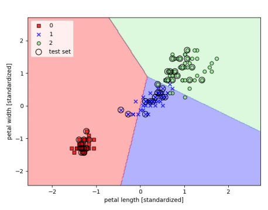
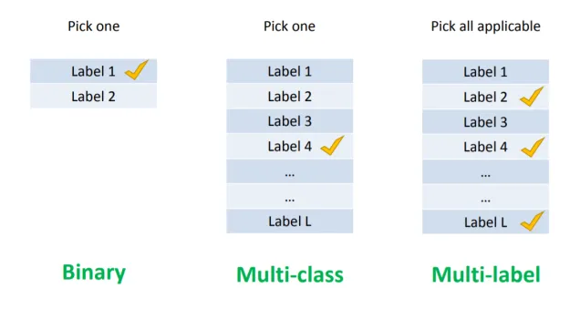
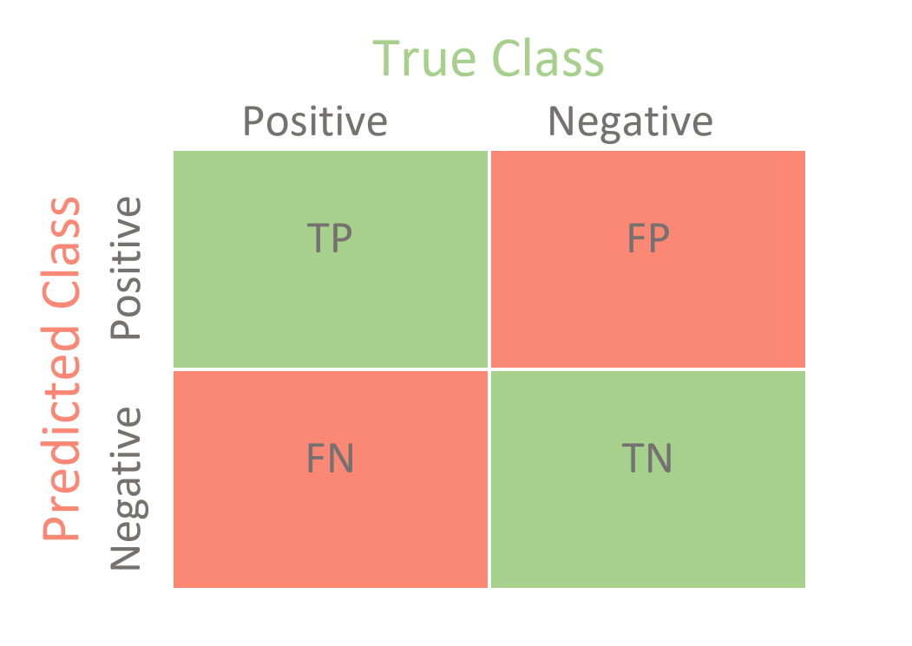
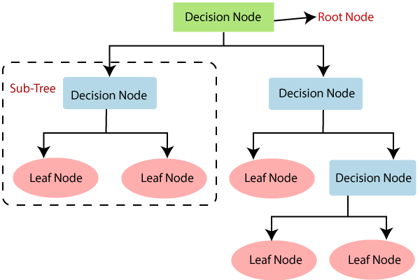
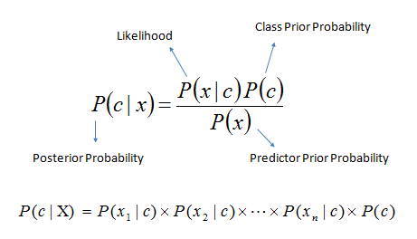
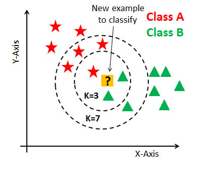
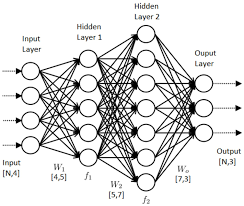

# Classification Algorithms

Classification is a type of machine learning used to predict the class or group membership of
data points. It is a type of supervised learning, meaning we know the different
groups or labels we are trying to classify the data into. This definition of
labels differentiates it from clustering, which is unsupervised learning and
just groups similar data points without the labeling of that group. Some real world  bioinformatics applications of classification can include classifying RNA-seq data intodifferent disease types and categories.

## Classifier Types

There are a few different types of classifiers

  - Binary classification is when there are two different labels that data points can be grouped into. An example of a binary classification system is a spam detector. The classifier must determine if something is one of two options: spam or relevant emails.
  - Multiclass classification is when there are multiple labels that data points can be assigned to. An example would be an image detection algorithm that can decide if a given animal is a dog, cat, fish, etc. Perhaps in the future, multiclass classifcation algorithms can be used to classify X-ray images to make the lives of radiologists much easier.
  - Multilabel classification is when data points can be grouped into one or more of the labels defined. An example would be a classifier that labels movies- a given movie could be classified as action, romance, comedy, family-friendly, or some combination of these labels, like a romantic comedy.
 
 

## Classifier Evaluation

The most basic way to evaluate how well a classifier is working is a confusion matrix. That is, we compare our classifier's projected values to the actual values, seeing how many true positives and negatives or false positives and negatives we have.

From here, we can calculate metrics of how accurate our classifier is, such as sensitivity (or recall), specificity, and precision.
 - Sensitivity is the true positive rate, or the ratio of correctly categorized positives to all actual positives.
 - Specificity is the true negative rate, telling us the ratio of correctly categorized negative to all actual negatives.
 - Precision tells us the ratio of our correctly categorized positives to all categorized positives

Depending on the purpose of the classifier, a different type of evaluation metric will be appropriate to measure the classifier.

## Classification Algorithms

There are many different implementations of classification. In the following sections, we go over a few of the more popular types.

### Decision Trees

A Decision Tree Classifier is a model that works by systematically questioning certain attributes or predictors of a data point, narrowing down the possible classification of that data based on the answers, until it can place a data point in a specific class.

The decision tree itself is made up of a root node with only outgoing edges, internal nodes which each have one incoming edge and two or more outgoing edges, and terminal nodes which each have one incoming edge. Each terminal node represents a different label or class, and each internal node has a predictor or attribute that acts as a differentiator.

A decision tree is created from training data using a recursive greedy algorithm that chooses the most optimal attribute to partition data at each iteration.

Pros of using decision trees include that it is simple to understand and can be visualized for easy interpretation, it does not require heavy data preparation, and that it can handle numerical and categorical data.

Cons include that datasets can create very complex trees that don't generalize the data well, trees can become very biased if classes are not balanced, and optimal creation of a tree is actually very difficult.

### Naive Bayes

A Naive Bayes Classifier is a probabilistic model that works by applying Bayes Theorem
to the data, assuming that each predictor of a group is independent of another.  It uses the probability of each predictor happening in conjunction with Bayes Theorem and calculates the probability of a data point belonging to a group. 

Looking at the formula, we are looking to find P(c|x), the probability that an object belongs to class c given predictor x. We calculate the remaining probabilities needed, such as the probability that a random data point belongs to class c or the probability that a data point has a predictor x, from the training data. 

The pros of using a Naive Bayes model are that it is relatively fast and easy to set up and train, and that it performs well given the labels are non-numerical. It does come with some large cons though, including the fact that it assumes that predictors are independent, which is very often not true, in which case it is known to be a relatively bad estimator, so it is not to be used when incredibly high accuracy is demanded.

### K-Nearest neighbor

The K-nearest neighbor classification algorithm takes a testing data point and finds the k-specified training points that are closest in distance to the testing data point. At that point, the algorithm will make a classification decision based on the makeup of the k-nearest neighbors. The valuation of k is a large determining factor of the accuracy of this algorithm, as at different k-values, the classification decision can change. For example, if we take a look at the image above, at K=3, and K=7 it seems that the profile of the K-nearest neighbors are different and would result in different classifications.

In order to properly choose an appropriate k, it is important that the k-value is not too large. This would lead to k - neighbors that are far away in distance from the testing data point. In addition, it would be proper for the value k value to ensure that there cannot be ties between data sets. For example, if there are two data sets, the k-value should be odd. In general if there are "x" training data sets, the k-value should not be a multiple of x.

Pros of using K nearest neighbors is its inherent simplicity and its non-parametric attributes. You do not need to know much about the data to interpret it. In a a setting with your colleagues that may not know much about the data, you can still be able to explain how a k-nearest neighbors algorithm would work for the dataset.

Cons include its high cost of computing and its difficulty handling missing values.

### Neural Networks

Artificial Neural networks are made to model the natural biological communication between neurons. They use this decision making process to solve problems in artificial intelligence. Similar to excitatory and inhibitory neural signaling, artificial neural networks use information processing of numbers between -1 and 1 to make its decisions. Mathematical non-linear models, decision making models, and regression models can be used to summate the information that is flowing through these networks. What is special about neural networks is that often, a large amount of self-learning could occur even with the use of supervised models.

Advantages of using artificial neural networks include its ability to make fast decisions once enough training data is input through the system. 

Disadvantages of using neural networks include its black block properties, meaning that it is sometiems difficult to assess how one independent variable is affecting another independent variable. In addition, often neural networks require a large amount of training data to be passed through the system.

## References
1. "Classification Algorithms | Types of Classification Algorithms." *Edureka*, 17 Jan. 2019, https://www.edureka.co/blog/classification-algorithms/.
2. Dey, Ishaan. "Evaluating Classification Models." *Medium*, 14 June 2019, https://towardsdatascience.com/hackcvilleds-4636c6c1ba53.
3. "Introduction to Classification Algorithms - DZone AI." *Dzone.Com*, https://dzone.com/articles/introduction-to-classification-algorithms. Accessed 15 Dec. 2020.
4. Julie, M. David, and Kannan Balakrishnan. "Significance of Classification Techniques in Prediction of Learning Disabilities." *International Journal of Artificial Intelligence & Applications*, vol. 1, no. 4, Oct. 2010, pp. 111–20. DOI.org (Crossref), doi:10.5121/ijaia.2010.1409.
5. Larry Hardesty  |  MIT News Office. “Explained: Neural Networks.” MIT News | Massachusetts Institute of Technology, news.mit.edu/2017/explained-neural-networks-deep-learning-0414. 
6. Nelson, Daniel. “What Is a KNN (K-Nearest Neighbors)?” Unite.AI, 23 Aug. 2020, www.unite.ai/what-is-k-nearest-neighbors/. 
7. Woo, Amanda. “X-Ray Image Classification: The Easy Way.” Medium, Towards Data Science, 5 Sept. 2019, towardsdatascience.com/x-ray-image-classification-the-easy-way-69665448604a. 
