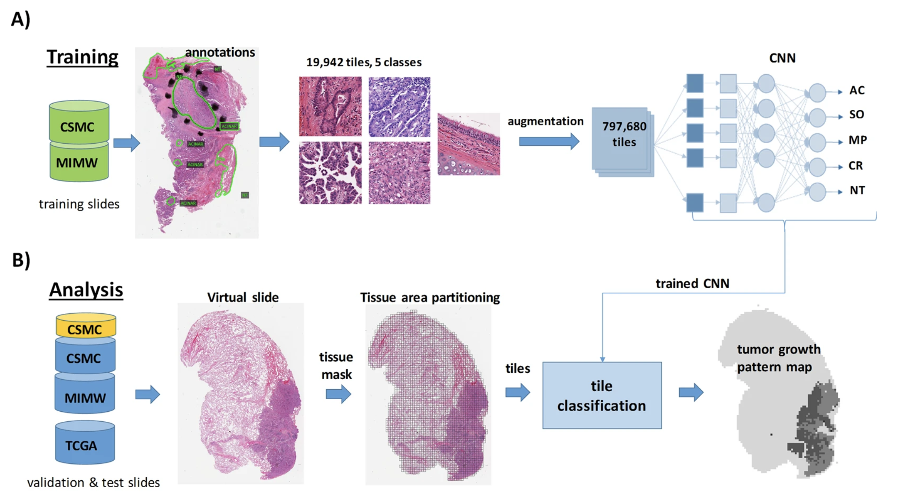
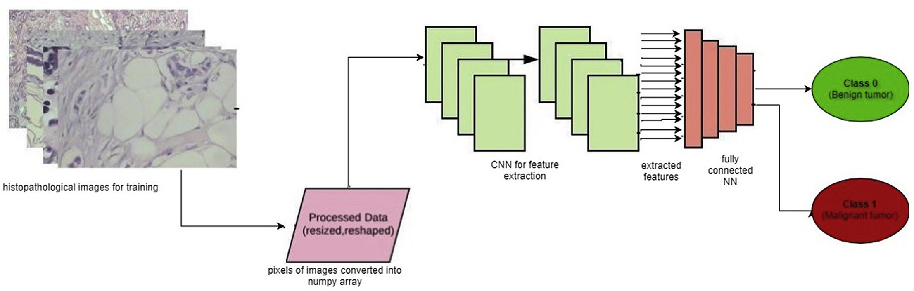
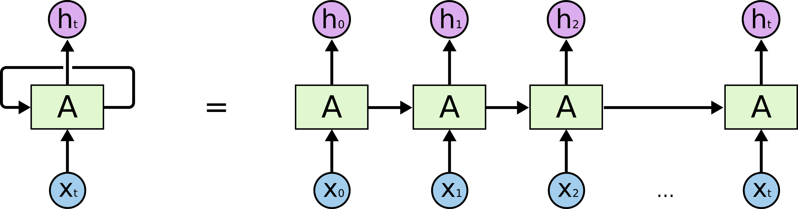
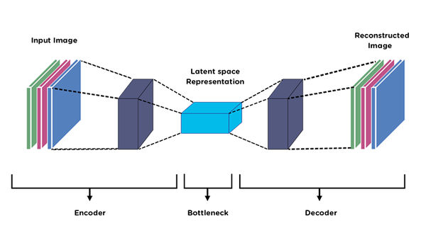
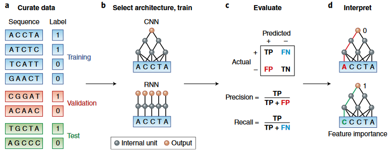
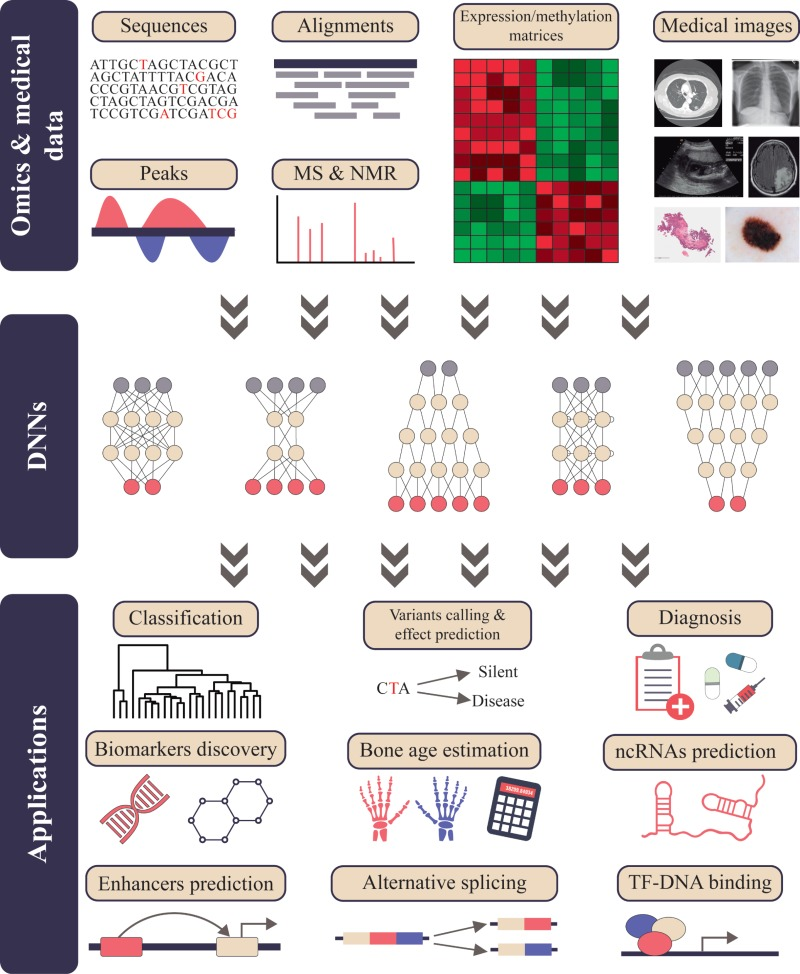
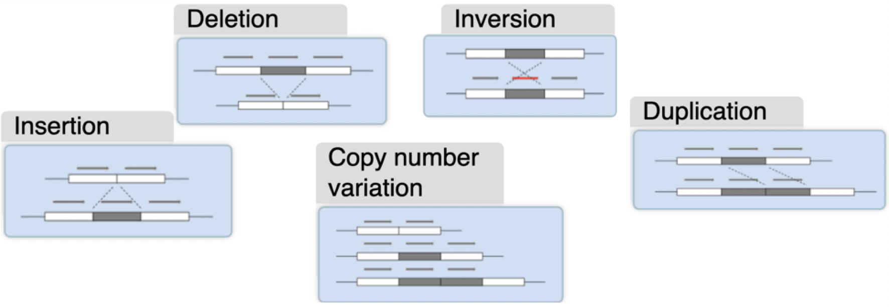
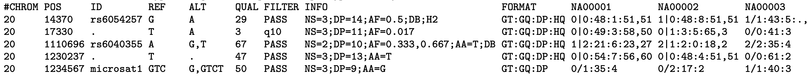

# Deep Learning in OMICS - Group 2

#### Fernando Bracamonte, Ishaan Gupta, Matias Lin

<!--lets update Contents after we're done finalizing the rest-->

## Contents

- [Introduction](#Introduction)
- [OMICS](#OMICS)
- [Deep Learning](#Deep-Learning-Background)
  - [ANNs](#ANNs)
  - [Deep Learning Methods](#CNNs)
  - [Applications](#Applications-in-OMICS-and-Precision-Medicine)
- [Conclusion](#Conclusion)
- [References](#References)

---

## Introduction

With the invention of new OMIC technologies, as well as with the advancement in technology withing new and old OMIC technologies, such as microarrays and next-generation sequencing, biological data has increased exponentially. These datasets are complex and would be nearly impossible for a human to extract valuable information from these in order to interpret it and make conclusions about it. Thus, this has given bioinformaticians and machine learning researchers a challenge to come up with ways to extract valuable information from these biological datasets to be able to fully analyze them. This has given rise to different deep learning algorithms and methods which are able to identify complex patterns and create predictive models and from these large biological datasets [(5)](#References).

### Aim of this lesson:

- To show how AI is revolutionizing Precision Medicine and OMICS data analysis
- To explain the background of Deep Learning and Artificial Neural Networks (ANNs), with a focus on Convolutional Neural Networks (CNNs)
- To introduce different kinds of architectures and appropriate uses
- To show what kinds of data can be used input and output for DL in OMICS data through examples
- Particularly focus on Variant Calling as an example application

---

---

## OMICS

Omics are the different science branches of Biology, which have the suffix of _-omics_, such as genomics (which is the focus of BENG 183), transcriptomics, epigenomics, metabolomics, proteomics, and so on [(8)](#References). Moreover, Omics represents al the different technologies that are used to determine the roles, relationships, and actions of different types of molecules for the structure, function and dynamic that make up the cells of an organism [(7)](#References). A few Omic technologies are shown below with explanations as to what they study:

- Genomics: studies the structure, function, evolution, and mapping of genomes as well as the characterization and quantification of genes.
- Transcriptomics: studies the transcriptome, which is the collection of all mRNA
- Proteomics: studies all protein as well as their properties and functional roles

With the summary of what some of these Omics technologies do, the overall objective of Omics as a whole is to identify, characterize and quantify all biological molecules that are involved in the structure, function and dynamics of a cell, tissue, or organism [(7)](#References).

---

## Deep Learning Background

Deep Learning is a subset of machine learning that were modeled to represent the biological neural network of our brain. This model is called artificial neural networks (ANNs) (See Figure [(0)](#ANNs vs BioNN). To better undestand what Artificial intelligence and deep learning are and their importance, it would be benefitial to see what experts in the field have to say. Andrew Moore, Former-Dean of the School of Computer Science at Carnegie Mellon University said:
> Artificial intelligence is the science and engineering of making computers behave in ways that, until recently, we thought required human intelligence [(1)](#References).

And Tom M. Mitchell from the Machine Learning Department in Carnegie Mellon University, said: 
> Machine learning is the study of computer algorithms that allow computer programs to automatically improve through experience [(1)](#References).

In general terms, deep learning is an algorithm that performs tasks through experience or "learning" as implied by its name.  There are different types of learning that deep learning can do. Learning can be supervised, unsupervised and semi_supervised.  In supervised learning, deep learning takes in labeled training data as input. In unsupervised learning, does not use labeled training data. And semi_supervised learning is the combination of both, it trains on a small labeled data combined with big unlabeled data [(20)](#References).

As mentioned above, ANNs were biological neural networks because they are made by interconnected artificial neurons. Each artificial neuron receives an input, applies a certain transformation on that input and "fires" an output. With this model, deep learning has many applications. They can encode and learn from heterogeneous and complex data. This can be useful in image recognition, voice and speech recognition and language processing. Image recognition is useful in the field of biology because deep learning can take as input medical images and output a diagnosis for medical conditions such as cancer or other diseases [(5, 20)](#References). Deep Learning has become a crucial part in Omics Data Analysis since it has outperformed other techniques and methods as it is more specific, sensative and efficient [(5)](#References).


###### Fig 0: Depiction of a biological neuron compared to an artificial neuron [(19)](#References). 

### ANNs

#### Basic design:

- Image of a simple neural network
- Inputs are training data ($x$ for each training example), first layer outputs just that
- In the forward-propagation step, the outputs of activation function of neurons in one layer are successively applied weights and other parameters ($w,b$) on and fed to next layer in forward fashion. Output of final is the expected output ( $\hat{y}$ for each training example)
- Loss function ( $L(\hat{y},y)$ ) compares expected output with real output of training data ($y$ for each training example)
- Cost function $ J $ is the average of $L$ across all training examples.
- In back-propagation step, We use Gradient Descent to optimize Cost Function, i.e, find the parameters that minimize the Cost Function.
- In Gradient Descent, we change the parameters by a step proportional to the slope of Cost function for those parameters.
- So for each parameter $w$, $ \frac{\partial J}{\partial w} $ is computed by chain rule.
- Iteratively, we minimize $ J $ by iteratively in each forward propagation step (except initial) tuning the parameter $w$ in the direction $ -\frac{\partial J}{\partial w} $ This algorithm called gradient descent helps **learn** the parameters.

This is further complicated by use of various activation functions, differing the number of hidden layers, or the number of perceptrons in a layer, different ways to initialize the weights and other optimization techniques.
Furthermore, the example we saw is a Deep Feed-Forward NN (DFF), but there are different NN architectures specific to different uses.

### CNNs

If we want to use high dimensional data, such as images (with each pixel corresponding to a neuron in the input layer), as input for a neural network, we have a large number of neurons in the input layer and large number of neurons in the next layer. By the fully connected architecture we saw above, how many parameters would we need? Just the number of simple weights would the product of those two large numbers of neurons.

So for large data, we use Convolutional Neural Network Architecture (CNNs) that have layers themselves comprising of Convolutional filters and pooling layers, that act like feature reduction, reducing the number of parameters needed. Thus, CNNs are often used for DL with images.


###### Fig 1: Example of feature extraction with the help of Convolutional filter layer


###### Fig 2: Example of feature extraction with the help of Pooling layer

Oncology is one of the areas in the medical field where CNNs are gaining prevalence. One of the papers that explored this possibility is "Convolutional neural networks can accurately distinguish four histologic growth patterns of lung adenocarcinoma in digital slides". To better improve the accuracy when diagnosing Lung Adenocarcinomas (LAC), researchers utilize DL to evaluate distinct histological tumor growth patterns [(9)](#References). There are five main growth patterns of interest when it comes to assaying LAC: Acinar (AC), Microcapillary (MP), Solid (SO), Cribriform (CR) and Non-Tumor (NT). In an effort to automate the task of quantifying these growth patterns, the scientists developed a pipeline that involves a CNN model.



###### Fig 3: Pipeline with a CNN model that classifies the different growth patterns in lung adenocarcinoma (LAC). A: Flow chart describing the model of CNN. B: Flow chart showing the whole pipeline of the project.

From Figure 3.A, we can observe that the researchers employ a convolutional neural network to predict all five growth patterns (AC, SO, MP, CR and NT) given an image (note that this paper refers to the input images as tiles). In this example, a single histopathology slide yielded 19,942 tiles corresponding to 5 classes and after data augmentation, 797,680 images were used to train the model. Once the CNN model was trained, it was incorporated into the overall pipeline as seen in Figure 3.B. The model is used to be able to classify the tiles to be able to quantify the different growth patterns and later construct the tumor growth pattern map.

Another interesting example involves the studying and diagnosis of breast cancer as described in the following paper: "Cancer diagnosis in histopathological image: CNN based approach". The process of diagnosing breast cancer is through the careful analysis of breast tissue cells. This is a task that can be wearisome and even error-prone if performed by an individual. Therefore, this paper proposes a machine learning approach where they use CNN models to predict whether a histopathology slide of breast tissue cells is malignant or benign [(10)](#References).



###### Fig 4: Pipeline showing the use of CNN to predict whether a breast tissue cell is malignant or benign.

From Figure 4 we can that the CNN model will be able to take a histopathology slide of a breast tissue cell and classify it to be either malignant (label 0) or benign (label 1). The utilized a total of 7,909 biopsy images that were partitioned for training and testing, 6,327 and 1,582 respectively. After this model has been trained and tested, it reported the following performance: precision of 0.93, recall of 0.93, F1-Score of 0.93 and an accuracy of 0.98 [(10)](#References). These results suggest that the use of deep learning (CNN) not only resolves the laborious task of an classifying cells, but does so with impressive accuracy.

These papers not only demonstrate the potential of CNN in a clinical setting but also the wide range of applications in which this machine learning technique can be used in. We've seen in the first example how CNN could be used to classify different growth patterns in lung adenocarcinoma, and on the second example we've seen how a similar model could be used to predict whether a histopathology panel of breast tissue is malignant or not.

### RNNs and LSTMs

Recurrent Neural Networks, or RNNs, are another example of artificial neural networks. RNNs differ to other Neural Networks in that they can take any sized vector as an input, where NNs can only take a fixed size vector. The training process of RNNs is unique. They are able to take input vectors and produce output vectors that are influenced by various things, like weights from inputs, and a hidden state that stores the context from inputs and previous outputs. Thus, it won't guarantee the same output from the same input, since it also takes into consideration the context of previous inputs and outputs. An example of an RNN model is shown in Figure 5, as the input layers also get the context of previous inputs before generating a final output. Therefore, since they are good at processing sequential inputs, RNNs are often used in speech and handwriting recognition [(17)](#References). But, normal RNNs have a short-term memory, which means that they don't retain the context of previous inputs/outputs for long. A model is able to retain this information are called LSTM, which are explained below.

One example of an RNN, which is able to process sequential data as mentioned above, are Long short-term memory, or LSTMs. They have an improved model structure, as they contain additional (memory) gates and a cell state which determines the time it should keep the context of previous inputs/outputs and when it should learn new ones. LSTMs extend the memory of RNNs by the implementation of 4 gates: the learn gate, the forget gate, the remember gate, and the use gate. Therefore, due to its model characteristics, LSTM are used for example in Natural Language processing tasks [(14, 17)](#References).



###### Fig 5. Basic model architecture of an RNN. This basically shows how a RNN allows for data to be fed back into the network (creating a loop) [(14)](#References).


### Autoencoders

Another type of artificial neural networks are the autoencoders which employ efficient data encoding to learn a given dataset in an unsupervised manner [(11)](#References). We can think of autoencoders as two funnels where in the first pass we go from a high dimension input to a lower dimensionality. Then we use the output of the first funnel to pass it through a reverse funnel, where we go from a data with low dimensions to a higher dimensionality.



###### Fig 6. Represents a diagram of a general architecture for autoencoders. In this case, the input data are images.

As seen in the image above, there are two main sections to the autoencoder: Encoder and Decoder. The encoder makes reference to the first funnel, where we compress of the input data as a way of feature extraction. That is to say that by reducing the dimensions of the input data we force the encoder to learn the features that are crucial to understand and represent the data given. Once we reach the bottleneck, the decoder comes into play, where the objective is to reverse engineer the original data given the output of the encoder (which has a lower dimensionality).  
Autoencoders can be utilized for a wide variety of applications: dimensionality reduction, image compression, image denoising, feature extraction, recommendation systems, sequence to sequence prediction, image generation, among others [(12)](#References). In the area of oncology, researchers utilized the ability of autoencoders to feature extract to attempt to discover relationships between multi-omics and medical data as seen in the paper "Variational Autoencoders for Cancer Data Integration: Design Principles and Computational Practice" [(13)](#References).

---

## Applications in OMICS and Precision Medicine

As previously explained, Deep Learning algorithms are good for the task of analyzing omics datasets. The workflow of Deep Learning applications in Omics data is depicted in Figure 5. The basic workflow is that deep learning algorithms/methods such as CNNs and RNNs are applied to biological data, such as sequencing data, alignment data, expression matrices, etc. From the output results of the deep learning methods, we get multiple applications, such as alternative splicing analysis, classification, enhancer prediction, varient calling, etc. Many of these applications also improve and give rise to precision medicine from analyzing medical imaging to get a specific diagnosis for a person [(5)](#References).

Some other examples of what deep learning applications can be used for are explained below:

### Genomics and Sequence analysis

There are many examples where deep learning methods have been applied to genomics data. One example is using CNNs which detects single-nucleotide polymorphisms (SNP) and indels. Another example is the use of DFFs and SAEs which predict the effect of genetic variants on gene expression. Finally, CNNs and LSTMs have been used to predict promoter sequences in genes, and CNNs have been used to identify splice junctions [(5)](#References).

An example of the workflow of deep learning methods in genomics is shown below.



###### Fig 7. An example of a deep learning method workflow in genomics. The workflow starts with a dataset that is randomly split up into a training, a validation and a test datasets. Then a deep learning method, such as a CNN or RNN is trained on the training dataset. Finally, the results are evaluated and we can make predictions based on the outputs of the models [(15)](#References).

### Transcriptomics

In transcriptomics, which is the omics technology that quantifies RNA expression levels, deep learning algorithms use generally expression matrices of different gene expression levels as their input. Therefore, with the output of these deep learning methods, many applications can be conducted. For example, CNNs are used to identify actual splice junctions from false positives generated from RNA-seq reads alignment. Also, using a DNN with a Bayesian statistical model to analyze differential splicing between different samples using RNA-seq data. One final example is the use of an RNN to differentiate between coding and non-coding RNAs [(5)](#References).

### Epigenomics

Epigenomics studies the DNA structure modifications that has the potential of modifying gene expression. These changes, which were learned at the beginning of BENG 183, are for example DNA methylation and histone modifications. Therefore, just like the previous methods discussed, deep learning methods can be used on methylation matrices, ChIP- and CLIP-seq data, DNase I sequencing data in order to predict and use it in many applications. Some examples are: CNNs have been used to predict sequences recognizes by DNA- and RNA-binding proteins; CNNs also have predicted the 3D chromatin state in a cell; and a final example is that a CNN was used to predict gene expression from histone modification data [(5)](#References).

### Medical Imaging

Medical imaging is a crucial component in the healthcare industry to treat patients. With the introduction of deep learning methods in this field, it has helped push transition medicine to transition into precision medicine. Omics data analysis has also helped precision medicine from the study of diseases at different molecular levels, such as DNA sequences and RNA expression, to determine if any have been altered. To understand the importance of using medical imaging in deep learning methods, we will explore various applications and uses there have been. Deep Leaning Methods are used in identifying skin cancer; for example, CNNs have been used to predict whether a certain skin lesion is cancer or not with the input of clinical images. Moreover, it has applications in identifying brain tumors, where CNNs and SAEs are applied on MRI images to predict and identify characteristics of tumors. One final example is in the diagnosis of medical conditions with X-ray images. One such example is a CNN trained to detect vessel regions for the diagnosis of coronary artery disease [(5)](#References).



###### Fig 8: Workflow of Deep Learning Applications in Omics Data Analysis [(5)](#References).

---

### Applications of CNNs

<!--CNN for medical images here-->

As previously mentioned, CNNs have many uses in the analysis of Omics data. CNNs can be used in genomics and sequence analysis, transcriptomics, epigenomics, medical imaging, and many other areas. The next section of the paper will focus on a specific example of CNN applications in Omics data analysis, and that is in the detection of SNPs/indels and other variants.

### Deep Learning for Variant Calling

#### What is Variant Calling

Variants are regions of the genome where the sequence differes from the reference genome. They could be in the form of:

- Single NUcleotide Variants (SNVs) (which are SNPs if 1% or more frequent in population)
- Indels
- Structural Variants (SVs)
  - Copy number Variants (CNVs)
  - Translocation
  - Duplication
  - Inversion



###### Fig 9: Types of Variants [(6)](#References).

#### Sequencing error vs Variants

Accurate identification of Variants involves differentiating between the two causes of differences between reference genome and sequenced reads - Sequencing/Alignment error and Genomic Variants. This is essentially what the Variant callers involve. Traditionally, Variant callers are statistical methods designed by humans that analyze frequency of a variant at the same position from all the reads, along with the quality of those read bases, and neighboring bases on same read. Example - GATK, FreeBayes, SAMtools etc.

#### Challenges in Variant Calling

As discussed above, variants are traditionally identified by statistical methods that find features by already set certain filters that consider particular parameters. This type of manual selection of features can create bias in terms of what parameters are considered. For

Furthermore, with the evolution of different sequencing technologies (Illumina sequencing, long read sequencing etc.), we need to set different filters manually for the human-designed statistical methods for optimal Variant Calling in different data types.

Not only this, we also need different methods to identify different types of variant. Method to identify an single-nucleotide variant must be very different from a copy number variant.

Even with all these taken care of, somatic variants are not always easy to detect, though, especially in applications like Cancer Biomarker detection, as shown in Fig 10. Usually approximately half of the reads should show an SNV/indel that is present on chromosome, so they should generally be detectable. However, even with 40% samples being normal cells in a tumor samples, we can have a false negative for the SNV (Fig 10(b)).


###### Fig 10: Somatic mutation detection in tumor samples [(16)](#References). Calling variants being used as Cancer biomarkers. Major task in Variant calling (a) In a pure tumor sample, approximately half of the reads contain the SNV, but in (b) 60% purity sample, it becomes difficult to distinguish the heterozygous somatic SNV in the center from a sequencing error.

#### DeepVariant

Use of neural networks can address these challeneges since they automate the feature extraction process without introduing any human bias, or becoming specialized for types of data or types of variants. Instead of making new filters, we just need to retrain the model on new data.

#### Background check - Pileup and VCF files

Since in Variant calling we want to analyze different reads at each position, wouldn't it be easier to kind of take the transpose of a BAM file which gives aligned reads info read-wise across positions, and have the information instead position-wise across the reads? A Pileup file does exactly that. While it can be easily generated using SAMtools, GATK etc, most Variant callers take BAM file as input and perform the conversion to Pileup for you by default. Table 1 shows an example of a section of a Pileup file.

###### Table 1 - Example section of a Pileup file, based on the the information on Pileup format given by SAMtools [(18)](#References)

| Sequence | Pos | Reference Base | # of Reads |        Read Results         |       Base Quality       |
| :------: | :-: | :------------: | :--------: | :------------------------- | :---------------------- |
|   seq1   | 272 |       T        |     24     | ,.$.....,,.,.,...,,,.,..^+. | <<<+;<<<<<<<<<<<=<;<;7<& |
|   seq1   | 273 |       T        |     23     |   ,.....,,.,.,...,,,.,..A   | <<<;<<<<<<<<<3<=<<<;<<+  |
|   seq1   | 274 |       T        |     23     |  ,.$....,,.,.,...,,,.,...   | 7<7;<;<<<<<<<<<=<;<;<<6  |
|   seq1   | 275 |       A        |     23     | ,$....,,.,.,...,,,.,...^l.  | <+;9\*<<<<<<<<<=<<:;<<<< |
|   seq1   | 276 |       G        |     22     |   ...T,,.,.,...,,,.,....    |  33;+<<7=7<<7<&<<1;<<6<  |
|   seq1   | 277 |       T        |     22     |   ....,,.,.,.C.,,,.,..G.    |  +7<;<<<<<<<&<=<<:;<<&<  |
|   seq1   | 278 |       G        |     23     |  ....,,.,.,...,,,.,....^k.  | %38\*<<;<7<<7<=<<<;<<<<< |
|   seq1   | 279 |       C        |     23     |   A..T,,.,.,...,,,.,.....   | ;75&<<<<<<<<<=<<<9<<:<<  |

As you can see in table 1, pileup file gives information position-wise (column 2), shows base in the reference genome at each position (column 3), number of reads aligning at that position (column 4), and what base each read gives at that position (column 5), and then the quality of the base given by each read at that position. For eaxmple, in read results, each '.' refers to the base matching reference genome on forward strand, while ',' on reverse strand. Bases A/C/T/G appearing refer to an SNV substituion of reference genome base to A/C/T/G on forward strand, and a/c/t/g give the same but on reverse strand. So a read result like ,.$.AA...tAAAtA,.tAA.. might look like an SNV (substituted to A on forward strand) on one chromosome while matching reference base on other.

VCF on the other hand is the standard outout format of variant callers. 
###### Table 2 - Example section of a VCF File from VCF format information given by SAMtools [(21)](#References)


Tabe 2 shows different Variants, each with what chromosome they lie on, their exact starting position on that chromosome, the ID given by dbSNP - the databse of all sorts of ploymorphisms (or '.' if unknown), reference base, altenate base (eg: first row - substitution G -> A, fourth row - deletion of T), and the quality score of variant out of 100 (not reading quality but the probability of it being an SNV), the filter passed (pass means good enough) - So while the first row is good SNP because it passes the quality filter, the second row shows filter q10 which means it's a possible SNP - and the rest of the columns show additional information such predicted genotype (GN) - 0|1 meaning heterozygous and 0|0 meaning homozygous non-reference.

#### Structure of DeepVariant Model

<div align="center">
    <figure class="image">
        </figcaption>
    </figure>
</div>

###### Fig 11: DeepVariant Model Workflow [(3)](#References)


As figure 11 (Left) shows, DeepVariant takes as input aligned reads, and predicts Genotype Likelihoods for Homozygous Reference (Same as reference), Heterezygous, or Homozygous Alteranate (Non-reference). Based on that, it emits a variant call if highest likelihood is for  Heterezygous or Homozygous Alteranate. uses CNN. 

The CNN can be trained by feeding the CNN with aligned reads encoded into pileup images, something like Figure 12, and making the model target corresponding genotype likelihoods. Thus, we leverage the convolutional filter and pooling layers of CNN that make it able to take high dimensional data - read bases, quality of of bases and neighboring bases - just all the BAM file features. Essentially, the CNN is now just performing Image Classification.


###### Fig 12 The deployment workflow explained by DeepVariant open-source github Readme. [(22)](#References)

The deployment of the model can be done easily by following the pipeline shown above. Input: BAM file, output: VCF.
Google Brain Team reccomends running DeepVariant Docker container. Let's explore what kind of inputs go into the command to run DeepVariant:
```sudo docker run \
  -v "${INPUT_DIR}":"/input" \
  -v "${OUTPUT_DIR}:/output" \
  google/deepvariant:"${BIN_VERSION}" \
  /opt/deepvariant/bin/run_deepvariant \
  --model_type=WGS \ **Replace this string with exactly one of the following [WGS,WES,PACBIO]**
  --ref=/input/ucsc.hg19.chr20.unittest.fasta \
  --reads=/input/NA12878_S1.chr20.10_10p1mb.bam \
  --regions "chr20:10,000,000-10,010,000" \
  --output_vcf=/output/output.vcf.gz \
  --output_gvcf=/output/output.g.vcf.gz \
  --num_shards=1 \ **How many cores the `make_examples` step uses. Change it to the number of CPU cores you have.**
```
(Given by a DeepVariant pipeline tutorial [(23)](#References)

So really all it takes as input is the familiar BAM file, reference genome. You can set option flags like  model type and regions which we will explain importance of in the next section.

#### Comparison with other Variant Calling methods

DeepVariant was developed by the Google Brain Team in response to the PrecisionFDA Truth Challenge, and was declared as the most accurate Variant caller at the time. In fact, this was even confirmed by studies systemetically comparing different Variant Callers [(24)](#References)

DeepVariant is also cost-effective and fast since it has been especially designed to be deployable on Cloud. Also, DeepVariant has been found to perform remarkably even on low quality data [(25)](#References)

Besides performance, let us compare the technology itself. While statistical methods require us to find special filters that can make it work on different data like long-reads data, DeepVariant, like any AI solution, automates that by boiling that down to retraining the existing default model on long read data and making the thus specialized models available through that model type flag we saw earlier. In fact, DeepVariant has been experimentally found to be perfoming better than the statistical methods with filters applied, as shown in Figure 13.


###### Fig 13 Comparison of (Left) DeepVariant retrained with PacBio CCS data, with (Right) GATK with a Hard Filter applied designed for optimal performance with PacBioCCS

The improvement of performance of DeepVariant from that of GATK was found to be even more with PacBio CCS than it was with typical Illumina Sequencing data. This is the benfit of automated unbiased feature extraction process. 

DeepVariant also offers the option flag of region to make analysis not heavier than required.

As discussed above, deep learning methods allow more flexibilty in feature exatraction. An example of this is that DeepVariant has even shown to improved further to incorporate detection of haplotypes. Haplotype phasing involves assigning which of the variants called lie on the same DNA molecule, or the same chromosome. DeepVariant has been shown to account for that better by simply sorting the reads in the pileup by haplotype.

### Other applications

### References

1. Machine Learning (ML) vs. Artificial Intelligence (AI) — Crucial Differences ( https://medium.com/towards-artificial-intelligence/differences-between-ai-and-machine-learning-and-why-it-matters-1255b182fc6 )
2. Deep learning in bioinformatics ( https://pubmed.ncbi.nlm.nih.gov/27473064/ )
3. Poplin, R., Chang, PC., Alexander, D. et al. A universal SNP and small-indel variant caller using deep neural networks. Nat Biotechnol 36, 983–987 (2018). https://doi.org/10.1038/nbt.4235
4. Zhou, J., & Troyanskaya, O. G. (2015). Predicting effects of noncoding variants with deep learning–based sequence model. Nature methods, 12(10), 931-934.
5. Martorell-Marugán J, Tabik S, Benhammou Y, et al. Deep Learning in Omics Data Analysis and Precision Medicine. In: Husi H, editor. Computational Biology \[Internet\]. Brisbane (AU): Codon Publications; 2019 Nov 21. Chapter 3. Available from: https://www.ncbi.nlm.nih.gov/books/NBK550335/ doi: 10.15586/computationalbiology.2019.ch3
6. https://www.ebi.ac.uk/training-beta/online/courses/human-genetic-variation-introduction/what-is-genetic-variation/types-of-genetic-variation/
7. Ward, Sherry L. “Omics, Bioinformatics, Computational Biology.” AltTox.org, 14 July 2014, alttox.org/mapp/emerging-technologies/omics-bioinformatics-computational-biology/. Accessed 13 Dec. 2020.
8. Vailati-Riboni M., Palombo V., Loor J.J. (2017) What Are Omics Sciences?. In: Ametaj B. (eds) Periparturient Diseases of Dairy Cows. Springer, Cham. https://doi.org/10.1007/978-3-319-43033-1_1
9. Gertych, A., Swiderska-Chadaj, Z., Ma, Z., Ing, N., Markiewicz, T., Cierniak, S., Salemi, H., Guzman, S., Walts, A. E., & Knudsen, B. S. (2019, February 6). Convolutional neural networks can accurately distinguish four histologic growth patterns of lung adenocarcinoma in digital slides. Scientific Reports. https://www.nature.com/articles/s41598-018-37638-9?error=cookies_not_supported&code=1e50ee0c-b6fa-430e-bfd6-129301dc481c
10. Cancer diagnosis in histopathological image: CNN based approach. (2019, January 1). ScienceDirect. https://www.sciencedirect.com/science/article/pii/S2352914819301133 (#10)
11. Wikipedia contributors. (2020, December 2). Autoencoder. Wikipedia. https://en.wikipedia.org/wiki/Autoencoder#:%7E:text=An%20autoencoder%20is%20a%20type,to%20ignore%20signal%20%E2%80%9Cnoise%E2%80%9D.
12. Mantri, N. (2019, July 20). Applications of Autoencoders. OpenGenus IQ: Learn Computer Science. https://iq.opengenus.org/applications-of-autoencoders/
13. Simidjievski, N. (2019). Variational Autoencoders for Cancer Data Integration: Design Principles and Computational Practice. Frontiers. https://www.frontiersin.org/articles/10.3389/fgene.2019.01205/full
14. Gnanamoorthy, Branav Kumar. “RNNs to Write like Shakespeare.” Medium, 28 Feb. 2019, medium.com/@gnabr/rnns-to-write-like-shakespeare-226609863cd1. Accessed 15 Dec. 2020.
15. Zou, J., Huss, M., Abid, A., Mohammadi, P., Torkamani, A., & Telenti, A. (2019). A primer on deep learning in genomics. Nature genetics, 51(1), 12-18.
16. Raphael, B.J., Dobson, J.R., Oesper, L. et al. Identifying driver mutations in sequenced cancer genomes: computational approaches to enable precision medicine. Genome Med 6, 5 (2014). https://doi.org/10.1186/gm524
17. Mahendran Venkatachalam. “Recurrent Neural Networks.” Medium, Towards Data Science, 24 Feb. 2019, towardsdatascience.com/recurrent-neural-networks-d4642c9bc7ce. Accessed 14 Dec. 2020.
18. SAMtools Pileup Format http://samtools.sourceforge.net/pileup.shtml
19. Nagyfi Richárd. “The Differences between Artificial and Biological Neural Networks.” Medium, Towards Data Science, 4 Sept. 2018, towardsdatascience.com/the-differences-between-artificial-and-biological-neural-networks-a8b46db828b7. Accessed 15 Dec. 2020.
20. Dickson, Ben. “What Is Deep Learning?” PCMAG, 8 Aug. 2019, www.pcmag.com/news/what-is-deep-learning. Accessed 15 Dec. 2020.
21. https://samtools.github.io/hts-specs/VCFv4.1.pdf
22. https://github.com/google/deepvariant
23. https://github.com/google/deepvariant/blob/r0.9/docs/deepvariant-quick-start.md
24. Supernat, A., Vidarsson, O., Steen, V. and Stokowy, T. (2018). Comparison of three variant callers for human whole genome sequencing. Scientific Reports, 8(1).
25. Evaluating the Performance of NGS Pipelines on Noisy WGS Data, (2018, January 16), https://blog.dnanexus.com/2018-01-16-evaluating-the-performance-of-ngs-pipelines-on-noisy-wgs-data/
