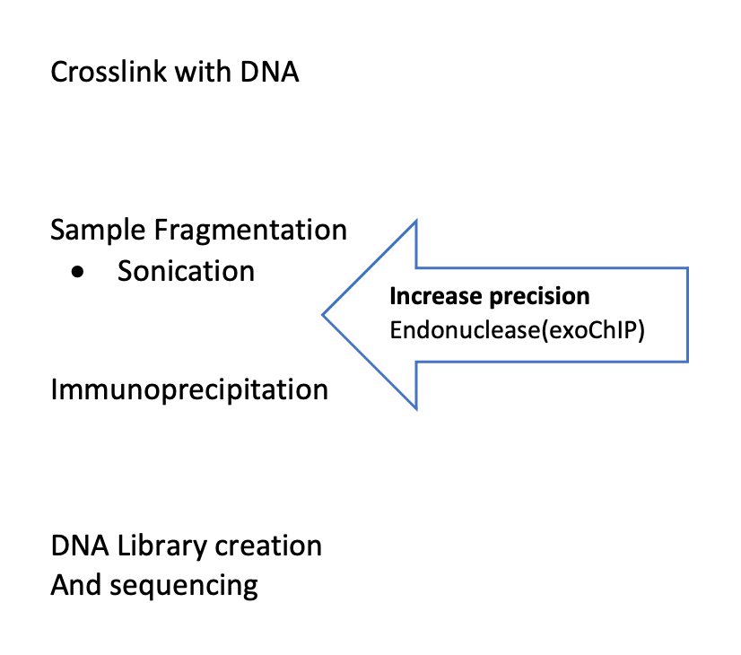
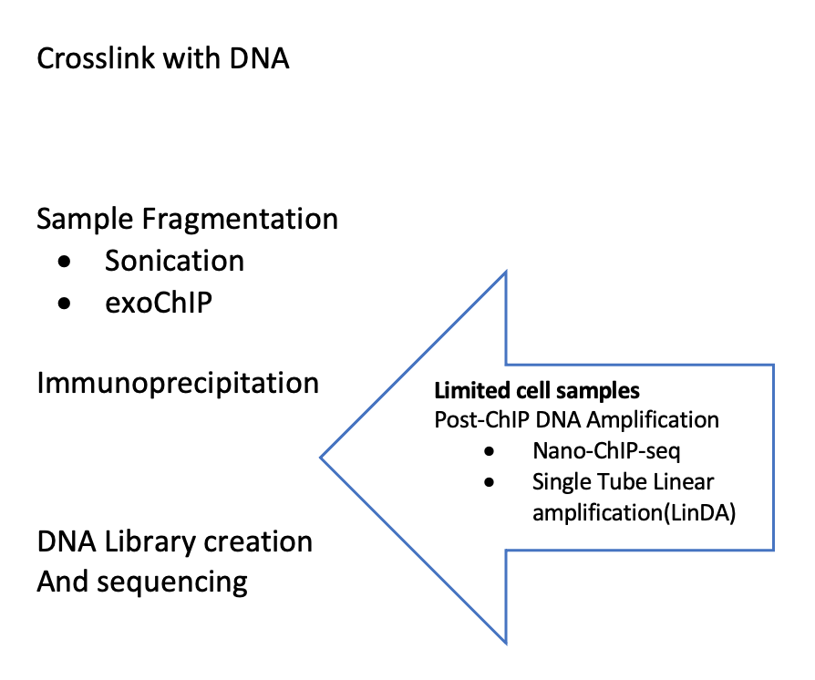

# CHIP-Sequencing and Potential Improvement
BENG183 Final Paper  
Date: 12-15-2020 
Group 4: Kelly Chou, Renyi Zhao, Li Yu Tang 

1. [Introduction](#1)
2. [ChIP-Sequencing Workflow](#2) 
    2.1 [Experimental Workflow](#21) 
    2.2 [Computational Analysis](#22) 
3. [Advantages](#3)
4. [Disadvantages](#4)
5. [Improved Methodologies](#5) 
    5.1 [ChIP-exo](#51) 
    5.2 [Limited Cell Number](#52) 
    5.3 [Re-ChIP](#53) 
6. [Quality Control](#6) 
    6.1 [Sequencing Depth](#61) 
    6.2 [S/N - The Signal To Noise Ratio](#62) 
7. [References](#7) 

<!--- 
(make sure that you're using a "Relative path" of the figure so that when you pull your project folder to course project repo, we can properly see your figures. eg, using  where your .md file are under the same level with the pictures folder.)
-->

## 1. Introduction

  

ChIP-Sequencing stands for chromatin-immunoprecipation and focuses on protein-DNA interactions. It uses antibodies to select specific proteins or nucleosomes that are then hybridized to a microarray to identify the DNA fragments later. It enriches for DNA fragments bound to proteins or nucleosomes.

The goal of ChIP-Sequencing is to map binding sites of any DNA binding protein, histone modifications, nucleosome positioning, and other protein-DNA interactions.

---

## 2. ChIP-Sequencing Workflow

### 2.1 Experimental Workflow

  

1. **Crosslink**:
The proteins are first crosslinked to the DNA using formaldehyde.
2. **Shear Chromatin**:
Then, the chromatin is sheared into smaller pieces by sonication or enzymes to digest them.
3. **Add protein-specific antibody**:
Next, the antibodies for the specific protein in question is added.
4. **Immunoprecipitation**:
Later, the DNA is immunoprecipitated to isolate and concentrate the particular protein in question.
5. **Purify DNA**:
The crosslinks are reversed and the DNA is purified using the antibody-bound magnetic beads.
6. **Prepare for sequencing**:
The immunoprecipitated DNA is now prepared to be used for a next-generation sequencing to be analyzed for DNA binding sites.

### 2.2 Computational Analysis

    

After the DNA is prepared for sequencing and mapping, different analysis strategies may be used depending if there is a **small-scale analysis**, like a single or small sample, or a **large-scale anaylsis** with many samples. Normally **differential analysis** is used for small-scale samples with **spike-in analysis** or **de novo normalization** by using different [signal-to-noise (S/N) ratios](#61) and underlying assumptions. For small-scale analyses, **peak-calling strategies** and parameters may be adjusted. For large-scale analyses, it may be wise to **jointly analyze** all the ChIP samples instead of comparing peaks for each sample individually. A **relaxed threshold** to compare the peaks may be used for large-scale analyses.

**Peak calling** is comparing different peaks from each experiment. There are three modes that each require different peak-calling strategies: 
- **sharp mode**: specific positions in genome
- **broad mode**: large genomic domains
- **mixed mode**: both specific positions and large genomic domains

Broad and mixed mode peaks are associated with weak and widespreach enriched regions with no clear peak summits and sequence specficity.

In addition, other analysis strategies may be used to further analyze: 
- **Functional analysis**: motif analysis, gene ontology
- **Integration with other technologies**: gene expression, chromatin, genetic variation, DNA methylation
- **Validation**: qPCR, knockdown analysis

---

## 3. Advantages
- **Mapping**

    It can be used to map DNA-binding proteins and histone modifications in a genome-wide manner at base-pair resolution.
    
- **Higher resolution, less noise, higher genome coverage and wider dynamic range**

- **Requires few amounts of DNA**
    
    Generates a more precise list of protein binding sites and targets of transcription factors, enhancers, and identification of sequence motifs. Detailed profiling of           histone modifications and nucleosome positions enables greater understanding of epigenetic mechanisms in development and differentiation.
 
- **Repetitive regions in the genome can now be examined**

- **Increased sensitivity and specificity**

    Increased sensitivity and specificity in the mapping of transcription factor binding sites can facilitate motif discovery and target identification.
    
- **Compatibility with various input of DNA samples.**

- **Single nucleotide resolution**

    While the resolution for ChIP-chip varied by arrays, it is generally in the range of 30-100 bp.
    
- **Eliminate signal noise**

    During ChIP-chip’s hybridization process there may be cross-hybridization between imperfectly matched sequences, which adds to signal noise. ChIP-seq is intrinsically         immune to such sources of noise due to the direct sequencing method.

---

## 4. Disadvatages
- **High cost and availability**

    ChIP-chip costs $400–$800 per array (1–6 million probes) but multiple arrays may be needed for large genomes, however ChIP-Seq cost around $1000–$2000 per Illumina lane       (6–15 million readsprior to alignment)

- **High quality of antibodies required**

    ChIP-seq makes use of antibodies in immunoprecipitation, hence the quality of the data relies on the high quality of the antibody. However, antibodies vary widely in           quality between suppliers and batches.

- **Required large amounts of tissue**

    It requires a lot of tissue to be prohibitive for some rare sample types. The peaks in the profiles need to be compared to the same loci of the control sample to make        the result more accurate.

- **Prior knowledge of DNA-binding protein required**

    Prior knowledge of specific binding sites are needed for the antibodies to see where they exactly bind to the protein that we are interested in. 
    
- **Bias in high GC-rich content in fragment selection**

---

## 5. Improved Methodologies

### 5.1 ChIP-exo 

  

In the fragmentation process, ChIP-exo can be performed to increase precision and avoid systematic biases. 
Standard ChIP-seq experiments that use sonication to fragment chromatin result in libraries containing DNA molecules that are ~200 bases long, even though each protein typically binds only 6-20 bases. In addition, resulting libraries are often contaminated with DNA not bound by the target factor, which has necessitated the use of the input control experiments and is responsible for some common systematic biases.   
Instead of sonication, ChIP-exo uses lambda (λ) exonuclease to digest the protein-bound, it can largely eliminate contaminating DNA. It could identify binding sites with single basepair precision, a 90-fold greater precision than when using the standard protocol, and with a 40-fold increase in the signal-to-noise ratio indicating lower background (contaminating) signal.  

### 5.2 Limited Cell Number

  

Typically, large numbers of cells (~10 million) are required for a ChIP experiment limiting both the types of cells that can be assayed as well as the number of ChIP experiments that can be performed on a valuable sample. It can be especially challenging in small model organisms where multiple whole animals may be necessary to achieve these quantities. Two protocols have been recently developed to address this problem through post-ChIP DNA amplification.   

### 5.3 Re-ChIP  

DNA bound proteins and histone modifications work together and with other genomic modifications to perform cellular functions. For experiments in which different proteins or modifications are at the same genomic location, sequential ChIP, or re-ChIP are performed.   
Sequential experiment uses antibodies to different proteins in succession. It can help to determine whether the interactions are simultaneously present or on different chromosomes in the same cell or in different cells. It is helpful to reveal the identities of individual proteins interacting in larger complexes, providing evidence for combinations of factors that will bind together. 

---

## 6. Quality Control

  

Because the quality of the ChIP-seq results are relevant to the specificity of the binding events and the choice of a method in a specific analysis, the overall design and quality management of the experiment are of critical importance. We are still discovering biases in sequence data due to a combination of genomic characteristics, experimental protocols, specific sequencing technologies, and analytical methods. In order to maintain the robustness of the technique, it is crucial to monitor several varibles for quality control and adjust the protocols accordingly.    

### 6.1 Sequencing Depthh
The number of called peaks increases with the sequencing depth, because the weaker sites become statistically significant with a greater number of reads. Thus,sufficient sequencing depth is required to include all functional sites, which avoids the technical biases caused by uneven Chip-enrichment. 
  
A saturation analysis is usually performed to determine adquate sequencing depth. And for most histone-modification which exists no clear saturation point, the depth is usually determined empirically. 
  
Increased sequencing depth allows detection of more sites with reduced enrichment. It is noted that setting a minimal signal strength threshold, usually based on a p-value or false discovery rate calculation, to identify peaks does not guarantee discovery of all functional sites. 
  
It is also noted that DNA sequencing library complexity, which is the amount of unique DNA molecules, must be sufficient meaning sequencing depths do not exceed complexity. It is suggested that at least 80% of 10 million or more reads be mapped to distinct genomic locations.
  
Low complexity libraries generally indicate a failed experiment where not enough DNA was recovered causing the same PCR amplified products to be sequenced repeatedly and many small peaks to be detected with a high false positive rate. 
  

### 6.2 Signal To Noise Ratio S/N 
The S/N is evaluated by the number and strength of peaks obtained for each ChIP sample. This measure can also be used to assess the degree of noises in the input sample. The ENCODE consortium proposed two metrics, fraction of reads in peaks (FRiP) and cross-correlation profiles (CCPs) to measure the S/Ns. However, they have mainly been tested using only a few species and a more extensive investigation is necessary to understand the applicability of this approach to many other species. 
  
Moreover, a large S/N does not guarantee that the identified peaks are genuine binding sites—a large score merely means that there are many read-enriched regions in the genome. Samples that have many false-positive sites (e.g. non-specific binding sites) also have large S/Ns.

 

---

## 7. References

1.  Barski, A., & Zhao, K. (2009, January 27). Genomic location analysis by ChIP‐Seq. Retrieved December 07, 2020, from https://onlinelibrary.wiley.com/doi/pdf/10.1002/jcb.22077
2.  Furey, T. (2012, December). ChIP-seq and beyond: New and improved methodologies to detect and characterize protein-DNA interactions. Retrieved December 07, 2020, from https://www.ncbi.nlm.nih.gov/pmc/articles/PMC3591838/
3.  Nakato, R., & Sakata, T. (2020, March 30). Methods for ChIP-seq analysis: A practical workflow and advanced applications. Retrieved December 07, 2020, from https://www.sciencedirect.com/science/article/pii/S1046202320300591
4.  Nakato, R., & Shirahige, K. (2017, March 1). Recent advances in ChIP-seq analysis: From quality management to whole-genome annotation. Retrieved December 07, 
2020, from https://www.ncbi.nlm.nih.gov/pmc/articles/PMC5444249/

---

