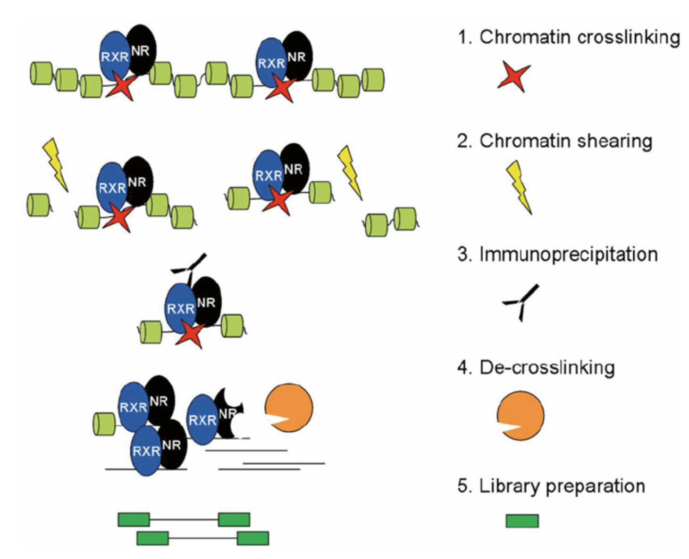
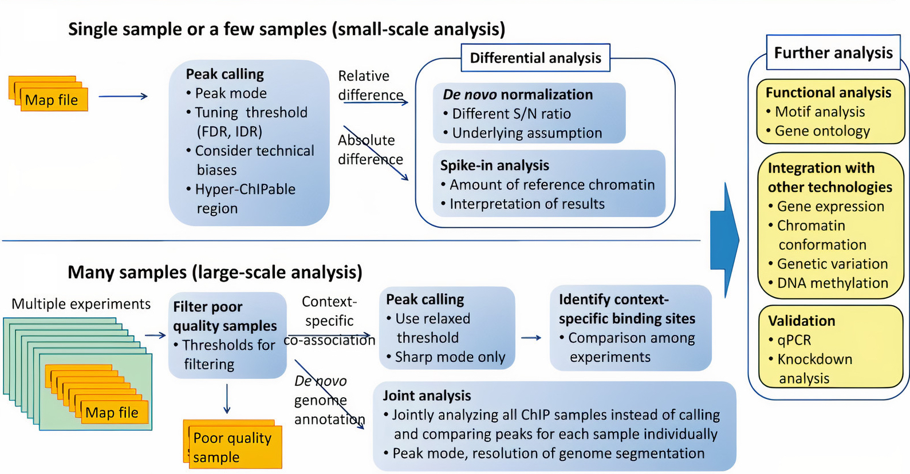

# CHIP-Sequencing
BENG183 Final Paper
Date: 12-15-2020
Group 4: Kelly Chou, Renyi Zhao, Li Yu Tang

1. [Introduction](#1)
2. [ChIP-Sequencing Workflow](#2)<br>
    2.1. [Experimental Workflow](#21)<br>
    2.2. [Computational Analysis](#22)<br>
3. [Advantages](#3)
4. [Disadvantages](#4)
5. [Improvements and Possible Solutions](#5)
6. [References](#6)

<!--- 
(make sure that you're using a "Relative path" of the figure so that when you pull your project folder to course project repo, we can properly see your figures. eg, using  where your .md file are under the same level with the pictures folder.)
-->

## 1. Introduction<a name="1"></a>


ChIP-Sequencing stands for chromatin-immunoprecipitation and focuses on protein-DNA interactions. It uses antibodies to select specific proteins or nucleosomes that are then hybridized to a microarray to identify the DNA fragments later. It enriches for DNA fragments bound to proteins or nucleosomes.

The goal of ChIP-Sequencing is to map binding sites of any DNA binding protein, histone modifications, nucleosome positioning, and other protein-DNA interactions.

---

## 2. ChIP-Sequencing Workflow<a name="2"></a>

### 1) Experimental Workflow<a name="21"></a>




1. **Crosslink**:
The proteins are first crosslinked to the DNA using formaldehyde.
2. **Shear Chromatin**:
Then, the chromatin is sheared into smaller pieces by sonication or enzymes to digest them.
3. **Add protein-specific antibody**:
Next, the antibodies for the specific protein in question is added.
4. **Immunoprecipitation**:
Later, the DNA is immunoprecipitated to isolate and concentrate the particular protein in question.
5. **Purify DNA**:
The crosslinks are reversed and the DNA is purified using the antibody-bound magnetic beads.
6. **Prepare for sequencing**:
The immunoprecipitated DNA is now prepared to be used for a next-generation sequencing to be analyzed for DNA binding sites.

### 2) Computational Analysis<a name="22"></a>



Depending on if there is a small-scale analysis, like a single or small sample,or a large-scale anaylsis with many samples, different analysis strategies may be used. Peak calling is comparing different peaks from each experiment. For larger-scale analyses, a relaxed threshold to compare the peaks may be used. Normally differential analysis is used for small-scale samples, but other analysis strategies may be used to further analyze: 
- Functional analysis: motif analysis, gene ontology
- Integration with other technologies
- Validation: qPCR, knockdown analysis

---

## 3. Advantages<a name="3"></a>

---

## 4. Disadvatages<a name="4"></a>
- **High cost and availability**

    ChIP-chip costs $400–$800 per array (1–6 million probes) but multiple arrays may be needed for large genomes, however ChIP-Seq cost around $1000–$2000 per Illumina lane       (6–15 million readsprior to alignment)

- **High quality of antibodies required**

    ChIP-seq makes use of antibodies in immunoprecipitation, hence the quality of the data relies on the high quality of the antibody. However, antibodies vary widely in           quality between suppliers and batches.

- **Required large amounts of tissue**

    It requires a lot of tissue to be prohibitive for some rare sample types. The peaks in the profiles needed to be compared to the same loci of the control sample to make        the result more accurate.

- **Prior knowledge of DNA-binding protein required**

    Prior knowledge of specific binding sites are needed for the antibodies to see where they exactly bind to the protein that we are interested in. 
    
- **Bias in high GC-rich content in fragment selection**


---

## 5. Improvements and Possible Solutions<a name="5"></a>

---

## 6. References<a name="6"></a>
1.  Barski, A., & Zhao, K. (2009, January 27). Genomic location analysis by ChIP‐Seq. Retrieved December 07, 2020, from https://onlinelibrary.wiley.com/doi/pdf/10.1002/jcb.22077
2.  Furey, T. (2012, December). ChIP-seq and beyond: New and improved methodologies to detect and characterize protein-DNA interactions. Retrieved December 07, 2020, from https://www.ncbi.nlm.nih.gov/pmc/articles/PMC3591838/
3.  Nakato, R., & Sakata, T. (2020, March 30). Methods for ChIP-seq analysis: A practical workflow and advanced applications. Retrieved December 07, 2020, from https://www.sciencedirect.com/science/article/pii/S1046202320300591
4.  Nakato, R., & Shirahige, K. (2017, March 1). Recent advances in ChIP-seq analysis: From quality management to whole-genome annotation. Retrieved December 07, 
2020, from https://www.ncbi.nlm.nih.gov/pmc/articles/PMC5444249/


---

# Text weight

# Really heavy text!
## Less heavy
### Even littler
#### I'm shrinking
##### Oh no
###### plz help
This is some normal text...

This is a new paragraph
that continues in the same line despite the line break.


---


# Text formatting

 **I'm bold!**

 *I'm italic!*

### <span style="color:cyan">COLOR!</span> <span style="color:red">COLOR!</span> <span style="color:yellow">COLOR!</span> <span style="color:magenta">COLOR!</span>


---

# Links
## [I'm a hyperlink](https://en.wikipedia.org/wiki/YOLO_(aphorism)
[*I'm a small italic link*](https://en.wikipedia.org/wiki/YOLO_(aphorism)

___


# Quoting

"Normal Quotes"

Block quotes!

>Lorem ipsum dolor sit amet, consectetur adipiscing elit. Mauris a ipsum nec justo dictum convallis. Integer luctus ultricies tortor sit amet vehicula. Nam tristique faucibus pharetra. Cras nec erat ligula. Proin at odio ex. Nulla ornare imperdiet nulla, sed posuere est imperdiet et. Curabitur egestas risus vitae quam pulvinar, in vulputate leo mollis. Fusce nec tincidunt libero. Suspendisse odio urna, pretium eget lectus id, accumsan bibendum ex. Aenean accumsan malesuada sem, at blandit dui euismod a. Sed sed eros porttitor, iaculis augue id, pulvinar mi. Ut in scelerisque libero, quis malesuada sem. Donec commodo diam quis massa condimentum, non consequat orci bibendum. Praesent auctor tellus egestas felis tincidunt, eget imperdiet lorem pharetra.

---

# Pictures
Two ways to format this


![Puppy1][puppy2]

[puppy2]: https://i.ytimg.com/vi/AZ2ZPmEfjvU/maxresdefault.jpg "Another Puppy!!"


[](nytimes.com)

---

# Code
You can reference variables like `x` or `y` inline.
But you can also have block quotes like:
```
import numpy as np
random = np.random.randn(10, 10)

print('Hello World!')
```
But you can even format the text for languages:
```python
import numpy as np
random = np.random.randn(10, 10)

print('Hello World!')
```
**Pretty!**


----

# Lists

1. Item One
2. Another


* Unordered Item
* Another one!

---

# Tables
Note the different alignments

|Time of day| Favorite snack | Why?                |
|-----------|:----------------:|----:              |
|Morning    | Oreos!           | Delicious         |
|Afternoon  | Otter Pop        | It's hot out baby |
|Night      | IPA              | I need it. |

# Comments (look at the source code)

[comment]: <> (This is a comment
               everything in here won't be in the final doc)

 <!---
This is also a comment :)
 -->
