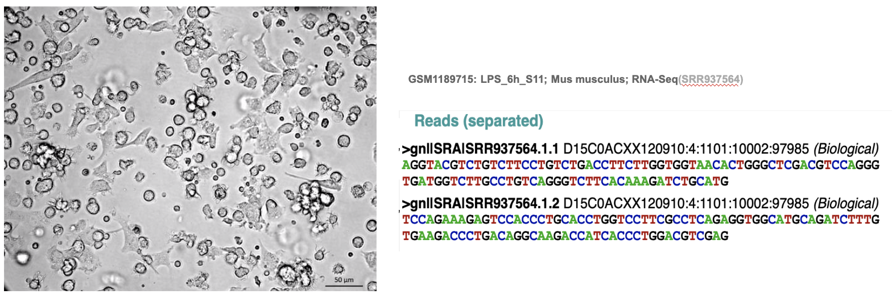

Introduction to Alternative Splicing
====================================

The discovery and analysis of Alternative Splicing (AS) is a fairly
recent topic of interest. The concept of AS was first proposed by Walter
Gilbert in 1978, who noted that in several studies of eukaryotic genes,
analyses of globin, ovalbumin, immunoglobulin, SV40 and polyoma, all
seem to display that the sequences of DNA that will ultimately be
translated into amino acid sequences are disrupted by ‘silent’ DNA
rather than remaining continuous. These ‘silent’ DNA fragments were
proposed to be introns, named for intragenic regions. He hypothesized
that the cistron, a genetic component of function that is thought to be
congruous with the polypeptide chain, is replaced by introns, which in
turn alternate with the regions of DNA which are expressed, named exons.
Together, the introns and exons create a mosaic on the given gene.

We can formally define Alternative Splicing as the process in which
exons within a primary transcript (pre-mRNA) of a gene are
differentially joined or skipped to produce multiple functionally and
structurally distinct protein variants. Though scientists still have a
long way to go in the research and analysis of this fascinating process,
the genetic and evolutionary importance of this functionality does not
go unnoticed. AS has already been shown to play an important role in
increasing the diversity and functional capacity of a gene during
post-transcriptional processing, and is also integral to gene
regulation: AS modulates protein binding, binding between protein and
membranes, and binding between proteins and nucleic acids, and it also
modulates protein localization and the enzymatic properties of of
proteins and their interactions.

In its essence, the universal purpose of Alternative Splicing is to
increase mRNA diversity expressed from the genome. Experiments have
shown that various physiological conditions can cause changes in
alternative splicing patterns – for example, one interesting study
revealed that medical students who were facing high amounts of stress
observed a change in their pre-mRNA alternative splicing of the
phosphatidylinositol 3-kinase-related protein kinase (SMG-1) (Kurokawa
et al., 2010). Kurokawa also found that such a change in splicing
pattern might cause later effects related to nonsense-mediated RNA decay
and the p53 pathway. Additionally, alternative splicing can also be
utilized for advantageous conditions (Fu et al., 2007). Fu demonstrated
that changes in alternative splicing could be used to produce male flies
with a splicing defect, which would eliminate female offspring. This
defect could ultimately be used as a method of pest control.

Such studies have exciting implications for what we can learn about
environmental effects of Alternative Splicing and how the process
directly correlates to human health and beyond. Although numerous
studies of this fashion have been released and are currently taking
place, there is still very little known about the functions of most
alternative exons, leaving lots of room to explore AS further.

Mechanism of Alternative Splicing
=================================

So, what do scientists know about the process credited for the genetic
diversity observed in the world today? In this section, we will briefly
cover the process of Alternative Splicing and its various forms.

Human exons range in length from 50 to 300 nt, averaging around 137 nt.
They can be viewed as short sequences of the pre-mRNA that are
surrounded by larger introns, which are on average 3,400 nt in length,
on each side. During the period in which RNA polymerase II is being
synthesized in the nucleus, the spliceosome, a large macromolecular
complex, identifies exons and removes the intervening sequences
previously defined as introns. The spliceosome consists of five small
nuclear RNAs (snRNAs) and around 170 proteins. The exons consist of
three major sequence elements: the branch point, the 3’ splice site, and
the 5’ splice site. During alternative splicing, the spliceosome
identifies the exon’s three defining sequence elements and assembles in
a stepwise pattern of the forming pre-mRNA. Next, the U1 snRNP will
attach to the 5’ spice site, and the splicing factor 1 attaches to the
branch point, which aids the binding of the U2AF factor on the 3’ splice
site.

The prespliceosomal A complex is a result of the previous step, which
creates what is known as the early (E) complex, which carries out the
splicing reaction by the substitution of SF1 by U2 snRNP. With the
tradeoff and recruitment of additional factors, the A complex is
reconstructed into the spliceosomal B complex which separates the intron
and combines the exons in a transesterification reaction. The final
outcome of Alternative Splicing depends on several factors, such as
stoichiometry and interactions of splicing activators and inhibitors as
well as the steric conformation and accessibility of the splicing sites.

Research has revealed seven main types of Alternative Splicing so far
(shown on the following page). The most common pattern is the
Cassette-Type Alternative Exon, also known as exon skipping, which
accounts for roughly 30 percent of all Alternative Splicing in
vertebrates and invertebrates. The most common splicing pattern in lower
metazoans is Intron Retention.

Multiple studies have suggested that splice-site selection can be
influenced by transcription factors performing at the level of
initiation and elongation. Specifically, factors that decrease the rate
of RNA polymerase II elongation can lead to greater levels of
alternative exon inclusion. One theory that has been introduced as an
explanation for this phenomenon is that the reduction of RNA polymerase
II elongation ends up kinetically favoring the recognition of relatively
weak splicing signals that neighbor an alternative exon over the
relatively stronger splicing signals that favor splicing of the
surrounding upstream and downstream constitutive exons, which results in
skipping of the alternative exons.

Significance of Alternative Splicing
====================================

In this final section on Alternative Splicing, we will discuss the
lasting impact and significance of the process in further detail.
Alternative splicing is very common in human genes – research has found
that at least 75 percent of approximately 25,000 human genes undergo
alternative splicing to encode two or more splice isoforms that
ultimately produce greater than 90,000 different proteins. AS is known
to be involved in regulations of normal physiological functions as well
as pathologies, and a current topic of interest is how different
diseases can be linked to changes in Alternative Splicing. For example,
studies have revealed that mutations in the splicing factors
PRPF31/U4-61K and PRP8 are responsible for the autosomal dominant forms
of retinitis pigmentosa, a genetic disorder in the eyes that leads to
vision loss (Tazi et al., 2009). With further investigation into such
studies, scientists may be able to get a better understanding on the
severity of Alternative Splicing mutations and how these can be
prevented for better population health.

Along with playing an important role in human genes and gene expression,
Alternative Splicing is also very common and significant in plants.
Research has found that roughly 90 percent of protein-coding genes in
plants are the result of Alternative Splicing. Alternative Splicing in
plants may also play a vital role in maintaining their circadian clock,
which is critical for plant growth and development. Research has shown
that two transcripts of CCA1, CCA1α and CCA1β, are spliced according to
plant type, and these genes go on to affect various aspects of plant
physiology that help regulate its circadian clock (Shang et al., 2017).

As shown throughout this section, Alternative Splicing is a complicated
process that allows for substantially greater diversity through limited
genes. New insights are being uncovered daily through experimentation
and analysis. Though the scope and exact role of AS is still being
determined through investigation on a genome-wide scale, scientists do
know that Alternative Splicing greatly increases the complexity of gene
expression and plays an important role in cellular differentiation and
organism development across the planet.

Why Do Bioinformaticians Study Alternative Splicing
===================================================

Bioinformaticians study alternative splicing sites and events to
understand the expression of genes, or determining “when, where and how
a gene is turned on”, and the cause of diversity in proteomes (Purdue
University). Alternative splicing events are responsible for “binding
properties, intracellular localization, enzymatic activity, protein
stability, and posttranslational modifications of a large number of
proteins” (Stamm et al). They can result in the complete loss of
function of the gene, the generation of new functions, or modified
expression of the parental gene and are often seen during the
developmental stage of cells. For example, the transmembrane protein
CD45 is manipulated by genes that contain isoforms with a spectrum of
functions. CD45 is responsible for regulating the receptor signaling of
T-cells and B-cells in lymphocytes. Different isoforms of the gene that
regulate the CD45 protein determine the differentiation and activation
state of the T and B cells. For example, Although naive T lymphocytes
express large CD45 isoforms and are usually positive for CD45R,
activated and memory T lymphocytes express the shortest CD45 isoform,
CD45R0, which facilitates T cell activation” (Zhao). Different isoforms
of genes are correlated with the “development [and] differentiation”; we
can study altered state of genes (ex: diseases) using protein analysis
tools after determining the gene expression (Katz et. al). Diseases,
including cancer, familial dysautonomia, and myotonic dystrophy, “have
been associated with dysregulation of alternative splicing (Tazi et al.,
Tang et al.). Scientists can now manipulate AS as splice modulating
therapies to develop modern medicine and therapeutics. For example,
“clinical drugs such as novantrone (mitoxantrone) can enhance the
effectiveness of therapeutic treatments for familial neurodegenerative
diseases by stabilizing the tau pre-mRNA splicing regulatory element”
(Tang et al.). Scientists utilize high throughput genomic tools to
determine “the changes in alternative splicing under various conditions;
the properties and functions of protein isoforms; and the splicing and
alternative splicing regulation process” (Cuperlovic-Culf et al.).

Methods To Study Alternative Splicing
=====================================

Advancements in biological technology within the 20th century have paved
a route for bioinformaticians to manipulate sequencing data and
computational tools to study alternative splicing sites and events. The
study of gene expression became widely popular after the discovery of
pre-mRNA splicing in 1977). Experiments with pre-mRNA splicing allowed
for the discovery of the unique splicing patterns of genes. Scientists
discovered that mature mRNA transcripts were a result of “various
combinations of exons from a single precursor” (Stamm et al). The
characterization of alternative splicing events have been studied using
several methods including Reverse Transcription Polymerase Chain
Reaction (RT-PCR), Expressed Sequence Tags (ESTs), microarrays, and
RNA-sequencing. RT-PCR is a method used to amplify regions of the RNA;
“the method entails an initial step of transcribing a portion of the RNA
genome into complementary DNA (cDNA) which is then amplified through
PCR” (LabCE). The method overcomes the RNA amount and time limitations
that reduces the effectiveness and efficiency of “northern blotting,
ribonuclease protection assay, semi-quantitative RT-PCR, and competitive
RT-PCR” (Vandenbroucke et al.). RT-PCR is “characterised by a large
dynamic range of quantification, high accuracy, sensitivity and
throughput capacity, and requires no post-amplification manipulation,
thus avoiding possible carry-over contamination” (Vandenbroucke et al.).
It has been used to quantify different splice variants; however,
produces low throughput results. RT-PCR is limited to only characterize
known splicing events, because there is a “difficulty in creating two
reliable standard curves for the interpolation of unknown samples, a
critical step for [alternative splicing] analysis” (Vandenbroucke et
al.). ESTs are “small pieces of DNA sequence (usually 200 to 500
nucleotides long) that are generated by sequencing either one or both
ends of an expressed gene” (Purdue University). They are used to locate
genes within the chromosomal DNA by matching the nucleotides. ESTs have
also been used to quantify splicing variants and identify “widespread
alternative splicing in eukaryotes” (Purdue University). Still, a
constraint “on the discovery of alternative splice forms [using ESTs] is
that there simply aren’t enough EST data to give good coverage of most
region regions in anything approaching a representative list of tissues.
Even when alternative splice forms are found, information about their
tissue-specific regulation is often poor or unavailable” (Lee & Roy).
Therefore, the low throughput and high noise of ESTs make it a method to
only characterize known splice sites, similar to RT-PCR. Microarrays are
“used to sample alternative splicing events on a genome scale and
examine alternative splicing across tissues, cells, and species” (Lee &
Roy). During the microarray pipeline, DNA strands are fragmented and are
attached to fluorescent markers that are used to interact with DNA
probes to match complementary sequences. They are used to analyze
“exons, exon/exon junctions [and] specific splice forms”
(Cuperlovic-Culf). Microarrays often determine the overall expression of
a gene; therefore, it is difficult to isolate and study individual
probes, or individual splicing events. As a result, it is not the most
ideal method to study alternative splicing sites and events. The most
common and reliable method to analyze alternative splicing events is RNA
sequencing. The goals of RNA sequencing include “accurate measurements
of gene expression levels, discovery of novel transcribed regions,
identification of of novel and known isoforms, and relative changes of
isoform expression under different conditions” (Ding et al.). We can use
RNA sequencing to study alternative splicing events because it “can
quantify alternative-exon abundance and detection of differentially
regulated exons”, “can be used for estimation of the expression levels
of alternative exons” and is a “high throughput sequencing [tool for]
cDNA fragments” (Katz et al.).

RNA Sequencing Software Used To Characterize Alternative Splicing Products
==========================================================================

The products of alternative splicing through the RNA sequencing pipeline
can be characterized as transcript isoforms, as specific exons, or based
on the splicing events. The most popular tools used today use
high-throughput sequencing reads to quantify and visualize the
expression of isoforms, exons, or splicing events. Transcript isoforms
can be quantified and visualized through RSEM, Kallisto, and Salmon.
RSEM determines transcript quantification, such as estimated isoform
expression levels of highly expressed genes, from single ended or paired
end reads; Kallisto can accomplish the same tasks through
pseudoalignment; Salmon couples “the concept of quasi-mapping with a
two-phase interference procedure” (Patro). Specific exons can be
analyzed through MISO and DEXSeq. MISO uses statistical modeling to
estimate the expression of and detect the differentially regulated of
exons; DEXSeq uses differential exon usage to determine the “mean
changes in the relative usage of exons caused by the experimental
condition, defined as [the] number of transcripts from the gene that
contain this exon/[the] number of all transcripts from the gene” (Reyes
et al.). Splicing events can be characterized using rMATs, MAJIQ, and
LeafCutter. rMATs detects the splicing events by calculating the
“P-value and false discovery rate that the difference in the isoform
ratio of a gene between two conditions exceeds a given user-defined
threshold” (Xing Lab, Children’s Hospital of Philadelphia); MAJIQ is
used to model and quantify varying alternative junctions; LeafCutter
uses “short-read RNA sequencing data (...) to leverage spliced reads
(reads that span an intron) to quantity (differential) intron usage
across samples” (Li et al.).

Example of Bioinformatics Pipeline of RSEM to Quantify the Expression of Isoforms of a Highly Expressed Gene
============================================================================================================

Prepping Our Sample We start off with a single cell RNA-Sequencing
dataset, which contains  1 million paired-end reads sequenced from a
single dendritic cell. Our goal is to analyze our data to look at
different isoforms of genes and the expression levels of isoforms within
our sample.

Building the Reference Genome To build our reference genome, we start
with single cell RNA sequencing data of bone marrow samples from mouse
dendritic cells derived from the NCBI GEO database (GSE48968). We must
convert our sequencing data into aligned reads to the Ensembl mouse
genome using STAR/Bowtie.The aligned reads will be used to create the
transcript references necessary for RSEM. We use the Ensembl mouse
transcripts to build the reference in RSEM.

RSEM Command We run RSEM on our test data (our paired end single RNA
Sequencing dataset). We align our data to the reference transcript that
we generated in the previous steps using Bowtie/STAR.

Isoform Analysis

We derive results and can analyze the expression levels of all of the
genes and isoforms, determine the highly expressed genes, We can use our
data to visualize the different isoforms. We can study the different
isoforms of highly expressed genes from our sample. For example, we can
quantify the expression of the different isoforms of gene Ccl6
(expressed under myeloid cell differentiation). We can use the results
from our RSEM pipeline to quantify the expression of the different
isoforms of the Ccl6 gene in our sample.

Further details about this example can be found at the RSEM Github Page
(Source ).

Common Analysis Goals and Discoveries from RNA Sequencing 
==========================================================

Analysis Goals

The cellular transcriptome is everchanging, so it is paramount to keep
up with the discovery of the new things that come up, allowing us to
learn more about our genome. This can be done by analyzing the results
that RNA sequencing gives. It gives us a better understanding of how
proteins function and why certain genes are turned off and on in a cell.
There are many different analysis goals and discoveries that can be made
from RNA sequencing, just to name a few of them there is: pinpointing
differently expressed genes, discovering new isoforms or transcripts of
RNA, quantification of gene expression, mutations in the genome, fusion
of RNA and genes, and new gene discovery. More information and
discoveries can be found at:
https://www.ncbi.nlm.nih.gov/pmc/articles/PMC4863231/

Pinpointing of Differently Expressed Genes

“A gene is considered to be when there is a statistically significant
difference in expression levels or read counts during 2 experimental
conditions”(Anjum, Jaggi, Varghese, Lall, Bhowmik, Rai, 2016).
Differential gene expression is essential for multicellular eukaryotes.
It is the “basis for embryonic development and adult organ
function”(Klug, Cummings, Spencer, Palladino, 2016). It is also
essential for prokaryotes. Even if a gene may be normal, incorrect gene
expression results in “deleterious phenotype, cell death or
cancer”(Anjum, Jaggi, Varghese, Lall, Bhowmik, Rai, 2016). Identifying
and better understanding differentially expressed genes allows us to
learn more about diseases and development. There are various statistical
methods that have been used in order to identify the differentially
expressed genes. The two most common ones are based upon compound
Poisson distribution and the Negative Binomial distributions. Poisson
distribution is generally more straightforward, however it does not
account for overdispersion, this is when there is statistically
significant variability in the results produced. It may likely be caused
due to having a lack of consistency during replications. The reason that
overdispersion occuring is a problem, because it may result in
inaccurate results, when using methods that are based upon the Poisson
distribution. This is why there is a need for additional statistical
methods such as the Negative Binomial distributions. Although there are
many different statistical methods, they do not differ from each other
significantly, the differences come from “underlying data distributions,
their strategy for handling biological replicates, and ability to
perform multi-group comparisons”.(Fang, Martin, Wang, 2012).

Poisson Distribution

When the RNA samples constitute independent measurements from only one
source, the Poisson distribution is used. “$m_{ij}$$^{k}$ is defined as
the total number of short sequences which aligned to the gene, for the
expression level of a specific gene. Essentially the sum of a series of
random events that correspond to a short sequence and a Bernoulli
Distribution comes after. ”(Fang, Martin, Wang, 2012). The ”probability
that the sequence aligns to the gene”(Fang, Martin, Wang, 2012) is the
achievement. Poisson distribution is used in order to approximate
mij(k)sample, this can be written as “Poi(μi (k)), with μ i (k) being
the mean”.(Fang, Martin, Wang, 2012). The null hypothesis for the
ithgene will be that “all means are equal” for various expression
levels(Fang, Martin, Wang, 2012). Fisher’s Exact Test and the Likelihood
Ratio Test are both founded upon Poisson Distribution

Fisher’s Exact Test

This test measures if there is a notable mutualism between a phenotype
and gene expression, and “can be used for comparing two phenotypes...i.e
measuring if the odds ratio is significantly larger or smaller than
1”(Fang, Martin, Wang, 2012). In Figure 9, expression values are formed
using a contingency table. The contingency table in Figure 9 is only for
one gene, however, this can be used on hundreds to thousands of genes.

 [fig:galaxy]

 [fig:galaxy]

The values from the contingency table can be inputted into R in order to
calculate the P value. The function is listed in Figure 10. The p value
is the “hyper-geometric total probabilities for at minimum favorable to
an alternative hypothesis”(Fang, Martin, Wang, 2012) In other words this
is if phenotype 1 were larger than phenotype 2 in the gene expression or
if phenotype 1 were smaller 2 in the gene expression.(Fang, Martin,
Wang, 2012). If there is a case where there are many different
hypotheses due to having a large number of genes in a single RNA-seq
experiment, then the problem of a false positive may occur. To combat
the problem, “modifying the p-value or calculating q values”(Fang,
Martin, Wang, 2012) is used, the following methods have been suggested
in order to do so: “Bonferroni’s single-step adjusted p-values, Holm’s
step down adjusted p-values, and many more”(Fang, Martin, Wang, 2012).

Likelihood Ratio Test:

The likelihood ratio test is pinpointing differently expressed genes.
This method uses the Poisson distribution in the following equation
“Poi($μ_i$(k) =$L_j$$^k$$v_i$$^k$$(k))$, where $v_i$$^(k)$ represents
the proportion of gene transcript copies of the ith gene in all samples
under the kth phenotype”.(Fang, Martin, Wang, 2012) In order to lessen
the sequencing depth variation the $L_j$$^ k$ is incorporated into the
Poisson mean.

Figure 11 shows the following calculations that must be made in order to
calculate the statistic for the 2 sided alternative hypothesis.

 [fig:galaxy]

 [fig:galaxy]

If it is a one sided alternative hypothesis, Figure 12 illustrates the
equations used in order to make the calculations. However, “results may
be misleading if assumptions of sampling distribution are
violated”(Fang, Martin, Wang, 2012). If false positives do occur, the
same methods listed in the Fisher’s exact test section can be used.

Negative Binomial Distribution:

As brought up earlier, overdispersion occurs, the methods that are based
on Poisson distribution may not produce correct results. Bayesian method
can be applied in this case, “modeling gene counts by the marginal
distribution of $m_{ij}^k$ and making the Poisson mean a random
variable”(Fang, Martin, Wang, 2012). Gamma distribution has $\mu$
i(k)$\psi$ “scale parameter and (1/$\phi$) shape parameter”(Fang,
Martin, Wang, 2012), and by making the speculation that Poisson mean
comes from the Gamma distribution, the mean of the negative binomial
distribution becomes $\mu$i(k) while its variance transforms to
$\mu$i(k)(1+ $\mu$i(k)$\psi$) where $\psi$→ 0 resulting in an overall
depletion for the Poisson distribution. Essentially, the Negative
Bionomial model is a slight improvement and alteration of the Poisson
distribution. In order to detect the differentially expressed genes the
software/packages are are used: “R/Bioconductor package ‘edge R’“ (Fang,
Martin, Wang, 2012). Functions called in R used for uncovering of
differentially expressed genes are ”glmFit() and glmLRT()" (Fang,
Martin, Wang, 2012). The method of Deseq2 returns p values that are
unaltered. (Fang, Martin, Wang, 2012).

Deseq2

This method is based on improvement of the Negative Binomial
distribution. The negative Binomial distribution may have unexplained
variation when reducing variance and mean relationship. Deseq 2 uses the
equation in Figure 13 in order to model every gene for the normal count
data.

 [fig:galaxy]

The general workflow for Deseq2 can be divided up into two categories.
The first one is quality control, which has the following steps of “read
counts associated with genes, normalization and unsupervised clustering
analyses. The second portion is differential expression analysis which
has modelling of raw counts for each gene, shrinking log2 fold changes,
and testing for differential expression”(Chan, 2017). All of the steps
listed above are completed using a computer. These steps are essential
to do for every sample of a data set, because it allows scientists to
make conclusions based on the results, such as finding and identifying
the differentially expressed genes.

Final Results

After attempting the various statistical methods, a graph is produced
that helps with the identification of differently expressed genes. One
example is listed in figure 14. This is a histogram plot of up-regulated
gene expression. The Poisson distribution is fitted for the data with
this image. In figure 15 it can be seen that not all of the variance is
captured with Poisson distribution. So it is necessary to also fit the
plot with the negative binomial distribution. Using negative binomial
distribution all of the variance is captured. This can be seen in Figure
16. (Anjum, Jaggi, Varghese, Lall, Bhowmik, Rai, 2016)

(The figures mentioned above are listed below)

[fig:galaxy]

[fig:galaxy]

[fig:galaxy]

References
==========

​1. Blencowe, Benjamin J. “Alternative Splicing: New Insights from
Global Analyses.” Cell, Cell Press, 13 July 2006,
www.sciencedirect.com/science/article/pii/S0092867406008178.

​2. bli25broad, bli25broad. “bli25broad/RSEM~t~utorial.” GitHub,
github.com/bli25broad/RSEM~t~utorial.

​3. Cuperlovic-Culf, Miroslava, et al. “Microarray Analysis of
Alternative Splicing.” Omics : a Journal of Integrative Biology, U.S.
National Library of Medicine, 2006, pubmed.ncbi.nlm.nih.gov/17069512/.

​4. Ding, Lizhong, et al. “Comparison of Alternative Splicing Junction
Detection Tools Using RNA-Seq Data.” Current Genomics, Bentham Science
Publishers, June 2017, www.ncbi.nlm.nih.gov/pmc/articles/PMC5476949/.

​5. “ESTs: GENE DISCOVERY MADE EASIER.” ESTs,
www.cyto.purdue.edu/cdroms/cyto6/content/primer/est.htm.

​6. Katz, Yarden, et al. “Analysis and Design of RNA Sequencing
Experiments for Identifying Isoform Regulation.” Nature Methods, U.S.
National Library of Medicine, Dec. 2010,
www.ncbi.nlm.nih.gov/pmc/articles/PMC3037023/.

​7. Kelemen, Olga, et al. “Function of Alternative Splicing.” Gene, U.S.
National Library of Medicine, 1 Feb. 2013,
www.ncbi.nlm.nih.gov/pmc/articles/PMC5632952/.

​8. Lee, Christopher, and Meenakshi Roy. “Analysis of Alternative
Splicing with Microarrays: Successes and Challenges.” Genome Biology,
BioMed Central, 2004, www.ncbi.nlm.nih.gov/pmc/articles/PMC463277/.

​9. Li, Yang I, et al. “Alternative Splicing Quantification,
Differential Splicing, Outlier Splicing Detection, and Splicing QTL
Mapping.” Alternative Splicing Quantification, Differential Splicing,
Outlier Splicing Detection, and Splicing QTL Mapping • Leafcutter,
davidaknowles.github.io/leafcutter/.

​10. Multivariate Analysis of Transcript Splicing (MATS), Xing Lab,
Children’s Hospital of Philadelphia, rnaseq-mats.sourceforge.net/.

​11. Patro, Rob. “Salmon.” Salmon: Fast, Accurate and Bias-Aware
Transcript Quantification from RNA-Seq Data, 2020,
combine-lab.github.io/salmon/.

​12. “Reverse Transcriptase Polymerase Chain Reaction (RT-PCR).” Reverse
Transcriptase Polymerase Chain Reaction (RT-PCR) - LabCE.com, Laboratory
Continuing Education, LabCE,
www.labce.com/spg538192~r~everse~t~ranscriptase~p~olymerase~c~hain~r~eaction~r~t.aspx.

​13. Reyes, Alejandro, et al. “Inferring Differential Exon Usage in
RNA-Seq Data with the DEXSeq Package.” Bioconductor.org, 27 Oct. 2020,
bioconductor.org/packages/devel/bioc/vignettes/DEXSeq/inst/doc/DEXSeq.html.

​14. Shang, Xudong, et al. “Alternative Splicing in Plant Genes: A Means
of Regulating the Environmental Fitness of Plants.” International
Journal of Molecular Sciences, MDPI, 20 Feb. 2017,
www.ncbi.nlm.nih.gov/pmc/articles/PMC5343966/.

​15. Stamm, Stefan, et al. “Function of Alternative Splicing.” Gene,
Elsevier, 10 Dec. 2004,
www.sciencedirect.com/science/article/abs/pii/S037811190400650X?via=ihub.

​16. Tang, Jen-Yang, et al. “Alternative Splicing for Diseases, Cancers,
Drugs, and Databases.” The Scientific World Journal, Hindawi, 22 May
2013, www.hindawi.com/journals/tswj/2013/703568/.

​17. Tazi, Jamal, et al. “Alternative Splicing and Disease.” Biochimica
Et Biophysica Acta, U.S. National Library of Medicine, Jan. 2009,
www.ncbi.nlm.nih.gov/pmc/articles/PMC5632948/.

​18. Vandenbroucke, I I, et al. “Quantification of Splice Variants Using
Real-Time PCR.” Nucleic Acids Research, Oxford University Press, 1 July
2001, www.ncbi.nlm.nih.gov/pmc/articles/PMC55792/.

​19. Wang, Yan, et al. “Mechanism of Alternative Splicing and Its
Regulation.” Biomedical Reports, D.A. Spandidos, Mar. 2015,
www.ncbi.nlm.nih.gov/pmc/articles/PMC4360811/.

​20. W, Gilbert. “Why Genes in Pieces?” Nature, U.S. National Library of
Medicine, pubmed.ncbi.nlm.nih.gov/622185/.

​21. Zhao, Shanrong. “Alternative Splicing, RNA-Seq and Drug Discovery.”
Drug Discovery Today, Elsevier Current Trends, 4 Apr. 2019,
www.sciencedirect.com/science/article/pii/S1359644619300212?via=ihub.

​22. Fang, Z., Martin, J. & Wang, Z. Statistical methods for identifying
differentially expressed genes in RNA-Seq experiments. Cell Biosci 2, 26
(2012). https://doi.org/10.1186/2045-3701-2-26

​23. R. K. Meeta Mistry, “Gene-level differential expression analysis
with DESeq2,” Introduction to DGE, 13-Oct-2017. [Online]. Available:
https://hbctraining.github.io/DGE~w~orkshop/lessons/05~D~GE~D~ESeq2~a~nalysis2.html.
[Accessed: 15-Dec-2020]

​24. Kukurba, Kimberly R, and Stephen B Montgomery. “RNA Sequencing and
Analysis.” Cold Spring Harbor protocols vol. 2015,11 951-69. 13 Apr.
2015, doi:10.1101/pdb.top084970

​25. Anjum A, Jaggi S, Varghese E, Lall S, Bhowmik A, Rai A.
Identification of Differentially Expressed Genes in RNA-seq Data of
Arabidopsis thaliana: A Compound Distribution Approach. J Comput Biol.
2016 Apr;23(4):239-47. doi: 10.1089/cmb.2015.0205. Epub 2016 Mar 7.
PMID: 26949988; PMCID: PMC4827276.
