# In Depth Look at Next Generation Sequencing
Dheerav Chitalia | Dylan Lam | Alejandro Ramos

BENG 183: Applied Genomic Technologies

Professor Sheng Zhong

## Library Preparation

The library preparation step of next generation sequencing is essential for a successful next generation sequencing run. These initial steps ensure that issues with the quality of the sequencing reads and purity of the DNA samples do not affect the results of the run as well as making sure Illumina's sequencing analysis algorithms are able to perform downstream without issues. In this section, we will take a closer look at all the steps involved in a standard Illumina next generation sequencing library preparation. 

### Workflow
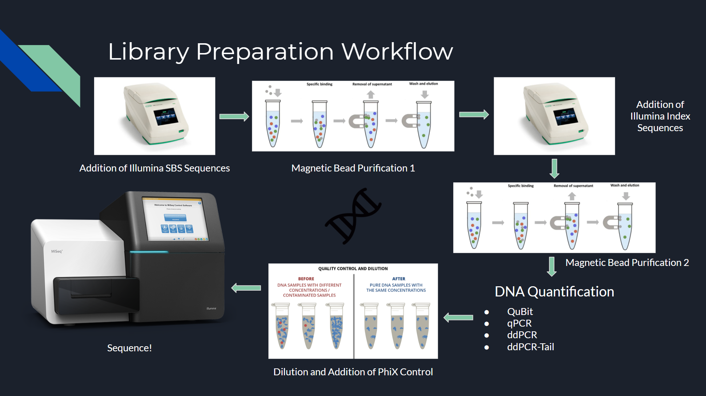
This image shows a general view of the NGS library preparation workflow. It includes:
- The addition of Illumina's sequencing by synthesis adaptors
- A first magnetic bead purification
- The addition of Illumina's index sequences
- A second magnetic bead purification
- A DNA quantification step
- A sample dilution and addition of PhiX control
- A sequencing run

We will now take a closer look at each one of these steps

### PCR 1: Addition of SBS Adaptors and Purification 1

#### Sequencing by Synthesis Adaptors
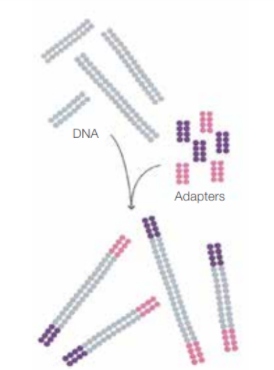

[Illumina SBS Adaptors](https://www.illumina.com/documents/products/techspotlights/techspotlight_sequencing.pdf)

The Illumina sequencing by synthesis adaptors are the first set of sequences to be added to the sample DNA. These adaptors are important because they allow the DNA samples to bind on to the flow cell surface and eventually are used to conduct bridge amplification in the sequencing workflow. These adaptors are added by polymerase chain reaction and then the samples are purified.
#### Magnetic Bead Purification 1
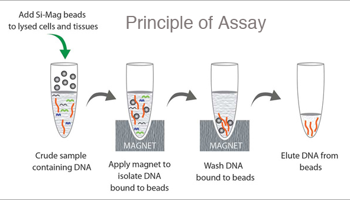

[Bead Purification](https://mvspacific.com/REAGENTS/DNA%20Isolation%20Kits.htm)

After the first PCR, the DNA samples will be contaminated with a variety of PCR residues and DNA dimers that can potentially affect the sequencing run. In order to purify these samples, a magnetic bead purification is done. This process involves:
- Adding magnetic beads to bind to the DNA samples of interest
- Placing the sample on a magnet to isolate the DNA samples that are bound to the beads
- Removing the contaminants from the solution
- Eluting the DNA from the beads

### PCR 2: Addition of Index Sequences and Purification 2

#### Index Sequences
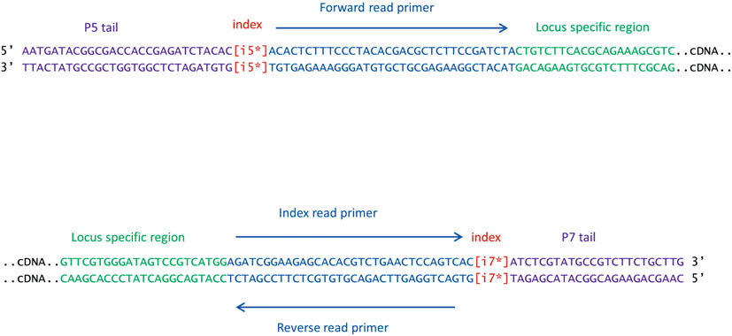

[Illumina Index Sequences](https://www.researchgate.net/figure/Dual-index-PCR-primers-designed-for-paired-end-Illumina-sequencing-of-5-UTR-region-The_fig5_289734765)

The addition of Illumina's unique dual (UD) index adaptors allows each sample of DNA to be identified after the sequencing run. These adaptors usually come in pairs (i5 and i7) and are 10 bases long. The addition of these adaptors makes it possible for scientists to conduct massively parallel sequencing runs with many different samples placed into a single pool. This technology saves time and the cost of having to conduct each of these sample sequencing runs in separate pools. Further downstream, the Illumina analysis algorithms are able to separate the sequences of the different samples in the pool by identifying the unique indexes. The addition of these indexes are done by a second PCR which, again, requires a purification.

#### Magnetic Bead Purification 2
After the second PCR, the DNA samples must be purified again in the same way they were purified after the first PCR except now these index samples can be pooled into one sample. This ensures that the quality of the DNA samples is preserved for the sequencing run

### Quantification, Dilution, and Addition of PhiX Control

#### Quantification
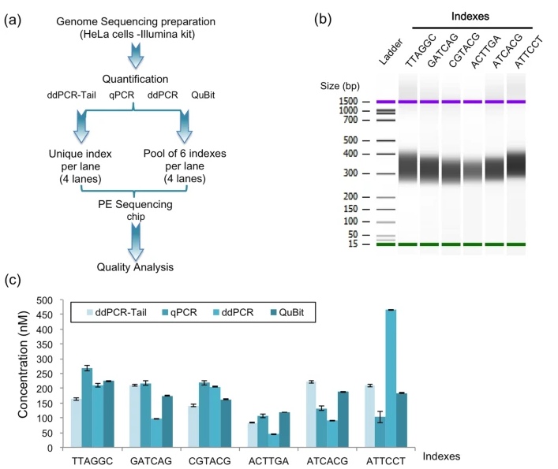

[Comparison of DNA Quantification Methods for Next Generation Sequencing](https://www.nature.com/articles/srep24067)

The quantification step of the library preparation workflow is required to create an accurate dilution of the DNA samples. There are many ways to quantify the DNA content of the sample pool and some examples are:
- qPCR
- Qubit
- ddPCR
- ddPCR-Tail

The image above is from an article where these four methods for quantification were done and the effects of the quantification methods on the final NGS run quality were analyzed.

In addition to these methods of quantification, it is standard to use tools such as Bioanalyzer (top right corner of the image above) to find the average base pair length of the sample pool. With these two quantification methods, the molarity of the sample can be calculated and be used for dilution.

#### Dilution

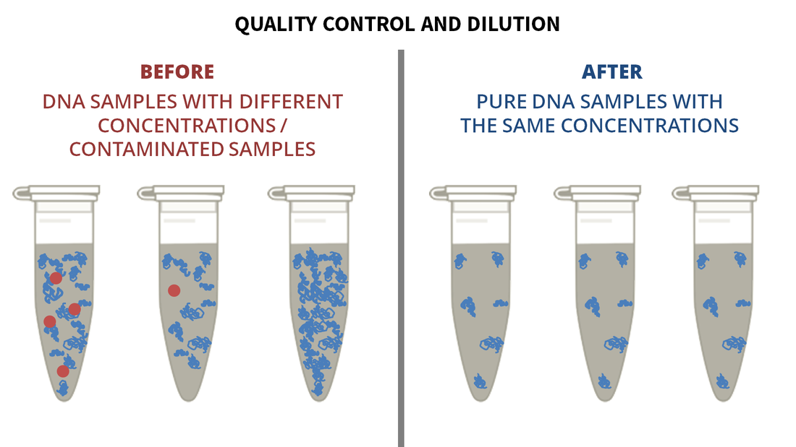

[Dilution](https://upcvmda-pl480.weebly.com/educational-articles/dna-sequencing-illumina-workflow-part-1-dna-isolation-quality-control-and-dilution)

Dilution is the next step in the library preparation workflow. This step is essential for the success of the resulting sequencing quality. When the sequencing undergoes bridge amplification, the sample DNA will be multiplied many times to form thousands of clusters across the sequencing flow cell. If the starting sample is not diluted enough, the clusters will overcrowd the flow cell and the clusters will not be distinguishable when the sequencing images are taken. The standard dilution of DNA samples is down to a 4nM library.

#### PhiX Control

The standard Illumina PhiX control that is used today is the PhiX Control v3 Library. This control is derived from the genome of a well-characterized bacteriophage. This library is about 500 base pairs long and has a composition of ~45% GC and ~55% AT. Because the composition of this PhiX control is so balanced, it helps even out base pair diversity across the flow cell. It provides a well-balanced, fluorescent signal for each cycle of the sequencing run to improve the quality of the reads. For example, if there is a region of the DNA samples of interest that have high GC content, the fluorescent images taken for the G and C bases would be overcrowded and the clusters would not be able to be differentiated. When PhiX control is added, it increases the base diversity and avoids this issue.
  
## Sequencing Run

Moving forward from preparing the library, sequencing begins by randomly fragmenting genomic DNA. This can be done by using enzymes or by sheer mechanical force. Once fragmented adapters are attached to both ends of the many fragments. Attaching these adapters allows for the now single stranded DNA to be bound to the surface of flow cell channels and In these flow cells, we add unlabeled nucleotides and enzymes to begin solid-phase bridge amplification. Amplification is a necessary step for generating DNA clusters for sequencing.

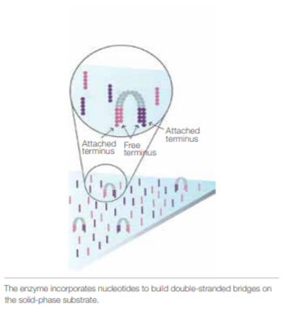

[Bridging](https://www.illumina.com/documents/products/techspotlights/techspotlight_sequencing.pdf)

After bridging, the fragments return to having a double stranded structure through enzymatic activity which incorporates added nucleotides to form double-stranded bridges on the solid-phase substrate. Upon completion of bridge formation, denaturation occurs, resulting in single stranded templates to be isolated and bound to the substrate.

What we are left with at this stage are the several million dense clusters of double-stranded DNA within the channels of the flow cell, completing amplification. 

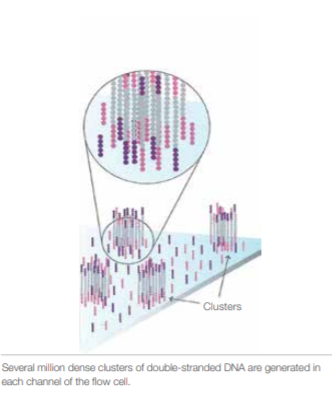

[Clustering](https://www.illumina.com/documents/products/techspotlights/techspotlight_sequencing.pdf)

We begin the first sequencing cycle by adding four labeled reversible terminators, primers, and DNA polymerase. A laser is then used to excite the molecules, resulting in the emission of fluorescence from each labeled and known cluster, thus capturing and identifying the first base. 

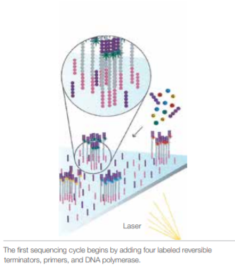

[First Base Identification](https://www.illumina.com/documents/products/techspotlights/techspotlight_sequencing.pdf)

The second cycle then proceeds similarly to the first with the addition of more terminators, primers, and DNA polymerase.  Upon laser excitation and fluorescence emission, the second base is captured and identified. 

This series of cycles is then repeated over thousands of cycles, resulting in an agglomeration of the completed fragment’s base pair sequence.

## Analysis
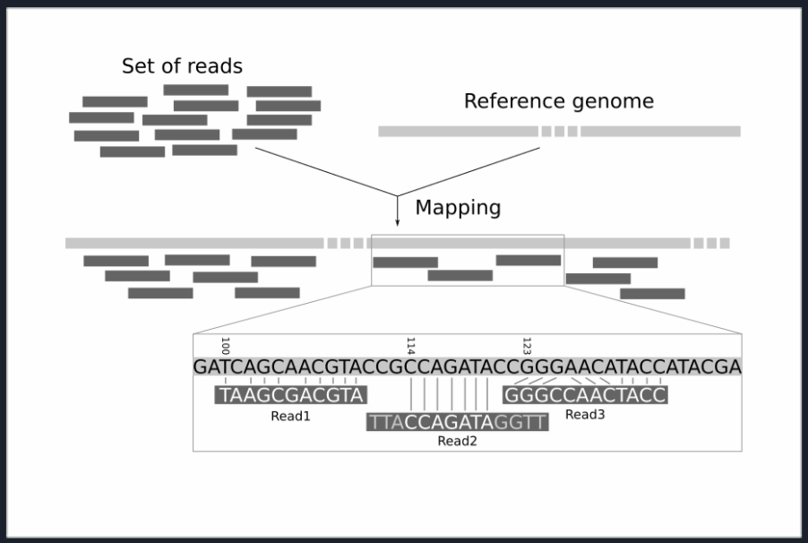

**_Alignment_**
Alignment is also known as mapping, allows us to see the genetic differences between our reads and the reference genome and helps us to detect variation in samples. NGS produces short read pairs or short reads which are sequences of < 200 bases. To compare the sequenced sample to the reference first we must find the corresponding part of that sequence for each read in our data, which is the actual alignment or mapping of reads. Below are some important tools that can be used for alignment of data.

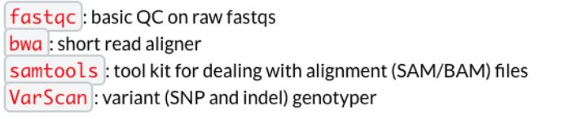

- fastqc is a very simple tool used to do quality control checks on data coming from sequencing pipelines.
- Burrows-Wheeler Alignment (bwa) is a software specifically designed for mapping low-divergent sequences against large reference genomes.
- Samtools is a software that helps manipulate aligned data in the BAM format.

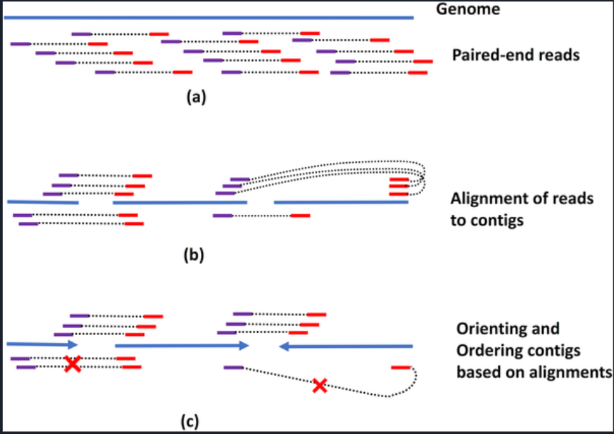

**_Assembly_**
Genome Assembly usually involves taking in a number of sequenced reads which are much shorter than the actual genome and re-creating the genome sequence. (If possible) Pair ended sequences are mapped out onto the genome with a given specific orientation and a given distance from each other. Below are some important tools used for genome assembly.

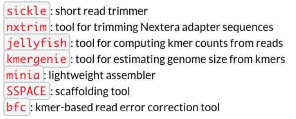

- Minia is a short-read assembler that is capable of assembling the human genome on a desktop computer in a day. Minia is based on a de Bruin graph. Assembly is performed using graph simplifications that are inspired by the SPAdes assembler.
- Sickle is a trimming tool for fastq files. It uses sliding windows and quality and length thresholds to determine and trim low quality bases.
- SSPACE is used for scaffolding contigs using paired-end reads. SSPACE has the feature of extending contigs using reads that are unmappable in the assembly step.

## Applications
<<<<<<< Updated upstream
1. Sequencing and construction of a new genome or transcriptome (De Novo Sequencing)
2. DNA/RNA Protein Interactions (ChIP Sequencing)
3. Metagenomics: the study of environmental samples where multiple microbial genomes are analyzed at the same time
=======
1. **_De Novo Sequencing_**: refers to the construction of a new genome or transcript. The mapping of reads for this process, especially during alignment, is fairly complicated due to the absence of a reference genome. In this process overlapping sequences are built up into as few large contigs as possible. Provision of high coverage read data increases the amount of overlapping sequences therefore increasing the confidence in sequence assembly.
2. **_ChIP Sequencing_**: or Chromatin Immunoprecipitation sequencing is used to analyze DNA-protein interactions. In this process, proteins are crosslinked with DNA to preserve the in vivo association. Next, DNA is sheared and a protein specific antibody isolates the DAN via immunoprecipitation. Lastly, the crosslinks are reversed and DAN is purified for sequencing.
3. Metagenomics: study of environmental samples where multiple microbial genomes are analyzed at the same time
>>>>>>> Stashed changes
4. Resequencing: used to determine the genomic variations of a sample in relation to a common reference sequence
5. Transcriptome Sequencing: Profiling, discovery, and analysis of the entire transcript- especially useful for RNA sequencing

## Citations

[An Introduction to Next-Generation Sequencing Technology](https://www.illumina.com/content/dam/illumina-marketing/documents/products/illumina_sequencing_introduction.pdf)

[Illumina Adaptor Sequences](https://support.illumina.com/content/dam/illumina-support/documents/documentation/chemistry_documentation/experiment-design/illumina-adapter-sequences-1000000002694-14.pdf)

[Illumina Sequencing Technology](https://www.illumina.com/documents/products/techspotlights/techspotlight_sequencing.pdf)

[Magnetic Beads Kits for DNA Extraction](https://mvspacific.com/REAGENTS/DNA%20Isolation%20Kits.htm)

[Nextera DNA Library Prep Reference Guide](https://support.illumina.com/content/dam/illumina-support/documents/documentation/chemistry_documentation/samplepreps_nextera/nexteradna/nextera-dna-library-prep-reference-guide-15027987-01.pdf)

[Using a PhiX Control for HiSeq Sequencing Runs](https://www.illumina.com/content/dam/illumina-marketing/documents/products/technotes/hiseq-phix-control-v3-technical-note.pdf)

[What is the PhiX Control v3 Library and what is its function in Illumina Next Generation Sequencing?](https://support.illumina.com/bulletins/2017/02/what-is-the-phix-control-v3-library-and-what-is-its-function-in-.html)

[Next Generation Sequencing Alignment](https://en.wikibooks.org/wiki/Next_Generation_Sequencing_(NGS)/Alignment)

[FASTQC](https://www.bioinformatics.babraham.ac.uk/projects/fastqc/)

[Manual Reference Pages - BWA(1)](http://bio-bwa.sourceforge.net/bwa.shtml)

[Minia](https://github.com/GATB/minia)

[Sickle - HCC-DOCS](https://hcc.unl.edu/docs/applications/app_specific/bioinformatics_tools/pre_processing_tools/sickle/)

[SSPACE - Bioinformatics](https://bioinformaticshome.com/tools/wga/descriptions/SSPACE.html#:~:text=SSPACE%20is%20a%20tool%20for,in%20the%20contig%20assembly%20step.)

[NGS Applications - AllSeq](https://allseq.com/kb-category/applications/)

Cortes, Kamila Caraballo, et al. “Next-Generation Sequencing of 5′ Untranslated Region of
  Hepatitis C Virus in Search of Minor Viral Variant in a Patient Who Revealed New Genotype While on Antiviral Treatment.” Respirology Advances in Experimental Medicine and Biology, 2015, pp. 11–23., doi:10.1007/5584_2015_186.
  
Robin, Jérôme D., et al. “Comparison of DNA Quantification Methods for Next Generation
  Sequencing.” Scientific Reports, vol. 6, no. 1, 2016, doi:10.1038/srep24067.

CSE 185: Advanced Bioinformatics Lab - Professor Melissa Gymrek

BENG 183: Applied Genomic Technologies - Professor Sheng Zhong
